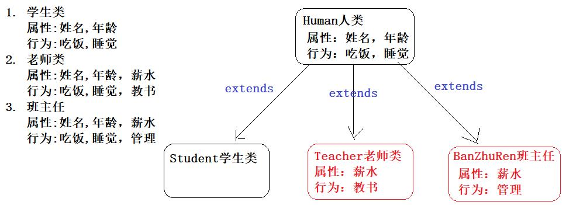
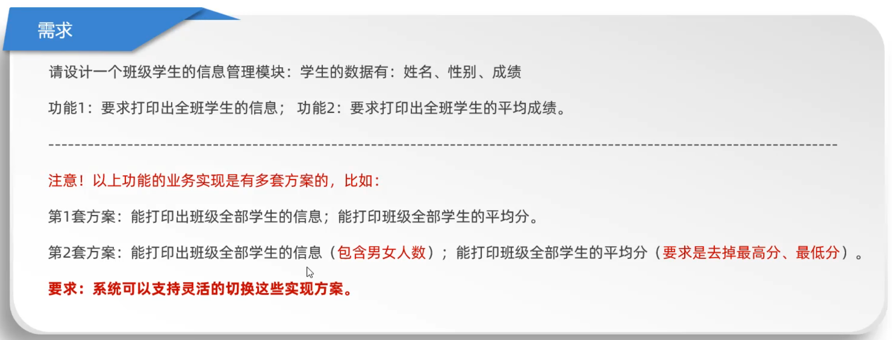

# Java 面向对象

## 定义 / 使用类

```java
// src/Phone.java
public class Phone {
    // 类属性
    String brand = "苹果";
    int price = 7999;

    // 类方法
    public void call() {
        System.out.println("打电话");
    }

    public void sendMessage() {
        System.out.println("发短信");
    }
}
```


两个类在同一个包中，那么不需要引入彼此就可以直接使用

```java
// src/Main.java
public class Main {
    public static void main(String[] args) {
        // 可以直接使用同一个包中的类
        Phone p = new Phone();

        System.out.println(p.brand); // 苹果
    }
}
```


## 成员变量 / 局部变量

* 类中位置不同：成员变量（类中方法外）局部变量（方法内部或方法声明上）
* 内存中位置不同：成员变量（堆内存）局部变量（栈内存）
* 生命周期不同：成员变量（随着对象的存在而存在，随着对象的消失而消失）局部变量（随着方法的调用而存在，醉着方法的调用完毕而消失）
* 初始化值不同：成员变量（有默认初始化值）局部变量（没有默认初始化值，必须先定义，赋值才能使用）

```java
public class Main {
    // 这里的是成员变量，也称之为全局变量，定义后不赋值就输出不会报错，因为有默认值
    // 比如String默认值为null，int为0，boolean为false等等...
    String name;
    int age;

    public static void main(String[] args) {
        // 这里的是局部变量，定义后不赋值就输出会报错
        int n;
        System.out.println(n);
    }
}
```


## private

被设置了 `private` 的属性表示私有的，只能在当前类中使用，其他类中不能 **直接** 使用或赋值

```java
public class Main {
    public static void main(String[] args) {
        Phone p = new Phone();
        System.out.println(p.brand); // 苹果
        System.out.println(p.price); // 报错，原因私有的属性不能被使用
    }
}
```

```java
public class Phone {
    String brand = "苹果";

    // 将price属性设置为私有的，只能在当前类中使用
    private int price = 7999;

    public void call() {
        System.out.println("打电话");
    }

    public void sendMessage() {
        System.out.println("发短信");
    }
}
```


如果想要改变私有属性的值，可以定义一个方法，通过调用该方法完成设置、获取操作

```java
public class Main {
    public static void main(String[] args) {
        Phone p = new Phone();

        // 调用该方法完成设置操作
        p.setPrice(8999);
    }
}
```

```java
public class Phone {
    String brand = "苹果";
    private int price = 7999;

    public void setPrice(int price) {
        // 通过this可以指向类里面的属性
        this.price = price;
    }
}
```


## this

`this` 修饰的变量用于指向成员变量，其主要作用是（区分局部变量和成员变量的重名问题）

* 方法的形参如果与成员变量同名，不带 `this` 修饰的变量指的是形参，而不是成员变量
* 方法的形参没有与成员变量同名，不带  `this` 修饰的变量指的是成员变量

```java
public class Main {
    public static void main(String[] args) {
        Phone p = new Phone();

        p.func("python");
    }
}
```

```java
public class Phone {
    String name = "java";

    public void func(String name) {
        // 当与方法形参重名时不加this就是形参name
        System.out.println(name); // python

         // 加this表示类属性中的name
        System.out.println(this.name); // java
    }
}
```

当没有形参情况下，不加 `this` 也可以访问到类属性 `name`


## 构造方法

类名 `==` 构造方法名

```java
public class Main {
    public static void main(String[] args) {
        Phone p = new Phone("Java", (byte) 20);
    }
}
```

```java
public class Phone {
    String name;
    byte age;

    // 构造方法，等同于js中的constructor
    public Phone(String name, byte age) {
        System.out.format("%s,%d", name, age);
    }
}
```


**构造方法的注意事项**

1. 构造方法的创建

   如果没有定义构造方法，系统将给出一个默认的无参数构造方法
   如果定义了构造方法，系统将不再提供默认的构造方法

2. 构造方法的重载

   如果自定义了带参构造方法，还要使用无参数构造方法，就必须再写一个无参数构造方法

3. 推荐的使用方式

   无论是否使用，都手工书写无参数构造方法

4. 重要功能！

   可以使用带参构造，为成员变量进行初始化

```java
class Student {
    private String name;
    private int age;

    public Student() {}

    public Student(String name) {
        this.name = name;
    }

    public Student(int age) {
        this.age = age;
    }

    public Student(String name, int age) {
        this.name = name;
        this.age = age;
    }
}
```


## 标准类

① 类名需要见名知意

② 成员变量使用private修饰

③ 提供至少两个构造方法 （带参与不带参）

④ 提供每一个成员变量对应的 `setXxx()` / `getXxx()` 方法

⑤ 如果还有其他行为，也需要写上

```java
public class Main {
    public static void main(String[] args) {
        // 带参数
        // Phone p = new Phone("Java", (byte) 20);
        
        // 不带参数
        Phone p = new Phone();

        p.setName("Java");
        p.setAge((byte) 20);
        p.getName(); // Java
        p.getAge(); // 20
    }
}
```

```java
public class Phone {
    private String name;
    private byte age;

    // 有参数
    public Phone(String name, byte age) {
        this.name = name;
        this.age = age;
        System.out.println(this.name + " " + this.age);
    }

    // 无参数
    public Phone() {}

    // 通过set / get来设置或访问类属性的值
    public void setName(String name) {
        this.name = name;
    }
    public void getName() {
        System.out.println(this.name);
    }

    public void setAge(byte age) {
        this.age = age;
    }
    public void getAge() {
        System.out.println(this.age);
    }
}
```


## static

类的静态属性、方法在多次 `new` 实例后在内存中只会创建一个内存空间，而实例属性在每次 `new` 时候就会创建一个新的空间

静态成员属于类的，实例成员属于每个实例出来的对象的


### 静态属性

当类的属性或方法被 `static` 修饰后，说明这个成员变量是属于类的，它称为类变量或静态成员变量。在使用时通过类名.属性名访问。因为类只有一个，所以静态成员变量在内存中也存在一份，所有的对象都可以使用这个变量

```java
public class Main {
    public static void main(String[] args) {
        User u = new User();

        // 实例也可以访问静态成员，但是不推荐
        System.out.println(u.data);
        
        System.out.println(User.data); // Hello World!
    }
}
```

```java
public class User {
    static String data = "Hello World!";
}
```

尽管我们使用实例对象来访问静态方法和属性，但实际上编译器会将它们转换为对应的类名进行访问。因此，实例对象和类名都可以用来访问静态方法和属性。

需要注意的是，尽管可以使用实例对象来访问静态方法和属性，**但这种做法并不推荐**。因为静态方法和属性属于类本身，它们不依赖于实例对象。更好的做法是直接使用类名来访问静态方法和属性，以提高代码的可读性和易于理解


**静态成员为什么不能访问实例属性？**

因为只有在 `new` 时候实例才会被创建，如果直接通过类名使用实例的属性，此时 `new` 并没有创建实例，因此就没有实例属性，所以静态成员不能通过访问实例的属性 / 方法


**实例属性**

如果没有 `static` 修饰的成员变量表示实例属性，它是属于每个对象的，必须创建类的对象才可以访问


### 静态方法

与静态属性同理

```java
public class Main {
    public static void main(String[] args) {
        User u = new User();

        User.func();
        u.func();
    }
}
```

```java
public class User {
    public static void func(){
        System.out.println("Hello World!");
    }
}
```


需要注意的是静态成员能够被实例访问也可以通过类名访问（不建议），而实例成员只能实例访问，不能通过类名访问。

```java
public class User {
    String data = "Hello World!";

    public static void func() {
        // 被static修饰的称为静态方法，他不能访问实例方法、属性
        System.out.println(this.data); // 报错
    }
}
```


**记录实例创建的次数**

```java
// Main.java
public class Main {
    public static void main(String[] args) {
        new Book();
        new Book();
        new Book();
        new Book();
    }
}
```

```java
// Book.java
public class Book {
    // 记录实例创建的次数
    static int n = 0;

    public Book() {
        n += 1;
        System.out.printf("实例创建了：%d次\n", n);
    }
}
```

**注意：** 如果把 `static` 去掉，那么 `n` 就会每次在 `new` 实例时候被重新创建然后 `0+1` 永远是 `1` ，所以就需要改成静态属性。因为静态属性一个类只会创建一个内存空间，因此在他每次被 `new` 创建新对象时并不会被重新创建，而是一直存在于之前的内存中


### 单例模式

**方法一、**

```java
public class Main {
    public static void main(String[] args) {
        Book b1 = Book.getInstance();
        Book b2 = Book.getInstance();
        System.out.println(b1 == b2); // true

        // Book b3 = new Book(); // 不允许被new实例化
    }
}
```

```java
public class Book {
    private static Book Instance = new Book();

    // 定义一个空参的构造方法，防止被new实例化
    private Book() {}

    public static Book getInstance() {
        return Instance;
    }
}
```


**方法二、**

```java
public class Main {
    public static void main(String[] args) {
        Book book = new Book();
        System.out.println(book.n); // 1

        Book a = book.getInstance();
        a.n = 100;
        System.out.println(a.n); // 100

        Book b = book.getInstance();
        b.n = 1000;
        System.out.println(b.n); // 1000
        System.out.println(a.n); // 1000

        // 可以发现他们的值都是一样的，因为他们都是同一个实例，修改的是同一个实例的值
    }
}
```

```java
public class Book {
    int n = 1;
    private Book book;

    public Book getInstance() {
        // 如果没有实例几局创建一个实例并返回
        if (book == null) {
            book = new Book();
        }

        // 如果有就直接返回
        return book;
    }
}
```


## 代码块

```java
public class Student {
    static String name = "zs";
    int age = 20;

    // 静态代码块：随着类的加载而执行,并且只执行一次
    static {
        // 只能访问静态属性、方法
        System.out.format("%s %s\n", "静态代码块", name);
    }

    // 构造代码块：每次调用构造方法时,都会执行一次,优先于构造方法执行
    {
        // 只能访问实例属性、方法
        System.out.format("%s %d\n", "构造代码块", age);
    }
}
```

**静态代码块：** 随着类的加载而执行，并且只执行一次，一般用于加载驱动，或者放只需要执行一次的代码

**构造代码块：** 每次调用构造方法时，都会执行一次,优先于构造方法执行，一般用于统计创建了多少个对象


**注意：** 静态代码块 优先于 构造代码块执行


## 继承

通过 `extends` 关键字，可以声明一个子类继承另外一个父类，定义格式如下：

```java
class 父类 {
	...
}

class 子类 extends 父类 {
	...
}
```

**注意：** `Java` 是单继承的，一个类只能继承一个直接父类。如果想要实现多继承可以B类继承A类，C类继承B类以此类推......


**基本示例**

```java
// A.java
public class A {
    String info = "AAA";
}

// B.java
public class B extends A {
    String info = "BBB";
}

// Main.java
public class Main {
    public static void main(String[] args) {
        B b = new B();
        System.out.println(b.info);
    }
}
```


**应用场景**

老师类，学生类，还有班主任类，实际上都是属于人类的，我们可以定义一个人类，把他们相同的属性和行为都定义在人类中，然后继承人类即可，子类特有的属性和行为就定义在子类中



**代码示例**

```java
// Main.java
public class Main {
    public static void main(String[] args) {
        // 教师类
        Teacher teacher = new Teacher();
        teacher.setName("播仔");
        teacher.setAge((byte) 31);
        teacher.setSalary(1000.99);
        System.out.format("%s %d %f ", teacher.getName(), teacher.getAge(), teacher.getSalary());
        teacher.teach();

        // 班主任类
        BanZhuRen banzhuren = new BanZhuRen();
        banzhuren.setName("灵涛");
        banzhuren.setAge((byte) 28);
        banzhuren.setSalary(1000.99);
        System.out.format("%s %d %f ", banzhuren.getName(), banzhuren.getAge(), banzhuren.getSalary());
        banzhuren.admin();

        // 学生类
        Student student = new Student();
        student.setName("播仔");
        student.setAge((byte) 31);
        System.out.format("%s %d ", student.getName(), student.getAge());
        student.behavior();
        // student.setSalary(1000.99); // student类没有薪水属性，报错！
    }
}
```


`Human` 公共类 将可复用的代码写在这个类中，让其他的类来继承他

```java
// Human.java
public class Human {
    private String name;
    private byte age;

    public String getName() {
        return name;
    }

    public void setName(String name) {
        this.name = name;
    }

    public int getAge() {
        return age;
    }

    public void setAge(byte age) {
        this.age = age;
    }
}
```


`Student` 类需要用到 `Human` 中的属性，可以继承它，减少代码冗余，提高代码规范性。不仅如此还可以在类的原有基础上继续扩展，比如扩展一个方法 `behavior` 

```java
// Student.java
public class Student extends Human {
    public void behavior(){
        System.out.println("好好学习，天天向上!");
    }
}
```


`Teacher` 如果没有我们想要的属性，也可以自己扩展

```java
// Teacher.java
public class Teacher extends Human {
    // 扩展一个薪资属性
    private double salary;

    public void teach(){
        System.out.println("老师在认真教技术！");
    }

    public double getSalary() {
        return salary;
    }

    public void setSalary(double salary) {
        this.salary = salary;
    }
}
```


```java
// BanZhuRen.java
public class BanZhuRen extends Human {
    private double salary ;

    public void admin(){
        System.out.println("班主任强调纪律问题！");
    }

    public double getSalary() {
        return salary;
    }

    public void setSalary(double salary) {
        this.salary = salary;
    }
}
```


### super

子父类中出现了同名的成员变量时，在子类中需要访问父类中 **非私有成员变量** 时，需要使用 `super` 关键字，修饰父类成员变量，类似于之前学过的 `this` 

不同的是 `super` 代表父类对象的引用，而 `this` 代表当前对象的引用

```java
public class Main {
    public static void main(String[] args) {
        Student s = new Student();
    }
}
```

```java
public class Student extends Person {
    String name = "子类属性";

    public Student(){
        // 访问当前子类属性
        System.out.println(this.name); // 子类属性

        // 访问父类属性 / 方法
        System.out.println(super.name); // 父类属性
        super.func(); // 父类方法
    }
}
```

```java
public class Person {
    String name = "父类属性";

    public void func() {
        System.out.println("父类方法");
    }
}
```

**注意：** `Person` 类中的成员变量是非私有的，子类中可以直接访问。若 `Person` 类中的成员变量私有了，子类是不能直接访问的。通常编码时，我们遵循封装的原则，使用 `private` 修饰成员变量，那么如何访问父类的私有成员变量呢？对！可以在父类中提供公共的 `getXxx` 方法和 `setXxx` 方法。


**类在构造函数中会自动调用 super 从而导致父类的构造函数触发**

```java
public class Main {
    public static void main(String[] args) {
        Student s = new Student();
        // 父类被调用了
        // 子类被调用了
    }
}
```

```java
public class Person {
    public Person(){
        System.out.println("父类被调用了");
    }
}
```

```java
public class Student extends Person {
    public Student(){
        System.out.println("子类被调用了");
    }
}
```


#### 访问特点

继承中成员变量与方法的访问特点

1. 如果当前类中属性与变量同名，那么优先输出变量

2. 如果子类与父类属性重名，那么输出子类的重名属性

3. 如果想要使用父类的属性，可以通过 `super`

```java
// Main.java
public class Main {
    public static void main(String[] args) {
        Student s = new Student();
        s.func();
    }
}
```

```java
// Person.java
public class Person {
    int n = 100;

    public void func(){}
}
```

```java
// Student.java
public class Student extends Person {
    int n = 200;

    public void func() {
        int n = 300;

        System.out.println(n); // 300
        System.out.println(this.n); // 200
        System.out.println(super.n); // 100
    }
}
```

**注意：** 通过 `super` 不能访问父类私有的属性


#### 方法重写

当子类中出现与父类一模一样的方法时（返回值类型，方法名和参数列表都相同），会出现覆盖效果，也称为重写或者复写。**声明不变，重新实现**


**应用场景**

子类继承了父类的方法，但是子类觉得父类的这方法不足以满足自己的需求，子类重新写了一个与父类同名的方法，以便覆盖父类的方法

例如：我们定义了一个动物类代码如下：

```java
public class Animal  {
    public void run(){
        System.out.println("动物跑的很快！");
    }
    public void cry(){
        System.out.println("动物都可以叫~~~");
    }
}
```

然后定义一个猫类，猫可能认为父类 `cry()` 方法不能满足自己的需求


**代码示例**

```java
public class Cat extends Animal {
    // 重写cry方法，覆盖父类的
    public void cry(){
        System.out.println("喵喵喵！");
    }
}

public class Test {
	public static void main(String[] args) {
      	// 创建子类对象
      	Cat ddm = new Cat()；
        // 调用父类继承而来的方法
        ddm.run();
      	// 调用子类重写的方法
      	ddm.cry(); // 喵喵喵！
	}
}
```


**注意：**

1. 方法重写是发生在子父类之间的关系。

2. 子类方法覆盖父类方法，必须要保证权限大于等于父类权限。

3. 子类方法覆盖父类方法，返回值类型、函数名和参数列表都要一模一样，否则会导致方法重载。

   ```java
   public class Main {
       public static void main(String[] args) {
           B b = new B();
           b.info(); # 666
           b.info(1, 2); # 300
       }
   }
   
   public class A {
       public void info() {
           System.out.println(666);
       }
   
       // 被子类重写了
       public void info(int x, int y) {
           System.out.println(x + y);
       }
   }
   
   public class B extends A {
       @Override
       public void info(int x, int y) {
           System.out.println(100 + 200);
       }
   }
   ```

   

#### @Override

在Java继承中，对于方法重写，不是必须要加上 `@Override` 注解。但是，建议在重写父类方法时使用 `@Override` 注解，这样可以增加代码的可读性和可维护性。


使用 `@Override` 注解可以确保方法的正确重写。如果在重写方法时，不小心拼写错误或者方法签名不匹配，编译器会报错。而使用注解，编译器会检查该方法是否确实是重写了父类的方法，如果没有重写成功，编译器会报错，提醒开发者进行修正。


总之，虽然不是强制要求加上 `@Override` 注解，但是建议在重写父类方法时使用该注解，以增加代码的可读性和可维护性，并避免潜在的错误。

```java
public class Main {
    public static void main(String[] args) {
        Student s = new Student();
        s.func(); // 子类方法
    }
}
```

```java
public class Student extends Person {
    String name = "子类属性";

    @Override
    public void func() {
        System.out.println("子类方法");
    }
}
```

```java
public class Person {
    String name = "父类属性";

    public void func() {
        System.out.println("父类方法");
    }
}
```


### 执行顺序

`new B()` 后他会根据参数来匹配对应的构造方法，如果是空参就会匹配空参的构造，有参就会匹配有参的构造

```java
public class Main {
    public static void main(String[] args) {
        new B(); // 1  3
        new B(100); // 1  4
    }
}
```

```java
public class A {
    public A() {
        System.out.println(1);
    }

    public A(int n) {
        System.out.println(2);
    }
}
```

```java
public class B extends A {
    public B() {
        System.out.println(3);
    }

    public B(int n) {
        System.out.println(4);
    }
}
```


`super` 会隐式自动调用

```java
public class Main {
    public static void main(String[] args) {
        new B(); // 1  4  3
    }
}
```

```java
public class A {
    public A() {
        System.out.println(1);
    }

    public A(int n) {
        System.out.println(2);
    }
}
```

```java
public class B extends A {
    public B() {
        // super(); 这里会隐式调用super然后触发父类的无参构造方法 1
        // 然后再调用自己的有参构造方法 4
        this(100);
        // 最后再打印 3
        System.out.println(3);
    }

    public B(int n) {
        System.out.println(4);
    }
}
```


如果子类调用了父类的构造方法或普通方法，那么他们的 `this` 就是子类对象

```java
public class Main {
    public static void main(String[] args) {
        new B();
    }
}
```

```java
public class A {
    public A() {
        System.out.println(this); // B@41629346
        this.info();
    }

    public void info() {
        System.out.println(this); // B@41629346
        System.out.println("AAA");
    }
}
```

```java
public class B extends A {
    public B() {
        // super();
        
        // 如果子类调用了父类的构造方法或普通方法，那么他们的 `this` 就是子类对象
        super.info();
    }

    public void info() {
        System.out.println("BBB");
    }
}
```

```
B@41629346
BBB
B@41629346
AAA
```


### 权限修饰符

| 修饰符    | 同一个类中 | 同一个包中 | 不同包的子类 | 不同包的无关类 |
| --------- | ---------- | ---------- | ------------ | -------------- |
| private   | √          |            |              |                |
| default   | √          | √          |              |                |
| protected | √          | √          | √            |                |
| public    | √          | √          | √            | √              |


### 注意点

子类复写父类方法时，访问权限必须大于或等于父类方法的权限

优先级：`public` -> `protected` -> `default`

```java
public class Main {
    public static void main(String[] args) {
        B b = new B();
        b.info();
    }
}
```

```java
public class A {
    public void info() {
        System.out.println("AAA");
    }
}
```

```java
public class B extends A {
    // 报错：优先级低于父类方法修饰符
    // protected void info() {
    // void info() {
    public void info() {
        System.out.println("BBB");
    }
}
```

如果父类的修饰符为 `protected` ，那么子类的修饰符就可以是 `public` -> `protected` ，必须大于或等于父类方法的权限


## 多态

当一个方法的形参是一个类，我们可以传递这个类所有的子类对象，而且还可以根据不同的对象来调用不同类中的方法。同时多态也是面向对象的三大特性之一


**为什么使用多态？**

如果没有多态，那么在下图中 `register` 方法只能传递 `Student` 学生对象，其他的 `Teacher` 和 `administrator` 对象是无法传递给 `register` 方法的，在这种情况下，只能定义三个不同的 `register` 方法分别接收学生，老师这两个类


有了多态之后，方法的形参就可以定义为共同的父类 `Person`，换句话说只要是继承于 `Person` 的父类都可以作为 `Person` 类型传递参数


**代码示例**

```java
// Main.java
public class Main {
    public static void main(String[] args) {
        A b = new B();
        A c = new C();

        go(b);
        go(c);
    }

    public static void go(A a){
        // 传递哪个类就调用哪个类的info方法
        a.info();
    }
}
```

```java
// A.java
public class A {
    public void info() {
        System.out.println("AAA");
    }
}
```

```java
// B.java
public class B extends A {
    public void info() {
        System.out.println("BBB");
    }
}
```

```java
// C.java
public class C extends A {
    public void info() {
        System.out.println("CCC");
    }
}
```

```
BBB
CCC
```

**注意：** 多态必须是以继承的关系才能被定义


### 弊端

多态编译阶段是看左边父类 类型的，如果子类有些 **独有** 的功能，那么使用多态就无法访问子类独有功能了

```java
public class Main {
    public static void main(String[] args) {
        Person p = new Student();
        p.setName("张三");
        p.setAge((byte) 18);

        // Person类有show方法，即使被Student类重写也是可以的
        p.show();
        
        // 编译报错，编译看左边的Person父类，Person中没有func变量
        p.func();
    }
}
```


### 转型

当使用多态方式调用方法时，首先检查父类中是否有该方法，如果没有，则编译错误。也就是说，**不能调用**子类拥有，而父类没有的方法。编译都错误，更别说运行了。这也是多态给我们带来的一点"小麻烦"。所以，想要调用子类特有的方法，必须做向下转型。

```java
public class Main {
    public static void main(String[] args) {
        // 向上转型  
        Animal a = new Cat();  
        a.eat(); // 调用的是 Cat 的 eat

        // 向下转型：强制转换为子类的类型自然就可以使用子类自己的方法了
        Cat c = (Cat) a;       
        c.catchMouse(); // 调用的是 Cat 的 catchMouse
    }  
}
```

```java
abstract class Animal {  
    abstract void eat();  
}  

class Cat extends Animal {  
    public void eat() {  
        System.out.println("吃鱼");  
    }  
    public void catchMouse() {  
        System.out.println("抓老鼠");  
    }  
}  

class Dog extends Animal {  
    public void eat() {  
        System.out.println("吃骨头");  
    }  
    public void watchHouse() {  
        System.out.println("看家");  
    }  
}
```


## instanceof

为了避免 `ClassCastException` 的发生，Java提供了 `instanceof` 关键字，给引用变量做类型的校验，注意是引用类型才能使用该关键字

```java
String s = new String("Hello");
System.out.println(s instanceof String); // true
```


**测试**

如果变量属于该数据类型或者其子类类型，返回 `true`，反之 `false`

```java
public class Main {
    public static void main(String[] args) {
        Person p = new Student();
        p.setName("张三");
        p.setAge((byte) 18);


        Student student = (Student) p;
        student.StudentFunc();

        // p属于Person或Student类型
        System.out.println(p instanceof Person); // true
        System.out.println(p instanceof Student); // true
        System.out.println(student instanceof Person); // true
        System.out.println(student instanceof Student); // true
        
        // 不属于Teacher类型
        System.out.println(p instanceof Teacher); // false
        System.out.println(student instanceof Teacher); 
        // 报错：不兼容的类型: Student无法转换为Teacher
        
        
        // 根据不同的类型转换为不同的类调用不同的方法
        if (p instanceof Student) {
            Student s = (Student) p;
            s.StudentFunc();
        } else if (p instanceof Teacher) {
            Teacher t = (Teacher) p;
            t.TeacherFunc();
        }
    }
}
```


**instanceof 新特性**

`JDK14` 的时候提出了新特性，把判断和强转合并成了一行

```java
// 如果p为Student类型 就自动强制转换为Student并赋值给s变量
if (p instanceof Student s) {
	s.StudentFunc();
} else if (p instanceof Teacher t) {
	t.TeacherFunc();
}
```


## final

1. 被 `final` 修饰的类称为最终类，不能被继承

   ```java
   public final class A {}
   
   public class B extends A {} // 报错：无法从final 'A' 继承
   ```

2. 被修饰的方法不能被重写

   ```java
   public class A {
       public final void func() {
           System.out.println(100);
       }
   }
   
   public class B extends A {
       @Override
       public final void func() { // 报错：B中的func()无法覆盖A中的func()
           System.out.println(200);
       }
   }
   ```

3. 被修饰的变量不能被二次赋值

   ```java
   final int n = 100;
   n = 200; // 报错：无法将值赋给 final 变量 'n'
   ```

4. 在类中被修饰的变量称为常量，不能被二次赋值

   ```java
   public final String KEY = "123123";
   ```


## 抽象类

抽象类存在的意义是为了被子类继承，否则抽象类将毫无意义。

抽象类可以强制让子类按照规定的格式进行重写。

如果一个类的某个方法被修饰为 `abstract`，那么该类必须是抽象类。


**定义抽象类**

```java
abstract class 类名字 {}
```

**定义抽象方法**

```java
abstract public class Animal {
    abstract public void run()；
}
```

**注意：** 抽象类不一定有抽象方法，但是有抽象方法的类必须定义成抽象类。


**写一个简单的抽象类**

```java
public class Main {
    public static void main(String[] args) {
        // 注意：抽象类不能被 new 实例化
        // A a = new A();

        B b = new B();

        b.name = "张三";
        System.out.println(b.name); // 张三

        b.info1(); // info1
        b.info2(); // info2
    }
}
```

```java
// 定义抽象类：不能new实例化，只能被继承
abstract public class A {
    String name;

    // 抽象方法一旦定义就必须由子类重写
    abstract public void info1();

    // 抽象类中也可以定义普通方法提供给子类继承时使用
    public void info2(){
        System.out.println("info2");
    };
}
```

```java
public class B extends A {
    // 实现抽象方法
    @Override
    public void info1() {
        System.out.println("info1");
    }
}
```

此时的方法重写，是子类对父类抽象方法的实现，我们将这种方法重写的操作，也叫做**实现方法**。


**注意：** 静态属性或方法不能定义为抽象类，并且抽象类中定义的抽象方法必须由子类全部实现，否则就会报错。想要避免报错，要么将子类也设置为抽象类，要么就将抽象类的方法全部实现

```java
//B类继承A类，此时B类也是抽象类，这个时候就可以不重写A类的抽象方法也不会报错
abstract public class B extends A {}
```


**举个栗子**

我们可以定义一个抽象方法 `func` 然后在 `info` 方法中调用，当我们继承了 `info` 的方法后就必须实现 `func` 继承方法才能调用

```java
public class Main {
    public static void main(String[] args) {
        B b = new B();
        b.info();
    }
}
```

```java
public abstract class A {
    public final void info() {
        System.out.println("开始");

        func();
        
        System.out.println("结束");
    }

    public abstract void func();
}
```

```java
public class B extends A {
    @Override
    public void func() {
        System.out.println("抽象类");
    }
}
```


## 接口类

接口是更加彻底的抽象，接口中全部是抽象方法。接口跟抽象类一样，不能 `new` 实例化对象


**定义接口**

Java 提供了一个关键字 `interface`，用来定义接口这种特殊结构

```java
public interface 接口名{
    //成员变量（默认常量）
    //成员方法（抽象方法）
}
```


**默认修饰符**

**抽象方法**

接口中的抽象方法默认会自动加上 `public abstract` 修饰符，无需自己手写！！写上也不会有问题，但没必要

```java
// 定义接口类
public interface A {
    // 默认：public abstract
    void info();
}
```

**常量**

接口中的成员变量默认会自动加上 `public static final` 修饰符，也就是说在接口中定义的成员变量实际上是一个常量。变量的值不能被二次修改，并且是静态的成员变量必须使用接口名访问

常量必须要给初始值。常量命名规范建议字母全部大写，多个单词用下划线连接。

```java
public interface A {
    // 默认：public static final
    String KEY = "ABCDEFG";
}
```


**举个栗子**

使用了接口类，那么就必须重写接口类的全部抽象方法，或者将这个类定义为抽象类

```java
public class Main {
    public static void main(String[] args) {
        B b = new B();
        b.info(); // ABCDEFG
    }
}
```

```java
// 定义接口类
public interface A {
    // 默认：public static final
    String KEY = "ABCDEFG";

    // 默认：public abstract
    void info();
}
```

```java
// 使用接口类
public class B implements A {
    @Override
    public void info() {
        // KEY = "OPQRST"; 报错：无法将值赋给 final 变量 'KEY'
        System.out.println(KEY);
    }
}
```


### 多接口实现

一个类也可以实现多个接口，如下所示定义了 `A` 和 `B` 接口，然后由 `C` 类使用，那么 `C` 类就必须实现 `A、B` 接口的所有方法

```java
public class Main {
    public static void main(String[] args) {
        C c = new C();
        c.info1(); // info1
        c.info2(); // info2
    }
}
```

```java
// 定义A接口
public interface A {
    void info1();
}
```

```java
// 定义B接口
public interface B {
   // 约束返回值为String类型，参数是int类型
   String info2(int n);
}
```

```java
// 定义C类，并同时实现A和B的接口类
public class C implements A, B {
    // 重写A接口的info1方法
    @Override
    public void info1() {
        System.out.println("info1");
    }

    // 重写B接口的info2方法
    @Override
    public String info2(int n) {
        System.out.println("info2");
        return n + "";
    }
}
```


### 接口继承

接口与类之间是实现关系 而 接口与接口之间是继承关系

接口继承接口就是把其他接口的抽象方法与本接口进行了合并

```java
public class Main {
    public static void main(String[] args) {
        D d = new D();
        d.info1(); // info1
        d.info2(); // info2
    }
}
```

```java
public interface A {
    void info1();
}
```

```java
public interface B {
   void info2();
}
```

```java
public interface C extends A, B {
    // 继承A与B接口的所有抽象方法
}
```

```java
public class D implements C {
    // 重写A接口的info1方法
    @Override
    public void info1() {
        System.out.println("info1");
    }

    // 重写B接口的info2方法
    @Override
    public void info2() {
        System.out.println("info2");
    }
}
```


**类实现接口的要求和意义**

1. 必须重写实现的全部接口中所有抽象方法。
2. 如果一个类实现了接口，但是没有重写完全部接口的全部抽象方法，这个类也必须定义成抽象类。
3. 意义：接口体现的是一种规范，接口对实现类是一种强制性的约束，要么全部完成接口申明的功能，要么自己也定义成抽象类。这正是一种强制性的规范。


### 应用场景



首先我们写一个学生类，用来描述学生的相关信息

```java
public class Student {
    private String name;
    private char sex;
    private double score;

    public Student() {
    }

    public Student(String name, char sex, double score) {
        this.name = name;
        this.sex = sex;
        this.score = score;
    }

    public String getName() {
        return name;
    }

    public void setName(String name) {
        this.name = name;
    }

    public char getSex() {
        return sex;
    }

    public void setSex(char sex) {
        this.sex = sex;
    }

    public double getScore() {
        return score;
    }

    public void setScore(double score) {
        this.score = score;
    }
}
```

接着，写一个StudentOperator接口，表示学生信息管理系统的两个功能。

```java
public interface StudentOperator {
    void printAllInfo(ArrayList<Student> students);
    void printAverageScore(ArrayList<Student> students);
}
```

然后，写一个StudentOperator接口的实现类StudentOperatorImpl1，采用第1套方案对业务进行实现。

```java
public class StudentOperatorImpl1 implements StudentOperator{
    @Override
    public void printAllInfo(ArrayList<Student> students) {
        System.out.println("----------全班全部学生信息如下--------------");
        for (int i = 0; i < students.size(); i++) {
            Student s = students.get(i);
            System.out.println("姓名：" + s.getName() + ", 性别：" + s.getSex() + ", 成绩：" + s.getScore());
        }
        System.out.println("-----------------------------------------");
    }

    @Override
    public void printAverageScore(ArrayList<Student> students) {
        double allScore = 0.0;
        for (int i = 0; i < students.size(); i++) {
            Student s = students.get(i);
            allScore += s.getScore();
        }
        System.out.println("平均分：" + (allScore) / students.size());
    }
}
```

接着，再写一个StudentOperator接口的实现类StudentOperatorImpl2，采用第2套方案对业务进行实现。

```java
public class StudentOperatorImpl2 implements StudentOperator{
    @Override
    public void printAllInfo(ArrayList<Student> students) {
        System.out.println("----------全班全部学生信息如下--------------");
        int count1 = 0;
        int count2 = 0;
        for (int i = 0; i < students.size(); i++) {
            Student s = students.get(i);
            System.out.println("姓名：" + s.getName() + ", 性别：" + s.getSex() + ", 成绩：" + s.getScore());
            if(s.getSex() == '男'){
                count1++;
            }else {
                count2 ++;
            }
        }
        System.out.println("男生人数是：" + count1  + ", 女士人数是：" + count2);
        System.out.println("班级总人数是：" + students.size());
        System.out.println("-----------------------------------------");
    }

    @Override
    public void printAverageScore(ArrayList<Student> students) {
        double allScore = 0.0;
        double max = students.get(0).getScore();
        double min = students.get(0).getScore();
        for (int i = 0; i < students.size(); i++) {
            Student s = students.get(i);
            if(s.getScore() > max) max = s.getScore();
            if(s.getScore() < min) min = s.getScore();
            allScore += s.getScore();
        }
        System.out.println("学生的最高分是：" + max);
        System.out.println("学生的最低分是：" + min);
        System.out.println("平均分：" + (allScore - max - min) / (students.size() - 2));
    }
}
```

再写一个班级管理类ClassManager，在班级管理类中使用StudentOperator的实现类StudentOperatorImpl1对学生进行操作

```java
public class ClassManager {
    private ArrayList<Student> students = new ArrayList<>();
    private StudentOperator studentOperator = new StudentOperatorImpl1();

    public ClassManager(){
        students.add(new Student("迪丽热巴", '女', 99));
        students.add(new Student("古力娜扎", '女', 100));
        students.add(new Student("马尔扎哈", '男', 80));
        students.add(new Student("卡尔扎巴", '男', 60));
    }

    // 打印全班全部学生的信息
    public void printInfo(){
        studentOperator.printAllInfo(students);
    }

    // 打印全班全部学生的平均分
    public void printScore(){
        studentOperator.printAverageScore(students);
    }
}
```

最后，再写一个测试类Test，在测试类中使用ClassMananger完成班级学生信息的管理。

```java
public class Test {
    public static void main(String[] args) {
        // 目标：完成班级学生信息管理的案例。
        ClassManager clazz = new ClassManager();
        clazz.printInfo();
        clazz.printScore();
    }
}
```

注意：如果想切换班级管理系统的业务功能，随时可以将StudentOperatorImpl1切换为StudentOperatorImpl2。自己试试


### 新特性

从JDK8开始，接口中新增的三种方法形式。

在普通类中不加修饰符默认是 `default`  而在接口类中默认是 `public` 

```java
public interface A {
    // 默认方法：必须使用default修饰，因为默认是public
    default void a() {
        System.out.println("默认方法~");
    }

    // 私有方法：必须使用private修饰
    private void b(){
        System.out.println("私有方法~");
    }

    // 静态方法：必须使用static修饰，默认会被public修饰
    static void c(){
        System.out.println("静态方法~");
    }

    void d();
}
```

```java
public class B implements A {
    // 如果不重写就使用默认的，可有可无
    public void a() {
        System.out.println("我是重写后的默认方法~");
    }

    // 必须实现
    public void d(){
        System.out.println("公共方法~");
    }
}
```

```java
public class Main {
    public static void main(String[] args) {
        B b = new B();
        b.a(); // 我是重写后的默认方法~~
        // b.b(); 只能在当前接口中使用
        A.c(); // 静态方法~
        b.d(); // 公共方法~
    }
}
```


### 注意点

以下为语法上要注意的细节，虽然条目较多，但若理解了抽象的本质，无需死记硬背。

1. 当两个接口中存在相同抽象方法的时候，该怎么办？

> 只要重写一次即可。此时重写的方法，既表示重写1接口的，也表示重写2接口的。

2. 实现类能不能继承A类的时候，同时实现其他接口呢？

> 继承的父类，就好比是亲爸爸一样
> 实现的接口，就好比是干爹一样
> 可以继承一个类的同时，再实现多个接口，只不过，要把接口里面所有的抽象方法，全部实现。

3. 实现类能不能继承一个抽象类的时候，同时实现其他接口呢？

> 实现类可以继承一个抽象类的同时，再实现其他多个接口，只不过要把里面所有的抽象方法全部重写。

4. 实现类Zi，实现了一个接口，还继承了一个Fu类。假设在接口中有一个方法，父类中也有一个相同的方法。子类如何操作呢？

> 处理办法一：如果父类中的方法体，能满足当前业务的需求，在子类中可以不用重写。
> 处理办法二：如果父类中的方法体，不能满足当前业务的需求，需要在子类中重写。

5. 如果一个接口中，有10个抽象方法，但是我在实现类中，只需要用其中一个，该怎么办?

> 可以在接口跟实现类中间，新建一个中间类（适配器类）
> 让这个适配器类去实现接口，对接口里面的所有的方法做空重写。
> 让子类继承这个适配器类，想要用到哪个方法，就重写哪个方法。
> 因为中间类没有什么实际的意义，所以一般会把中间类定义为抽象的，不让外界创建对象


## 内部类

内部类是类中的五大成分之一（成员变量、方法、构造器、内部类、代码块），如果一个类定义在另一个类的内部，这个类就是内部类。

当一个类的内部，包含一个完整的事物，且这个事物没有必要单独设计时，就可以把这个事物设计成内部类。

```java
public class A{
	// 这是一个内部类
    public class B{
        
    }
}
```


### 成员内部类

```java
public class Main {
    public static void main(String[] args) {
        A a = new A();
        System.out.println(a.n); // 100
        a.info(); // 200

        // 成员内部类调用格式：外部类.内部类 变量名 = new 外部类().new 内部类();
        A.B b = new A().new B();
        System.out.println(b.n); // 300
        b.info(); // 400 300 100 200
    }
}
```

```java
public class A {
    public int n = 100;

    public void info() {
        System.out.println(200);
    }

    // 成员内部类
    public class B {
        int n = 300;

        public void info() {
            int n = 400;

            // 访问内部类的局部变量
            System.out.println(n); // 400

            // 访问内部类的属性：如果局部变量和属性没有同名，那么可以省略this访问类的属性
            System.out.println(this.n); // 300

            // 访问外部类的属性：内部类成员与外部类成员同名，可以使用类名.this.成员区分
            System.out.println(A.this.n); // 100
            A.this.info(); // 200
        }
    }
}
```


### 静态内部类

静态内部类，其实就是在成员内部类的前面加了一个 `static` 关键字。静态内部类属于外部类自己持有，不允许被其他类使用。

```java
public class Main {
    public static void main(String[] args) {
        //静态内部类调用格式：外部类.内部类 变量名 = new 外部类.内部类();
        A.B b = new A.B();
        b.info(); // 200
    }
}
```

```java
public class A {
    public int x = 100;
    public static int y = 200;

    // 静态内部类
    public static class B {
        public void info() {
            // 内部类可以直接访问外部类的静态属性：
            // System.out.println(x); // 错误，无法访问外部类的实例属性
            System.out.println(y); // 正确，可以访问外部类的静态属性
        }
    }
}
```


### 局部内部类

局部内部类是定义在方法中的类，和局部变量一样，只能在方法中有效。所以局部内部类的局限性很强，一般在开发中是不会使用的

```java
public class Main {
    public static void main(String[] args) {
        A a = new A();
        a.info(); // 我叫张三 20岁
    }
}
```

```java
public class A {
    public int x = 100;
    public static int y = 200;

    public void info() {
        // 局部内部类
        class B {
            final String name;
            final int age;

            public B(String name, int age) {
                this.name = name;
                this.age = age;
            }

            public void print() {
                System.out.printf("我叫%s %d岁", name, age);
            }
        }

        B b = new B("张三", 20);

        b.print(); // 我叫张三 20岁
    }
}
```


### 匿名内部类

只有在调用方法时，当方法的形参是一个接口或者抽象类，为了简化代码书写，而直接传递匿名内部类对象给方法，这样就可以少写一个类


应用于接口类

```java
interface B {
    void info();
}

public class Main {
    public static void main(String[] args) {
        B b = new B() {
            String name = "张三";

            public void info() {
                System.out.printf("Hello %s", this.name);
            }
        };

        b.info();
    }
}
```


应用于抽象类

```java
abstract class B {
    public String name;

    public abstract void info();
}

public class Main {
    public static void main(String[] args) {
        // B b = new B(); 抽象类不能被实例化

        // 使用匿名内部类可以实现抽象类实例化
        B b = new B() {
            String name = "张三";

            public void info() {
                System.out.printf("Hello %s", this.name);
            }
        };

        b.info();
    }
}
```


```java
public class Main {
    public static void main(String[] args) {
        B b = new B() {
            String name = "张三";

            @Override
            public void info() {
                System.out.printf("Hello %s", this.name);
            }
        };

        // 也可以给方法传参使用
        go(b);
    }

    public static void go(B b) {
        System.out.println("开始~");
        b.info();
        System.out.println("结束~");
    }
}
```

```java
public abstract class B {
    public String name;

    public abstract void info();
}
```


## 私有类

私有类只允许在当前文件中使用，不能被其他文件使用

```java
class B {
    public String name;

    public B(String name) {
        this.name = name;
    }

    public void info() {
        System.out.printf("Hello %s", this.name);
    }
}

public class Main {
    public static void main(String[] args) {
        B b = new B("张三");

        b.info();
    }
}
```


## 枚举

枚举是一种特殊的类，它的格式是：

```java
public enum 枚举类名{
    枚举项1,枚举项2,枚举项3;
}
```


枚举项就表示枚举类的对象，只是这些对象在定义枚举类时就预先写好了，以后就只能用这几个固定的对象。

我们用代码演示一下，定义一个枚举类A，在枚举类中定义三个枚举项X, Y, Z

```java
public enum A{
    X,Y,Z;
}
```


想要获取枚举类中的枚举项，只需要用类名调用就可以了

```java
public class Test{
    public static void main(String[] args){
        //获取枚举A类的，枚举项
        A a1 = A.X;
        A a2 = A.Y;
        A a3 = A.Z;
    }
}
```

**注意：** 枚举的每个属性默认就是 `public static final` ，只能通过类名访问值，不能修改值


下面是枚举的简单用法，定义人的性别

```java
public class Main {
    public static void main(String[] args) {
        System.out.println(Gender.MALE.getName()); // 男
        System.out.println(Gender.FEMALE.getName()); // 女
        
        // Gender.MALE = Gender.FEMALE; // 报错：无法将值赋给 final 变量 'MALE'
    }
}
```

最原始的写法

```java
public class Gender {
    public static final Gender FEMALE = new Gender(1, "女");
    public static final Gender MALE = new Gender(2, "男");

	private final int id;
    private final String name;

    private Gender(int id, String name) {
        this.id = id;
        this.name = name;
    }

    public int getId() {
        return id;
    }

    public String getName() {
        return name;
    }
}
```

使用枚举的写法

```java
public enum Gender {
    MALE(1, "女"), FEMALE(2, "男");

    private int id;
    private String name;

    // 报错：枚举构造方法不允许是public，只能是私有的，因为默认是私有的，所以可写可不写
    // public Gender(int id, String name) { 
    Gender(int id, String name) {
        this.id = id;
        this.name = name;
    }

    public int getId() {
        return id;
    }

    public String getName() {
        return name;
    }
}
```


**枚举一般表示一组信息，然后作为参数进行传输**

比如我们现在有这么一个应用，用户进入应用时，需要让用户选择是女生、还是男生，然后系统会根据用户选择的是男生，还是女生推荐不同的信息给用户观看。

这里我们就可以先定义一个枚举类，用来表示男生、或者女生

```java
public enum Constant{
    BOY,GRIL
}
```

再定义一个测试类，完成用户进入系统后的选择

```java
public class Test{
    public static void main(String[] args){
        //调用方法，传递男生
        provideInfo(Constant.BOY);
    }
    
    public static void provideInfo(Constant c){
        switch(c){
            case BOY:
                System.out.println("展示一些信息给男生看");
                break;
            case GRIL:
                System.out.println("展示一些信息给女生看");
                break;
        }
    }
}
```

最终再总结一下枚举的应用场景：**枚举一般表示几个固定的值，然后作为参数进行传输**。


## 泛型

### 定义泛型

定义一个简单泛型

```java
public class Main {
    public static void main(String[] args) {
        A<String> a = new A();
        String data = a.getData("Hello");
        System.out.println(data);
    }
}
```

```java
public class A<E> {
    public E getData(E data) {
        return data;
    }
}
```


### 基本使用

加强版泛型

```java
public class Main {
    public static void main(String[] args) {
        B<String> b = new B();

        // 设置值
        b.setData("Hello");

        // 获取值
        String data = b.getData();
        System.out.println(data); // Hello
    }
}
```

```java
public interface A<E> { ;
    // 定义一个setData / getData方法，参数为E类型
    void setData(E data);

    E getData();
}
```

```java
public class B<E> implements A<E> {
    // 返回值为E类型的变量
    private E data;

    // 实现接口的方法
    @Override
    public void setData(E e) {
        this.data = e;
    }

    @Override
    public E getData() {
        return this.data;
    }
}
```


接下来再使用泛型模拟一个 `ArrayList` 集合

```java
public class Main {
    public static void main(String[] args) {
        MyArrayList<String> myArrayList = new MyArrayList();

        myArrayList.add("Hello");
        myArrayList.add("World");

        System.out.println(myArrayList.get(0));
        System.out.println(myArrayList.get(1));
    }
}
```

```java
public class MyArrayList<E> {
    private Object[] data = new Object[10];
    private int index; // 默认为0

    public void add(E e) {
        // 每次添加完元素后，index都会自增1
        data[index] = e;
        index++;
    }

    // 通过index获取元素
    public E get(int index) {
        return (E) data[index];
    }
}
```


### 泛型方法

```java
public class Main {
    public static void main(String[] args) {
        A a = new A();

        // 使用泛型：想传什么类型就传什么类型
        a.getData("Hello"); // String
        a.getData(100); // Integer
    }
}
```

```java
public class A {
    // public String getData(String data) { 如果把类型写死，那么只能返回String类型的参数

    // 可以使用泛型，根据实参的类型决定形参与返回值的类型
    public <T> T getData(T data) {
        return data;
    }
}
```


## 总结

OOP(object oriented programming)，即面向对象编程

**面向对象具有四大特性，分别是**

1. **抽象：** 将一些事物的共性抽离出来归为一个类。
   	如对于动物，具有生命体征、活动能力等区别于其它事物的共同特征
2. **封装：** 有选择地隐藏和暴露数据和方法
   	比如有U盘这个类，我希望隐藏内部组成和实现，只暴露 `USB` 接口以供使用
3. **继承：** 子类可以直接使用父类的部分数据和方法，可以有选择的扩展
   	比如鸟是动物，但鸟扩展了飞行的能力。
4. **多态：** 同一类的对象调用相同方法可以表现出不同的行为
   	比如动物实现了 `say()` 方法，猴子、马等动物重写了 `say()` 方法来表现不同的交流语言。"

