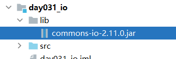
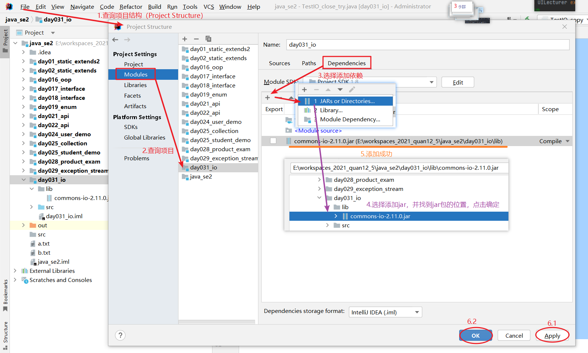

# Java高级

## Stream

假如有一个 `List` 集合，元素有 `"张三丰","张无忌","周芷若","赵敏","张强"`，找出姓张，且是 `3` 个字的名字，存入到一个新集合中去。


**定义数据**

```java
import java.util.ArrayList;
import java.util.List;

public class Main {
    public static void main(String[] args) {
        List<User> list = new ArrayList<>();

        list.add(new User(1, "张三", 18, "上海"));
        list.add(new User(2, "王五", 16, "上海"));
        list.add(new User(3, "李四", 20, "上海"));
        list.add(new User(4, "张雷", 22, "北京"));
        list.add(new User(5, "张超", 15, "深圳"));
        list.add(new User(6, "李雷", 24, "北京"));
        list.add(new User(7, "王爷", 21, "上海"));
        list.add(new User(8, "张三丰", 18, "广州"));
        list.add(new User(9, "赵六", 16, "广州"));
        list.add(new User(10, "赵无极", 26, "深圳"));
    }
}
```


### 初体验

**传统写法：**

```java
list.forEach(s -> {
    if (s.name.startsWith("张") && s.name.length() == 3) {
         System.out.println(s.name);
         // 张三丰
         // 张无忌
    }
});
```


**Stream写法：**

```java
list.stream().filter(item -> item.name.startsWith("张") && item.name.length() == 3).forEach(item -> System.out.println(item.name));
// 张三丰
// 张无忌
```


### forEach

遍历所有的数据

```java
list.stream().forEach(item -> System.out.println(item.name));
// 张三
// 王五
// 李四
// ...
```


### sorted

根据年龄对数据进行排序

```java
// 根据年龄从小到大排序
list.stream().sorted((a, b) -> a.age - b.age).forEach(item -> System.out.println(item.name));
// 根据年龄从大到小排序
list.stream().sorted((a, b) -> b.age - a.age).forEach(item -> System.out.println(item.name));
```


### filter

返回过滤后的数据

```java
// 过滤出姓张且名为3个字的用户数据
list.stream().filter(item -> item.name.startsWith("张") && item.name.length() == 3).forEach(item -> System.out.println(item.name));
// 张三丰
// 张无忌
```


```java
// 查找id为5的数据
list.stream().filter(item -> item.id == 5).forEach(item -> System.out.println(item.name));
// 张超
```


### map

返回被处理后的数据

```java
// 给每个用户名称之前拼接数据并返回
List<String> s =  list.stream().map(item -> "姓名：" + item.name).toList();
System.out.println(s);
// [姓名：张三, 姓名：王五, 姓名：李四, ...]

// 给所有用户数据的年龄增加10岁并返回
List<Integer> n = list.stream().map(item -> item.age + 10).toList();
System.out.println(n);
// [28, 26, 30, 32, 25, 34, 31, 28, 26, 36]
```


### peek

对数据进行处理

```java
// 对所有用户的年龄增加10岁
List<User> data = list.stream().peek(item -> item.age += 10).toList();
for (User item : data) {
    System.out.printf("姓名：%s 年龄：%d\n", item.name, item.age);
    // 姓名：张三 年龄：28
    // 姓名：王五 年龄：26
    // 姓名：李四 年龄：30
    // ...
}
```

**疑惑点：** `map` 与 `peek` 的区别是什么？

**答：** `map` 用于对流中的元素进行转换，生成一个新的流，而`peek` 用于在流处理过程中查看元素，对其进行操作，但不改变元素的值。


### limit

获取指定个数的数据

```java
// 只获取前三个数据
list.stream().limit(3).forEach(item -> System.out.println(item.name));
```


### skip

从哪个位置开始获取数据

```java
// 从第八个获取到最后一个数据
list.stream().skip(8).forEach(item -> System.out.println(item.name));
// 赵六
// 张无忌
```


```java
// 从第三个开始，获取4个数据
list.stream().skip(2).limit(4).forEach(item -> System.out.println(item.name));
// 李四
// 张雷
// 张超
// 李雷
```


**模拟分页查询**

```java
// 每页显示多少个数据
int page = 3;
for (int i = 1; i <= 4; i++) { // 第几页
    // 当前索引
    int startIndex = (i - 1) * page;
    list.stream().skip(startIndex).limit(page).forEach(item -> System.out.println(item.name));
    System.out.println("--------------");
}
```


### toList

```java
// 将stream转换为集合
// List<User> data = list.stream().collect(Collectors.toList());
List<User> data = list.stream().toList(); // 推荐方式
```


### count

统计数量

```java
// 统计姓张的用户数量
long n = list.stream().filter(item -> item.name.startsWith("张")).count();
System.out.printf("姓张的有：%d个人", n);
// 姓张的有：5个人
```


### max / min

返回最大值与最小值的数据

```java
// 求出最大的年龄
int max = list.stream().max((a, b) -> Integer.compare(a.age, b.age)).get().age;
System.out.printf("最大的年龄为：%d", max);
// 最大的年龄为：26
```


```java
// 找出年龄最大与最小的用户
User max = list.stream().max((a, b) -> Integer.compare(a.age, b.age)).get();
System.out.printf("年龄最大的用户是：%s 他的年龄为：%d", max.name, max.age);
// 年龄最大的用户是：张无忌 他的年龄为：26

User min = list.stream().min((a, b) -> Integer.compare(a.age, b.age)).get();
System.out.printf("年龄最大的用户是：%s 他的年龄为：%d", min.name, min.age);
// 年龄最小的用户是：张超 他的年龄为：15
```


### distinct

去重


## File

### exists

判断指定的目录或文件是否存在，存在就返回 `true` 反之 `false`

```java
import java.io.File;

public class Main {
    public static void main(String[] args) {
        File f1 = new File("src");
        File f2 = new File("src/1.txt");

        // 既可以判断目录，也可以判断文件是否存在
        System.out.println(f1.exists()); // true
        System.out.println(f2.exists()); // true
    }
}
```


### isFile

判断指定的文件是否存在，存在就返回 `true` 反之 `false`

```java
import java.io.File;

public class Main {
    public static void main(String[] args) {
        File f1 = new File("src");
        File f2 = new File("src/1.txt");

        // 不能判断目录，只能判断文件是否存在
        System.out.println(f1.isFile()); // false
        System.out.println(f2.isFile()); // true
    }
}
```


### isDirectory

判断是否是文件夹，是就返回 `true` 反之 `false`

```java
import java.io.File;

public class Main {
    public static void main(String[] args) {
        File f1 = new File("src");
        File f2 = new File("src/1.txt");

        // 是文件夹
        System.out.println(f1.isDirectory()); // true

        // 不是文件夹
        System.out.println(f2.isDirectory()); // false
    }
}
```


### getName

获取文件的名称

```java
import java.io.File;

public class Main {
    public static void main(String[] args) {
        File f = new File("src/1.txt");

        System.out.println(f.getName()); // 1.txt
    }
}
```


### length

获取文件的大小，返回字节个数

```java
import java.io.File;

public class Main {
    public static void main(String[] args) {
        File f = new File("src/1.txt");

        System.out.println(f.length()); // 12
    }
}
```


### lastModified

获取文件上一次被修改的时间

```java
import java.io.File;

public class Main {
    public static void main(String[] args) {
        File f = new File("src/1.txt");

        System.out.println(f.lastModified());
        // 1696926150928
    }
}
```


### getPath

获取创建文件对象时的路径 `src/1.txt`

```java
import java.io.File;

public class Main {
    public static void main(String[] args) {
        File f = new File("src/1.txt");

        // 字符串
        System.out.println(f.getPath()); // src\1.txt

        // File对象
        System.out.println(f); // src\1.txt
    }
}
```


### getAbsolutePath

获取文件的绝对路径

```java
import java.io.File;

public class Main {
    public static void main(String[] args) {
        File f = new File("src/1.txt");

        System.out.println(f.getAbsolutePath());
        // C:\Users\33111\IdeaProjects\liuyuyang\src\1.txt
    }
}
```


### getParentFile

获取指定文件的所有父级目录

```java
import java.io.File;

public class Main {
    public static void main(String[] args) {
        File file = new File("a/b/c/d/e/f/g.txt");

        System.out.println(file.getParentFile());
        // a\b\c\d\e\f
    }
}
```


### createNewFile

如果创建成功返回 `true`，反之 `false`

```java
import java.io.File;

public class Main {
    public static void main(String[] args) {
        File f = new File("src/2.txt");
        System.out.println(f.createNewFile());
    }
}
```

**注意：** `createNewFile` 只能创建文件，不能创建目录


### mkdir

与 `createNewFile` 使用相似，不同的是该方法只能创建目录

```java
import java.io.File;

public class Main {
    public static void main(String[] args)  {
        // 创建单个目录
        File f1 = new File("src/aaa");
        System.out.println(f1.mkdirs());

        // 创建多级目录
        File f2 = new File("src/aaa/bbb");
        System.out.println(f2.mkdirs());
    }
}
```


### delete

如果删除成功返回 `true`，反之 `false`

```java
import java.io.File;

public class Main {
    public static void main(String[] args) {
        File f = new File("src/1.txt");
        System.out.println(f.delete());
    }
}
```


### list

通过该方法可以将指定目录下的所有目录以及文件以字符串数组形式获取

```java
import java.io.File;

public class Main {
    public static void main(String[] args) {
        File f = new File("src");

        String[] files = f.list();

        for (String file : files) {
            System.out.println(file);
            // aaa
            // Err.java
            // Main.java
        }
    }
}
```


### listFiles

通过该方法可以将指定目录下的所有目录以及文件以 `File` 对象数组形式获取

```java
import java.io.File;

public class Main {
    public static void main(String[] args) {
        File f = new File("src");

        File[] files = f.listFiles();

        for (File item : files) {
            System.out.println(item.getName() + " ~ " + item);
            // a.txt ~ src\a.txt
            // abc ~ src\abc
            // Anno.java ~ src\Anno.java
            // Main.java ~ src\Main.java
            // User.java ~ src\User.java
        }
    }
}
```

**使用 listFiles 方法时的注意事项：**

1. 当主调是文件，或者路径不存在时，返回 `null`
2. 当主调是空文件夹时，返回一个长度为 `0` 的数组
3. 当主调是一个有内容的文件夹时，将里面所有一级文件和文件夹的路径放在 `File` 数组中返回
4. 当主调是一个文件夹，且里面有隐藏文件时，将里面所有文件和文件夹的路径放在 `File` 数组中返回，包含隐藏文件
5. 当主调是一个文件夹，但是没有权限访问该文件夹时，返回 `null`


### 练习

**练习一：** 过滤出指定目录中的所有以 `.java` 作为后缀的文件

```java
import java.io.File;
import java.io.FileFilter;

public class Main {
    public static void main(String[] args) {
        File f = new File("src");

        // 过滤文件
        File[] files = f.listFiles(new FileFilter() {
            @Override
            public boolean accept(File data) {
                // 只要返回值为true就返回哪个数据
                // 返回以.java后缀的所有文件
                return data.toString().endsWith(".java");
            }
        });

        for (File item : files) {
            System.out.println(item);
        }
    }
}
```


**练习二：** 遍历指定文件目录中所有的目录，不含文件

```java
import java.io.File;

public class Main {
    public static void main(String[] args) {
        File dir = new File("src/abc");
        System.out.println(dir); // src/abc

        // 遍历abc文件目录下所有的目录
        listAllFiles(dir, "");
    }

    public static void listAllFiles(File dir, String tab) {
        File[] files = dir.listFiles();

        for (File item : files) {
            // 只打印文件目录
            if (item.isDirectory()) {
                System.out.println(tab + item.getName());

                // 通过递归实现无限遍历，直到遍历完毕为止
                listAllFiles(item, tab + "\t");
                // a
                //    aa
                //    bb
                // b
                //    bb
                // c
            }
        }
    }
}
```


**练习三：** 查询指定目录中是否存在 `.avi` 格式的文件，如果有就返回 `true ` 反之 `false`

```java
import java.io.File;
import java.io.IOException;

public class Main {
    public static void main(String[] args) throws IOException {
        File file = new File("src");
        System.out.println(haveAVI(file));
    }

    // 查询指定目录中是否存在.avi格式的文件，如果有就返回true 反之false
    public static boolean haveAVI(File file) {
        File[] list = file.listFiles();

        for (File item : list) {
            if (file.isFile() && item.getName().endsWith(".avi")) {
                return true;
            }
        }

        return false;
    }
}
```


**练习四：** 使用代码创建目录 `a/b/c/d/e/f/g.txt`

```java
import java.io.File;
import java.io.IOException;

public class Main {
    public static void main(String[] args) throws IOException {
        File file = new File("a/b/c/d/e/f/g.txt");

        // 判断父级目录是否存在
        if(!file.getParentFile().exists()){
            // 如果父级目录不存在就创建
            file.getParentFile().mkdirs();
        }

        // 创建文件g.txt
        file.createNewFile();
    }
}
```


**疑惑点：**  `list` 方法与 `listFiles` 方法都可以获取到所有的目录、文件列表，那么他们的区别是什么？

**答：** `list` 获取的是文件的名称，而 `listFiles` 获取的是文件对象


## IO

### 字节流

#### FileOutputStream

操作本地文件的字节输出流，可以吧程序中的数据写到本地文件中

```java
import java.io.*;

public class Main {
    public static void main(String[] args) throws IOException {
        FileOutputStream fos = new FileOutputStream("src/a.txt");
        // FileOutputStream fos = new FileOutputStream(new File("src/a.txt"));
        
        // 将数据97写入到a.txt：97对应的Asllc码值为a，所以在a.txt文件中的内容为a
        fos.write(97);
        // 然后又将b写入到文件中，此时内容为：ab
        fos.write(98);
        
        // 释放资源
        fos.close();
    }
}
```


批量将数据写入到 `a.txt` 文件中：`abcde`

```java
import java.io.*;

public class Main {
    public static void main(String[] args) throws IOException {
        FileOutputStream fos = new FileOutputStream("src/a.txt");

        // 批量将数据写入到a.txt文件中：abcde
        byte[] list = {97, 98, 99, 100, 101};
        fos.write(list);

        // 释放资源
        fos.close();
    }
}
```


将数据转换为字节并写入数据

```java
import java.io.FileOutputStream;
import java.io.IOException;
import java.util.Arrays;

public class Main {
    public static void main(String[] args) throws IOException {
        FileOutputStream fos = new FileOutputStream("src/a.txt");

        // 将数据转换为字节
        byte[] bytes = "你好呀".getBytes();
        System.out.println(Arrays.toString(bytes));
        // [-28, -67, -96, -27, -91, -67, -27, -111, -128]

        // 一键写入数据
        fos.write(bytes);

        fos.close();
    }
}
```


将该数组从第二个开始往后取 `3` 个数据批量写入到 `a.txt` 文件中：`cde`

```java
import java.io.*;

public class Main {
    public static void main(String[] args) throws IOException {
        FileOutputStream fos = new FileOutputStream("src/a.txt");

        // 将该数组从第二个开始往后取3个数据批量写入到a.txt文件中：cde
        byte[] list = {97, 98, 99, 100, 101};
        fos.write(list, 2, 3);

        // 释放资源
        fos.close();
    }
}
```


**使用细节**

① 创建字节输出流对象

1. 参数可以是字符串路径，也可以是File对象

2. 如果文件不存在 会创建一个新的文件，但必须保证父级路径是存在的

3. 如果文件已经存在，则会清空文件


② 写入数据

`write` 方法的参数为整数类型，但实际上写到本地文件中的是整数在 `ASCll` 上对应的字符


③ 释放资源

每次使用完留之后都要释放资源

`write` 方法的参数为整数类型，但实际上写到本地文件中的是整数在 `ASCll` 上对应的字符


**换行 & 续写**

```java
import java.io.*;
import java.util.Arrays;

public class Main {
    public static void main(String[] args) throws IOException {
        // 如果第二个参数为true则表示支持续写，默认情况下为false表示不续写，每次写入的内容会覆盖之前的内容
        FileOutputStream fos = new FileOutputStream("src/a.txt", true);

        // 数据内容
        String content1 = "Hello";
        // 将内容转换为byte格式
        byte[] content1Bytes = content1.getBytes();
        System.out.println(Arrays.toString(content1Bytes)); // [72, 101, 108, 108, 111]

        // 将转换后的byte对应的字符写入到文件内容中
        fos.write(content1Bytes);

        // 换行：为了兼容性，我们通常使用"\r\n"来表示换行
        String wrap = "\r\n";
        byte[] wrapBytes = wrap.getBytes();
        fos.write(wrapBytes);

        String content2 = "World";
        byte[] content2Bytes = content2.getBytes();
        fos.write(content2Bytes);

        // 释放资源
        fos.close();
        
        // 此时a.txt文件的内容为：
        // Hello
        // World
    }
}
```


#### FileInputStream

操作本地文件的字节输入流，将本地文件中的数据读取到程序中

```java
import java.io.*;

public class Main {
    public static void main(String[] args) throws IOException {
        FileInputStream fos = new FileInputStream("src/a.txt");

        // 每次调用read方法都会获取a.txt文件中的一个数据
        System.out.println(fos.read()); // 97 -> a
        System.out.println(fos.read()); // 98 -> b
        System.out.println(fos.read()); // 99 -> c
        System.out.println(fos.read()); // 100 -> d
        System.out.println(fos.read()); // 101 -> e

        // 如果没有数据了就返回-1
        System.out.println(fos.read()); // -1

        // 释放资源
        fos.close();
    }
}
```


**使用细节**

① 创建字节输入流对象

如果文件不存在就直接报错


② 写入数据

1. 一次性只能读一个字节，读出来的是数据在 `ASCll` 上对应的数字
2. 读取到文件末尾后，`read` 方法就会返回 `-1`


③ 释放资源

每次使用完留之后都要释放资源


**通过循环批量获取数据**

```java
import java.io.*;

public class Main {
    public static void main(String[] args) throws IOException {
        FileInputStream fos = new FileInputStream("src/a.txt");

        int b;

        // 循环读取数据
        while ((b = fos.read()) != -1) {
            System.out.printf("%d -> %c | ", b, (char) b);
            // 97 -> a | 98 -> b | 99 -> c | 100 -> d | 101 -> e | 
        }

        // 释放资源
        fos.close();
    }
}
```


**一次性读取多个数据**

```java
import java.io.FileInputStream;
import java.io.IOException;

public class Main {
    public static void main(String[] args) throws IOException {
        FileInputStream fis = new FileInputStream("src/a.txt");

        byte[] bytes = new byte[5];

        int len;
        while ((len = fis.read(bytes)) != -1) {
            System.out.print(len + " - "); // 每次读取的个数
            System.out.println(new String(bytes, 0, len)); // 每次读取的数据
            // 5 - abcde
            // 2 - fg

            // System.out.write(bytes, 0, len);
        }
        
        fos.close();
    }
}
```


#### 拷贝文件

将 `mac.jpg` 这张图片拷贝一张

```java
import java.io.FileInputStream;
import java.io.FileOutputStream;
import java.io.IOException;

public class Main {
    public static void main(String[] args) throws IOException {
        FileInputStream fis = new FileInputStream("mac.jpg");
        FileOutputStream fos = new FileOutputStream("macCory.jpg");

        // 记录开始时间
        long start = System.currentTimeMillis();

        System.out.println("拷贝中 请稍后~");

        int len;
        while ((len = fis.read()) != -1) {
            fos.write(len);
        }

        // 记录结束时间
        long end = System.currentTimeMillis();

        System.out.printf("拷贝成功 总用时：%d毫秒", end - start);
        // 拷贝成功 总用时：7407毫秒

        fis.close();
        fos.close();
    }
}
```


#### 优化拷贝时间

上面拷贝文件因为一次只能拷贝一个数据，所以导致非常缓慢，所以我们可以这样做，使每次可以拷贝多个数据从而优化拷贝文件的时间

```java
import java.io.*;

public class Main {
    public static void main(String[] args) throws IOException {
        FileInputStream fis = new FileInputStream("src/a.txt");

        byte[] bytes = new byte[2];

        // bytes数组中存储的个数
        // System.out.println(fis.read(bytes)); // 2

        fis.read(bytes);
        System.out.println(new String(bytes)); // ab

        fis.read(bytes);
        System.out.println(new String(bytes)); // cd

        fis.read(bytes);
        // 因为最后一个数据是e，e将cd的c覆盖之后就没有数据了
        // 而d并没有被覆盖。所以此时就是：ed
        System.out.println(new String(bytes)); // ed

        fis.read(bytes);
        System.out.println(new String(bytes)); // ed
        
        fos.close();
    }
}
```


上面代码存在一些问题，可以发现有一个多余的数据。所以这并不是最佳的解决方法

我们可以这么做来解决上面的问题

```java
import java.io.*;

public class Main {
    public static void main(String[] args) throws IOException {
        FileInputStream fis = new FileInputStream("src/a.txt");

        byte[] bytes = new byte[2];

        // bytes数组中存储的个数
        System.out.println(fis.read(bytes)); // 2

        // 读取2个数据
        int l1 = fis.read(bytes);
        System.out.println(l1); // 2
        System.out.println(new String(bytes, 0, l1)); // ab

        // 读取2个数据
        int l2 = fis.read(bytes);
        System.out.println(l2); // 2
        System.out.println(new String(bytes, 0, l2)); // cd

        // 读取1个数据
        int l3 = fis.read(bytes);
        System.out.println(l3); // 1
        System.out.println(new String(bytes, 0, l3)); // e
        
        fos.close();
    }
}
```


循环读取数据

```java
import java.io.*;

public class Main {
    public static void main(String[] args) throws IOException {
        FileInputStream fis = new FileInputStream("src/a.txt");

        byte[] bytes = new byte[2];

        int len;

        while ((len = fis.read(bytes)) != -1) {
            System.out.print(new String(bytes, 0, len));
        }
        
        fos.close();
    }
}
```


**下面是文件拷贝缓慢的解决方案：** 默认一次只能读取一个数据，我们可以设置为一次读取 `5` 个数据，这样拷贝的时间就快了好几倍

```java
import java.io.FileInputStream;
import java.io.FileOutputStream;
import java.io.IOException;

public class Main {
    public static void main(String[] args) throws IOException {
        FileInputStream fis = new FileInputStream("mac.jpg");
        FileOutputStream fos = new FileOutputStream("macCory.jpg");

        long start = System.currentTimeMillis();
        
        System.out.println("拷贝中 请稍后~");

        int len;
        byte[] bytes = new byte[1024 * 1024 * 5];

        while ((len = fis.read(bytes)) != -1) {
            fos.write(bytes, 0, len);
        }

        long end = System.currentTimeMillis();

        System.out.printf("拷贝成功 总用时：%d毫秒", end - start);
		// 拷贝成功 总用时：4毫秒
        
        fis.close();
        fos.close();
    }
}
```

经过这样的优化后，文件拷贝的速度快了几千倍


**疑惑点：** `new byte[]` 括号中的值越大，读取就越快。那为什么不能写成 `99999999999999` 呢，岂步更快？

```java
byte[] bytes = new byte[1024 * 1024 * 5];
```

**答：** 将这个值设置得过大可能会浪费内存资源。原因是，在读取文件时，内存中只能容纳有限数量的数据。如果一次性读取的数据超过内存的限制，就会导致内存溢出的情况发生，程序可能会因此崩溃。

所以我们一般根据文件的大小来决定，比如一个 `10M` 的视频，那么就写 `1024 * 1024 * 10` 相当于一次读取 `10M` 的数据，这样做最合适


#### 编码 & 解码

默认为操作系统编码，而国内 `window` 系统编码为 `utf-8`  

所以编码与解码都为 `utf-8` 格式，也可以指定为其他格式

```java
import java.io.UnsupportedEncodingException;
import java.util.Arrays;

public class Main {
    public static void main(String[] args) throws UnsupportedEncodingException {
        System.out.println("------编码------");
        
        String s1 = "爱你哟";
        // 不传参就是系统默认的编码格式，国内window操作系统默认编码为UTF-8
        byte[] list1 = s1.getBytes();
        System.out.println(Arrays.toString(list1));
        // [-25, -120, -79, -28, -67, -96, -27, -109, -97]
        // 爱：-25, -120, -79
        // 你：-28, -67, -96
        // 呦：-27, -109, -97

        String s2 = "爱你哟";
        // 指定为GBK编码
        byte[] list2 = s2.getBytes("GBK");
        System.out.println(Arrays.toString(list2));
        // [-80, -82, -60, -29, -45, -76]
        // 爱：-80, -82
        // 你：-60, -29
        // 呦：-45, -76


        System.out.println("------解码------");

        // 默认是UTF-8格式解码
        System.out.println(new String(list1)); // 爱你哟

        // 不传值相当于使用默认UTF-8，而这个是GBK数据，所以解码时候会乱码
        System.out.println(new String(list2)); // ����Ӵ

        // 指定为GBK格式解码
        System.out.println(new String(list2, "GBK")); // 爱你哟
        
        fos.close();
    }
}
```

根据上述代码可以看出，`UTF-8` 编码一次性读取 3 个字节，而 `GBK` 一次读取 2 个字节


### 字符流

#### FineReader

字符输入流用来将文件中的字符数据读取到程序中来，他比 `FileInputStream` 更适合读取中文数据

```java
import java.io.FileReader;
import java.io.IOException;

public class Main {
    public static void main(String[] args) throws IOException {
        FileReader fr = new FileReader("src/a.txt");

        int ch;

        while ((ch = fr.read()) != -1) {
            System.out.printf("%d %s | ", ch, (char) ch);
            // 20320 你 | 22909 好 | 32   | 74 J | 97 a | 118 v | 97 a |
        }

        fr.close();
    }
}
```


**疑惑点：** `FileInputStream` 与 `FineReader` 都可以实现读取数据，那么他们的区别是什么？

**答：** `FileReader` 与 `FileInputStream` 都可以用来读取文件中的中文数据。然而，它们确实有一些区别。

`FileReader` 是用来读取字符流的，它是 `InputStreamReader` 类的子类，并且使用默认的字符编码。它将文件中的字节流解码成字符流，因此适用于读取文本文件。对于读取文本文件中的中文数据，使用 `FileReader` 是一个比较方便的选择。

`FileInputStream` 是用来读取字节流的。它可以读取任何类型的文件，包括文本文件和二进制文件。读取文本文件时，需要在读取后进行字符编码处理才能正确地解析中文数据。


**一次性读取多个数据**

```java
import java.io.FileReader;
import java.io.IOException;

public class Main {
    public static void main(String[] args) throws IOException {
        FileReader fr = new FileReader("src/a.txt");

        char[] chars = new char[2];
        int len;

        while ((len = fr.read(chars)) != -1) {
            // 把数组中的数据变成字符串再打印
            System.out.print(new String(chars, 0, len));
            // 你好 Java
        }

        fr.close();
    }
}
```


### FileUtils

`commons-io` 有 `apache` 第三方组织开源项目，对使用者提供 `jar` 包

**步骤1：拷贝jar包**



**步骤2：启用jar包（将jar包应用到项目中）**




基本使用

```java
import java.io.File;
import java.io.IOException;

import org.apache.commons.io.FileUtils;

public class Main {
    public static void main(String[] args) throws IOException {
        // ----------拷贝文件----------
        File A_File = new File("src/a.txt");
        File B_File = new File("src/b.txt");

        // 将a.txt的内容拷贝给b.txt
        FileUtils.copyFile(A_File, B_File);


        // ----------拷贝文件夹----------
        File A_Dir = new File("src/a");
        File B_Dir = new File("src/b");

        // 将a文件夹里面的所有东西全部拷贝给b文件夹
        FileUtils.copyDirectory(A_Dir, B_Dir);


        // ----------删除文件----------
        FileUtils.deleteQuietly(new File("src/b.txt"));
        

        // ----------删除文件夹----------
		FileUtils.forceDelete(new File("src/a.txt")); // 删除的文件不存在会报错
        FileUtils.deleteDirectory(new File("src/b")); // 不会报错


        // ----------读写文件----------
        File file = new File("src/a.txt");

        // 写入数据
        FileUtils.writeStringToFile(file, "你好呀!", "utf8");

        // 读取数据
        String data = FileUtils.readFileToString(file, "utf8");
        System.out.println(data);
    }
}
```


**过滤目录**

参数二表示需要过滤的文件后缀名，不指定可以写 `null`

参数三表示是否深度过滤，如果为 `true` 表示过滤所有子目录，反之只过滤同级中的文件

**例子：** 过滤出 `src/a` 目录下所有以 `.java` 作为后缀的文件

```java
System.out.println(FileUtils.listFiles(new File("src/a"), new String[]{"java"}, true));
// [src\a\c\ddd.java, src\a\hello.java]
```


## 反射

```java
public class User {
    public String name = "zs";
    private int age = 18;
    
    public User(){
        System.out.println("User~");
    }

    public User(int i){
        System.out.println("User" + i);
    }

    public String info() {
        System.out.println("info");
        return "aaa";
    }

    private int info(int i, String s) {
        System.out.println("info" + i + s);
        return 123;
    }
}
```


**通过反射调用类的构造方法**

```java
import java.lang.reflect.Constructor;

public class Main {
    public static void main(String[] args) throws Exception {
        // 获取class
        Class clazz = Class.forName("User");

        // 获取构造方法
        Constructor cons1 = clazz.getConstructor();
        Constructor cons2 = clazz.getConstructor(int.class);

        // 调用无参构造
        cons1.newInstance(); // User~
        // 调用有参构造方法
        cons2.newInstance(123); // User123
    }
}
```


**通过反射获取、修改类的属性**

```java
import java.lang.reflect.Field;

public class Main {
    public static void main(String[] args) throws Exception {
        // 获取class
        Class clazz = Class.forName("User");

        // 获取实例
        Object obj = clazz.newInstance();

        // 获取属性
        // Field nameAttribute = clazz.getField("name");
        Field nameAttribute = clazz.getDeclaredField("name");
        Field ageAttribute = clazz.getDeclaredField("age");

        // 访问公有属性
        System.out.println(nameAttribute.get(obj)); // zs

        // 访问私有属性
        ageAttribute.setAccessible(true); // 设置为可访问的
        System.out.println(ageAttribute.get(obj)); // 18

        // 修改属性
        nameAttribute.set(obj, "ls");
        ageAttribute.set(obj, 20);
        System.out.println(nameAttribute.get(obj)); // ls
        System.out.println(ageAttribute.get(obj)); // 20
    }
}
```

**注意：** `getField` 只能获取 `public` 修饰的属性，不能获取私有属性。而 `getDeclaredField` 都可以获取


**通过反射调用类的公共属性和方法**

```java
import java.lang.reflect.Field;
import java.lang.reflect.Method;

public class Main {
    public static void main(String[] args) throws Exception {
        // 获取class
        Class clazz = Class.forName("User");

        // 获取实例
        Object obj = clazz.newInstance();

        // 获得User类的info方法
        Method infoMethod = clazz.getDeclaredMethod("info");

        // 通过invoke调用类的info方法
        Object result = infoMethod.invoke(obj); // info
        // 打印该方法的返回值
        System.out.println(result); // aaa
    }
}
```


**通过反射调用类的私有属性和方法**

```java
import java.lang.reflect.Field;
import java.lang.reflect.Method;

public class Main {
    public static void main(String[] args) throws Exception {
        // 获取class
        Class clazz = Class.forName("User");

        // 获取实例
        Object obj = clazz.newInstance();

        // 获得方法User类的info私有方法
        Method infoMethod = clazz.getDeclaredMethod("info", int.class, String.class);

        // 将私有方法设置为可访问的
        infoMethod.setAccessible(true);

        // 通过invoke调用类的info方法
        Object result = infoMethod.invoke(obj, 100, "_sss"); // 100_sss
        // 打印该方法的返回值
        System.out.println(result); // 123
    }
}
```


## 注解

### 基本使用

```java
public @interface Anno {
    public String value() default "";
    public String name() default "";

    public int age() default 0;
}
```

```java
@Anno(name = "ls", age = 20)
public class User {
    // @Anno()
    // @Anno("")
    @Anno(name = "ww")
    public String name = "zs";

    @Anno(age = 20)
    public void info() {
        System.out.println("info");
    }
}
```


### 元注解

#### @Retention

自定义声明周期、保留时间

| 属性                    | 含义                                                         |
| ----------------------- | ------------------------------------------------------------ |
| RetentionPolicy.SOURCE  | 源码，自定义注解只能在源码中使用，字节码中没有。提供给编译器使用 |
| RetentionPolicy.CLASS   | 字节码，自定义注解在源码、字节码中使用。运行后没有。提供运行器使用 |
| RetentionPolicy.RUNTIME | 运行时，自定义注解在源码、字节码、运行时都可以使用。开发中常见 |


**举个栗子：** 获取某个方法被注解的数据

```java
import java.lang.annotation.Retention;
import java.lang.annotation.RetentionPolicy;

@Retention(RetentionPolicy.RUNTIME)
public @interface Anno {
    public String name() default "";

    public int age() default 0;
}
```

```java
public class User {
    @Anno(name = "zs", age = 20)
    public void info() {
        System.out.println("info");
    }

    public void show() {
        System.out.println("show");
    }
}
```

```java
import java.lang.reflect.Method;

public class Main {
    public static void main(String[] args) throws Exception {
        Class clazz = Class.forName("User");

        Method infoMethod = clazz.getMethod("info");

        // 获取info方法上的Anno注解对象
        Anno anno = (Anno) infoMethod.getAnnotation(Anno.class);
        System.out.println(anno); // @Anno(name="zs", age=20)

        System.out.println(anno.name()); // zs
        System.out.println(anno.age()); // 20
    }
}
```


#### @Target

用于确定 `自定义注解` 使用位置（类、属性、构造、方法等）

| 属性            | 含义                               |
| --------------- | ---------------------------------- |
| ANNOTATION_TYPE | 可以用于注解类型的声明             |
| CONSTRUCTOR     | 可以用于构造方法的声明             |
| FIELD           | 可以用于字段（成员变量）的声明     |
| LOCAL_VARIABLE  | 可以用于局部变量的声明             |
| METHOD          | 可以用于方法的声明                 |
| MODULE          | 可以用于模块的声明（Java 9+）      |
| PACKAGE         | 可以用于包的声明                   |
| PARAMETER       | 可以用于方法参数的声明             |
| TYPE            | 可以用于类、接口、枚举等类型的声明 |

如果不写 `@Taget` 则表示在任何位置都可以使用该注解


**举个栗子：** 执行某个类中所有被注解的方法

```java
// 表示只能被方法使用
@Target({ElementType.METHOD})
// 表示可以通过反射来获取被注解的属性或方法
@Retention(RetentionPolicy.RUNTIME) 
public @interface Anno {

}
```

```java
public class User {
    @Anno
    public void info() {
        System.out.println("info");
    }

    public void show() {
        System.out.println("show");
    }
}
```

```java
import java.lang.reflect.Method;

public class Main {
    public static void main(String[] args) throws Exception {
        // 获取User类
        Class clazz = Class.forName("User");

        // 获取类实例
        Object obj = clazz.newInstance();

        // 获取指定类中所有的方法
        Method[] allMethods = clazz.getMethods();

        for (Method method : allMethods) {
            // 判断当前方法是否被Anno注解
            boolean r = method.isAnnotationPresent(Anno.class);

            // 如果被注解就调用
            if (r) method.invoke(obj);
        }
    }
}
```


## 多线程

启动一个多线程：定义一个类继承于 `Thread` ，然后重写 `run` 方法，创建子类对象并启动线程

```java
// 定义一个类继承于Thread
public class MyThread extends Thread {
    // 重写run方法
    @Override
    public void run() {
        for (int i = 1; i <= 10; i++) {
            System.out.println(getName() + i);
        }
    }
}
```


```java
public class Main {
    public static void main(String[] args) {
        // 创建子类对象
        MyThread mt = new MyThread();
        // 启动线程
        mt.start();
    }
}
```


```JAVA
public class Main {
    public static void main(String[] args) {
        MyThread mt1 = new MyThread();
        mt1.setName("线程A：");
        mt1.start();

        MyThread mt2 = new MyThread();
        mt2.setName("线程B：");
        mt2.start();
    }
}
```

