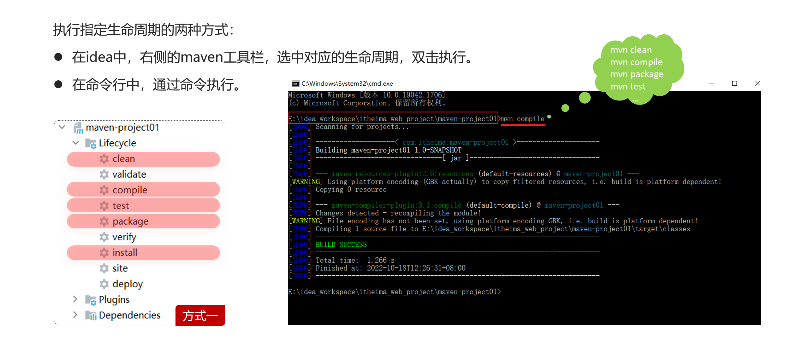

# Maven

`Maven` 是 `Apache` 提供的一个项目管理工具，它的作用就是管理项目。类似于前端的 `npm`


## 快速上手

### 安装

在此处下载：https://maven.apache.org/download.cgi


下载完成后是这样的目录结构


### 配置本地仓库

本地仓库如果在C盘，将来 `Maven` 仓库中 `jar` 包越来越多，仓库体积越来越大，可能会拖慢 C 盘运行速度，影响系统性能。所以建议将 `Maven` 的本地仓库放在其他盘符下。配置方式如下：


修改 `conf/settings.xml` 中的 `<localRepository>` 为一个指定目录

```xml
<localRepository>C:\yycg_repository</localRepository>
```


### 配置镜像源

`Maven` 下载 `jar` 包默认访问境外的中央仓库，而国外网站速度很慢。改成阿里云提供的镜像仓库，访问国内网站，可以让 `Maven` 下载 `jar` 包的时候速度更快。配置的方式如下：


修改 `conf/settings.xml` 中的 `<mirrors>` 标签，为其添加如下子标签：

```xml
<mirror>
	<id>alimaven</id>
    <name>aliyun maven</name>
    <url>http://maven.aliyun.com/nexus/content/groups/public/</url>
    <mirrorOf>central</mirrorOf>
</mirror>
```


### 依赖管理细节

**细节一、** `jar` 包在 `maven` 本地仓库是按照三层目录结构存放的


**细节二、** `maven` 在项目的 `pom.xml` 中通过 `dependency` 标签引入 `jar` 包

在此标签中需要声明三个要素：`groupId`、`artifactId`、`version`


## 项目结构

使用 `maven` 构建的项目，必须按照 `maven` 规定的结构来存放我们的代码

```
src    -------------------------------这是项目的资源文件
   |-----main ---------------------------这是当前项目的正式文件
   	|-- java-----------------------------------------------存放的是正式的java文件       
   	|-- resources------------------------------------------存放的是正式的配置文件
   |-----test ---------------------------这是当前项目的测试文件
	|-- java-----------------------------------------------存放的是测试的java文件       
	|-- resources------------------------------------------存放的是测试的配置文件
pom.xml-------------------------------这是maven要使用的当前项目的配置文件
target -------------------------------这是存储项目构建过程中产生的文件的
```


## 坐标

`Maven` 中的坐标是资源的唯一标识，通过该坐标可以唯一定位资源位置。使用坐标来定义项目或引入项目中需要的依赖。


**Maven 坐标主要组成**

1. **groupId：** 定义当前 `Maven` 项目隶属组织名称（通常是域名反写，例如：com.itheima）
2. **artifactId：** 定义当前 `Maven` 项目名称（通常是模块名称，例如 order-service、goods-service）
3. **version：** 定义当前项目版本号

```xml
<dependency>
    <groupId>ch.qos.logback</groupId>
    <artifactId>logback-classic</artifactId>
    <version>1.2.3</version>
</dependency>
```


## 生命周期

`maven` 可以基于命令快速完成项目构建，下面来看一些常见的命令

| 命令    | 作用                                                         |
| ------- | ------------------------------------------------------------ |
| clean   | 清理命令，作用是清理掉上一次项目构建产生的文件，也就是删除target目录 |
| compile | 编译命令，作用是将 src/main/java 下的文件编译为class文件输出到target目录下 |
| test    | 测试命令，作用是执行 src/test/java 下的测试类                |
| package | 打包命令，作用是将 src/main 下的文件进行打包                 |
| install | 安装命令，安装项目到本地仓库                                 |
| deploy  | 部署命令，将打好的包安装到私服                               |

**注意：** 在同一套生命周期中，当运行后面的阶段时，前面的阶段都会运行


可以通过 `IDEA` 右侧工具栏双击执行生命周期命令，也可以在命令行中通过命令执行




## 依赖范围

依赖的 `jar` 包，默认情况下，可以在任何地方使用。可以通过 `<scope>…</ scope >` 设置其作用范围。

| scope           | 主程序 | 测试程序 | 打包（运行） | 范例        |
| --------------- | ------ | -------- | ------------ | ----------- |
| compile（默认） | Y      | Y        | Y            | log4j       |
| test            | -      | Y        | -            | junit       |
| provided        | Y      | Y        | -            | servlet-api |
| runtime         | -      | Y        | Y            | jdbc驱动    |

主程序范围有效。（main文件夹范围内）

测试程序范围有效。（test文件夹范围内）

是否参与打包运行。（package指令范围内）