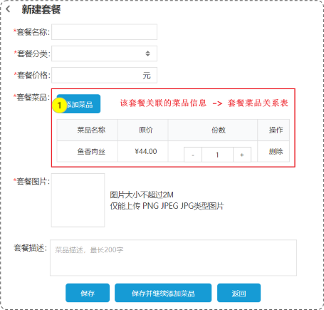

# MyBatis

`MyBatis` 是一款优秀的 **持久层** 框架，用于简化 `JDBC` 的开发。

官网：https://mybatis.org/mybatis-3/zh/index.html 


## 快速入门


## 主键返回

在某些应用场景中我们需要用到刚刚新增的数据主键ID来进一步操作，比如在新增菜品套餐时候需添加一些菜品数据，而这些数据需要依赖于菜品套餐，所以就需要先新增套餐并获取ID后再与菜品数据的ID进行关联




代码演示

```java
public interface UserMapper {
    @Select("select * from user where uid = #{uid}")
    public User info(Integer uid);

    // 核心代码
    @Options(keyProperty = "uid", useGeneratedKeys = true)
    @Insert("insert into user(uname) values(uname)")
    public Integer add(User user);
}
```

```java
public void add(User user) {
    SqlSession sqlSession = MybatisUtils.getSession();

    UserMapper userMapper = sqlSession.getMapper(UserMapper.class);

    Integer n = userMapper.add(user);
    System.out.println(n >= 1 ? "新增成功" : "新增失败");

    // 获取数据的主键ID
    System.out.println(user.getUid());

    MybatisUtils.close(sqlSession);
}
```


## 基于 XML 增删改查

### 项目结构


### pom.xml

```xml
<?xml version="1.0" encoding="UTF-8"?>
<project xmlns="http://maven.apache.org/POM/4.0.0"
         xmlns:xsi="http://www.w3.org/2001/XMLSchema-instance"
         xsi:schemaLocation="http://maven.apache.org/POM/4.0.0 http://maven.apache.org/xsd/maven-4.0.0.xsd">
    <modelVersion>4.0.0</modelVersion>

    <groupId>liuyuyang</groupId>
    <artifactId>untitled</artifactId>
    <version>1.0-SNAPSHOT</version>

    <properties>
        <maven.compiler.source>17</maven.compiler.source>
        <maven.compiler.target>17</maven.compiler.target>
        <project.build.sourceEncoding>UTF-8</project.build.sourceEncoding>
    </properties>

    <dependencies>
        <!--mysql-->
        <dependency>
            <groupId>mysql</groupId>
            <artifactId>mysql-connector-java</artifactId>
            <version>8.0.28</version>
        </dependency>

        <!--mybatis-->
        <dependency>
            <groupId>org.mybatis</groupId>
            <artifactId>mybatis</artifactId>
            <version>3.5.9</version>
        </dependency>

        <!--junit-->
        <dependency>
            <groupId>junit</groupId>
            <artifactId>junit</artifactId>
            <version>4.13.2</version>
            <scope>test</scope>
        </dependency>

        <!--lombok-->
        <dependency>
            <groupId>org.projectlombok</groupId>
            <artifactId>lombok</artifactId>
            <version>1.18.26</version>
        </dependency>
    </dependencies>
</project>
```


### Student

定义学生信息以及 `JavaBean` 

```java
package src.domain;

import lombok.Data;
import lombok.AllArgsConstructor;

@Data
@AllArgsConstructor
public class Student {
    private Integer id;
    private String name;
    private Integer gender;
    private String birthday;
    private String info;
}
```


### StudentMapper

在 `StudentMapper` 接口中定义增删改查方法

```java
package src.mapper;

import src.domain.Student;

import java.util.List;

public interface StudentMapper {
    public Integer add(Student student);

    public Integer del(Integer id);

    public Integer update(Student student);

    public Student info(Integer id);

    public List<Student> all();
}
```


### MybatisUtils

定义工具类，用于减少重复性的操作

```java
package src.utils;

import org.apache.ibatis.io.Resources;
import org.apache.ibatis.session.SqlSession;
import org.apache.ibatis.session.SqlSessionFactory;
import org.apache.ibatis.session.SqlSessionFactoryBuilder;

import java.io.IOException;
import java.io.InputStream;

public class MybatisUtils {
    static SqlSessionFactory sessionFactory = null;

    static {
        try {
            // 加载 SqlMapConfig.xml 文件
            InputStream is = Resources.getResourceAsStream("SqlMapConfig.xml");

            // 通过解析 SqlMapConfig.xml 文件创建 SqlSessionFactory 对象
            sessionFactory = new SqlSessionFactoryBuilder().build(is);
        } catch (IOException e) {
            throw new RuntimeException(e);
        }
    }

    // 获取session
    public static SqlSession getSession() {
        SqlSession session = sessionFactory.openSession();
        return session;
    }

    public static void close(SqlSession session) {
        if (session != null) {
            // 自动提交事务
            session.commit();

            // 自动释放资源
            session.close();
        }
    }
}
```


### Main

定义增删改查的最终实现

```java
import org.apache.ibatis.session.SqlSession;
import src.domain.Student;
import src.mapper.StudentMapper;
import src.utils.MybatisUtils;

import java.io.IOException;
import java.util.List;

public class Main {
    // 新增数据
    public void add(Student student) {
        SqlSession session = MybatisUtils.getSession();
        StudentMapper studentMapper = session.getMapper(StudentMapper.class);

        // 核心操作
        Integer n = studentMapper.add(student);
        System.out.println(n == 1 ? "新增成功" : "新增失败");

        // 释放资源
        MybatisUtils.close(session);
    }

    // 删除数据
    public void del(Integer id) {
        SqlSession session = MybatisUtils.getSession();
        StudentMapper studentMapper = session.getMapper(StudentMapper.class);

        Integer n = studentMapper.del(id);
        System.out.println(n);
        System.out.println(n == 1 ? "删除成功" : "删除失败");

        MybatisUtils.close(session);
    }

    // 修改数据
    public void update(Student student) {
        SqlSession session = MybatisUtils.getSession();
        StudentMapper studentMapper = session.getMapper(StudentMapper.class);

        Integer n = studentMapper.update(student);
        System.out.println(n == 1 ? "修改成功" : "修改失败");

        MybatisUtils.close(session);
    }

    // 获取数据
    public void info(Integer id) throws IOException {
        SqlSession session = MybatisUtils.getSession();
        StudentMapper studentMapper = session.getMapper(StudentMapper.class);

        Student student = studentMapper.info(id);
        System.out.println(student);

        MybatisUtils.close(session);
    }

    // 获取全部数据
    public void all() throws IOException {
        SqlSession session = MybatisUtils.getSession();
        StudentMapper studentMapper = session.getMapper(StudentMapper.class);

        List<Student> student = studentMapper.all();
        System.out.println(student);

        MybatisUtils.close(session);
    }
}
```


### StudentMapper.xml

定义 `StudentMapper.xml` 用于定义增删改查 `sql` 语句

```xml
<?xml version="1.0" encoding="UTF-8" ?>
<!DOCTYPE mapper
  PUBLIC "-//mybatis.org//DTD Mapper 3.0//EN"
  "http://mybatis.org/dtd/mybatis-3-mapper.dtd">

<mapper namespace="src.mapper.StudentMapper">
    <!--id表示src.mapper.StudentMapper接口中对应的方法，parameterType表示该方法的参数类型-->
    <insert id="add" parameterType="src.domain.Student">
        <!--这里直接写对应的SQL语句-->
        insert into student(name, gender, birthday, info) values(#{name}, #{gender}, #{birthday}, #{info})
    </insert>

    <delete id="del" parameterType="Integer">
        delete from student where id = #{id}
    </delete>

    <update id="update" parameterType="src.domain.Student">
        update student set name=#{name}, gender=#{gender}, birthday=#{birthday}, info=#{info} where id=#{id}
    </update>

    <!--resultType表示该方法的返回值类型-->
    <select id="info" resultType="src.domain.Student">
        select * from student where id=#{id}
    </select>

    <select id="all" resultType="src.domain.Student">
        select * from student
    </select>

    <!--    假设数据库的字段为create_time, 而JavaBean为createTime，他们之间不一致。-->
    <!--    要么将他们改成一致的，要么就使用resultMap映射-->
    <!--    <resultMap id="StudentResultMap" type="src.domain.Student">-->
    <!--        property为JavaBean | column为数据库列字段-->
    <!--        <result property="gendent" column="sex"></result>-->
    <!--    </resultMap>-->

    <!--    resultMap的值为上述<resultMap  id="StudentResultMap">的id-->
    <!--    <select id="query" resultType="src.domain.Student" resultMap="StudentResultMap">-->
    <!--        select * from student-->
    <!--    </select>-->
</mapper>
```

**注意：**

增删改的方法返回值为 `Integer` 类型，如果成功就返回 `1` ，失败就返回 `0` 并且支持使用 `parameterType` 来约束参数类型

**而**

查询方法因为返回值是自己定义的，所以既支持 `parameterType` 约束参数类型，也支持 `resultType` 来约束返回值类型等操作


### SqlMapConfig.xml

```xml
<?xml version="1.0" encoding="UTF-8" ?>
<!DOCTYPE configuration
        PUBLIC "-//mybatis.org//DTD Config 3.0//EN"
        "http://mybatis.org/dtd/mybatis-3-config.dtd">
<configuration>

    <settings>
        <!--在控制台输出发送的sql日志-->
        <setting name="logImpl" value="STDOUT_LOGGING"/>
    </settings>

    <environments default="development">
        <environment id="development">
            <transactionManager type="JDBC"/>

            <!--目前只关注这部分内容,它的作用就是声明要连接的数据信息-->
            <dataSource type="POOLED">
                <property name="driver" value="com.mysql.cj.jdbc.Driver"/>
                <property name="url" value="jdbc:mysql://localhost:3306/student"/>
                <property name="username" value="root"/>
                <property name="password" value="123123"/>
            </dataSource>
        </environment>
    </environments>

    <mappers>
        <!--声明含有sql的接口所在的位置-->
        <mapper resource="mapper/StudentMapper.xml"></mapper>
    </mappers>
</configuration>
```


### Test

```java
import src.domain.Student;

import java.io.IOException;

public class Test {
    @org.junit.Test
    public void run() throws IOException {
        Main m = new Main();
        
        // 新增
        m.add(new Student(null, "zs", 1, "2023/10/11", "介绍"));

        // 删除
        m.del(4);

        // 修改
        m.update(new Student(6, "ls", 2, "2023/3/14", "介绍666"));

        // 获取
        m.info(8);

        // 获取全部
        m.all();
    }
}
```


## 基于注解 增删改查

### 项目结构


## 驼峰映射

假如数据库中的字段为 `user_id` ，而 `JavaBean` 属性为 `userId`。数据不匹配就会导致 `userId` 的值为 `null`

**有两种方式可以解决这个问题：**

**第一种、** 通过注解或XML映射（适合单个）

```java
@Results({
	@Result(property = "userId", column = "user_id"),
})
```


**第二种、** 配置驼峰映射（适合多个）

配置驼峰映射后，会自动去除 `_` 并且将 `_` 后面的一个字母变成大写。

比如 `user_id` 自动转换为 `userId`

```xml
<setting name="mapUnderscoreToCamelCase" value="true"/>
```


在 `SqlMapConfig.xml` 中配置

```xml
<?xml version="1.0" encoding="UTF-8" ?>
<!DOCTYPE configuration
        PUBLIC "-//mybatis.org//DTD Config 3.0//EN"
        "http://mybatis.org/dtd/mybatis-3-config.dtd">
<configuration>
    
    <settings>
        <!--在这个位置配置驼峰映射-->
        <setting name="mapUnderscoreToCamelCase" value="true"/>
    </settings>
</configuration>
```


## 多表查询

### 一对多

将 `user` 与 `order` 数据进行关联，查询 `user` 并将对应的 `order` 数据显示


#### 逻辑关联

直接通过逻辑进行关联

```java
    // 获取用户列表
    public void userList() {
        SqlSession sqlSession = MybatisUtils.getSession();
        UserMapper userMapper = sqlSession.getMapper(UserMapper.class);
        OrderMapper orderMapper = sqlSession.getMapper(OrderMapper.class);

        List<User> userList = userMapper.list();

        // 1. 循环user拿到每一项的id
        for(User user: userList){
            // 2. 然后通过id拿到order对应的所有数据
            List<Order> orderList = orderMapper.list(user.getUid());
            // 3. 将值赋值给orderList
            user.setOrderList(orderList);
        }

        MybatisUtils.close(sqlSession);
    }
```


#### 注解关联

通过 `@Results` 进行注解关联

```java
@Results({
	// 将查询结果中的uid映射到实体类User的uid属性上
    @Result(property = "uid", column = "uid"),
    @Result(property = "uname", column = "uname"),
    // 将查询结果中的uid依次传递给src.mapper.OrderMapper.list方法并映射到User的类属性orderList中
    // 使用@Many来指定将uid传递给哪个方法的参数
    @Result(property = "orderList", many = @Many(select = "src.mapper.OrderMapper.list"), column = "uid")
    })
```


代码示例

```java
public interface UserMapper {
    @Select("select * from user")
    @Results({
            @Result(property = "uid", column = "uid"),
            @Result(property = "uname", column = "uname"),
            @Result(property = "orderList", many = @Many(select = "src.mapper.OrderMapper.list"), column = "uid")
    })
    public List<User> list();
}
```


注意

1. 如果 `property` / `column` 的值一致，则可以省略不写

   ```java
   @Result(property = "uname", column = "uname")
   ```

   

2. 但如果 `property` / `column` 的值被使用，则不能省略

   ```java
   @Result(property = "uid", column = "uid"),
   
   // uid被使用，所以上方代码不能被省略
   @Result(property = "orderList", many = @Many(select = "src.mapper.OrderMapper.list"), column = "uid")
   ```


3. `@Many` 表示一对多的关系，一个用户对应对个订单

   ```sql
   @Result(property = "orderList", many = @Many(select = "src.mapper.OrderMapper.list"), column = "uid")
   ```

**代码目录：** `代码/Mybatis/多表-注解方式`


#### XML 关联

通过 `XML` 方式进行关联

`resultMap` 相当于 `@Results`，用于配置数据表和 `JavaBean` 映射关系

```xml
<select id="list" resultType="src.domain.User" resultMap="UserResultMap">
	select * from user
</select>
    
<!--id对应的是标签中的resultMap属性，用于起到关联映射作用-->
<!--type表示JavaBean的类型-->
<resultMap id="UserResultMap" type="src.domain.User">
    <!--用于配置主键的映射关系-->
	<id property="uid" column="uid" />
    <!--用于配置普通字段的映射关系-->
    <result property="uname" column="uname" />
    <!--用于配置一对多的映射关系-->
    <collection property="orderList" select="src.mapper.OrderMapper.list" column="uid" />
</resultMap>
```

**代码目录：** `代码/Mybatis/多表-注解方式`


### 多对一

查询所有订单数据，以及订单所属用户信息


#### 逻辑关联

```java
	// 获取订单数据
    public void orderInfo(Integer id) {
        SqlSession sqlSession = MybatisUtils.getSession();
        UserMapper userMapper = sqlSession.getMapper(UserMapper.class);
        OrderMapper orderMapper = sqlSession.getMapper(OrderMapper.class);

        List<Order> orderList = orderMapper.list(id);
        for(Order order: orderList){
            User user = userMapper.info(id);

            order.setUser(user);
        }
        System.out.println(orderList);

        MybatisUtils.close(sqlSession);
    }
```


#### 注解关联

```java
	// 查询指定的订单数据以及所属用户
	@Select("select * from `order` where oid = #{oid}")
    @Results({
            @Result(property = "oid", column = "oid"),
            @Result(property = "price", column = "price"),
            @Result(property = "userId", column = "user_id"),
            @Result(property = "user", one = @One(select = "src.mapper.UserMapper.info"), column = "user_id"),
    })
    public Order info(@Param("oid") Integer oid);
```


**注意：** `@One` 表示多对一的关系，多个订单对应一个用户，所以使用的是 `@One` 而不是 `@Many`

```sql
@Result(property = "user", one = @One(select = "src.mapper.UserMapper.info"), column = "user_id")
```


#### XML 关联


## ResultMap

代码示例

```java
public interface OrderMapper {
    // 查询指定的订单数据以及所属用户
    @Select("select * from `order` where oid = #{oid}")
    @Results({
            @Result(property = "user", one = @One(select = "src.mapper.UserMapper.info"), column = "user_id")
    })
    public Order info(@Param("oid") Integer oid);


    // 查询指定用户的所有订单数据
    @Select("select * from `order` where user_id=#{uid}")
    @Results({
            @Result(property = "user", one = @One(select = "src.mapper.UserMapper.info"), column = "user_id")
    })
    public List<Order> list(@Param("uid") Integer uid);
}
```

从上述代码中我们可以看到他们的 `@Results` 注解映射条件都一样，造成了代码冗余，所以可以使用 `@ResultMap` 来解决

```java
public interface OrderMapper {
    @Select("select * from `order` where oid = #{oid}")
    // 给它指定一个id和value
    @Results(id = "orderMap", value = {
            @Result(property = "user", one = @One(select = "src.mapper.UserMapper.info"), column = "user_id")
    })
    public Order info(@Param("oid") Integer oid);


    @Select("select * from `order` where user_id=#{uid}")
    // 这里的参数写上述的id就可以实现注解复用，减少代码冗余
    @ResultMap("orderMap")
    public List<Order> list(@Param("uid") Integer uid);
}
```


## 疑点

1. **如果同时使用了注解、XML方式，那么最终会优先执行哪种方式呢？**

   **答：** 程序会优先执行注解方式，而 `XML` 方式并不会执行
