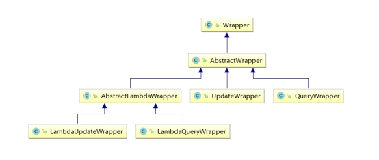
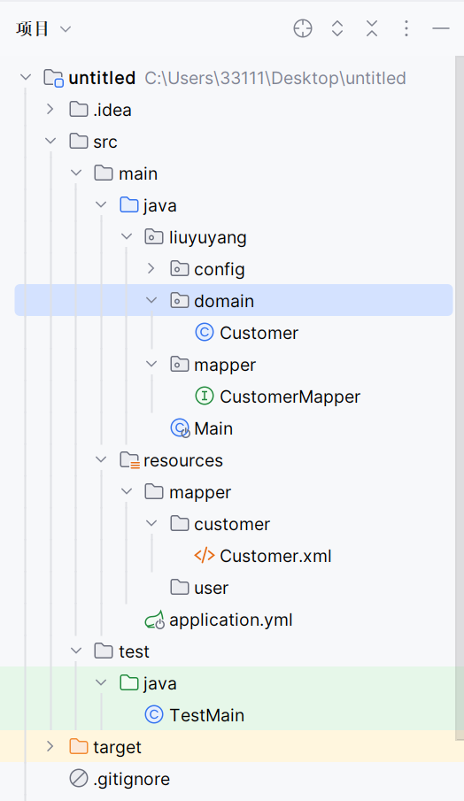
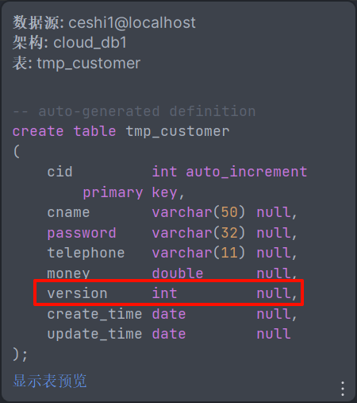

# Mybatis-Plus

## 快速上手

1. 确定 `spring boot` 的版本

```xml
<parent>
    <groupId>org.springframework.boot</groupId>
    <artifactId>spring-boot-starter-parent</artifactId>
    <version>2.3.5.RELEASE</version>
</parent>   
```


2. 导入相关依赖

~~~xml
    <dependencies>
        <!-- web 开发 -->
        <dependency>
            <groupId>org.springframework.boot</groupId>
            <artifactId>spring-boot-starter-web</artifactId>
        </dependency>

        <!--MySQL数据库驱动-->
        <dependency>
            <groupId>mysql</groupId>
            <artifactId>mysql-connector-java</artifactId>
        </dependency>

        <!--支持lombok-->
        <dependency>
            <groupId>org.projectlombok</groupId>
            <artifactId>lombok</artifactId>
        </dependency>

        <!--测试-->
        <dependency>
            <groupId>org.springframework.boot</groupId>
            <artifactId>spring-boot-starter-test</artifactId>
        </dependency>

        <dependency>
            <groupId>com.baomidou</groupId>
            <artifactId>mybatis-plus-boot-starter</artifactId>
            <version>3.4.0</version>
        </dependency>
    </dependencies>
~~~


3. 配置 application.yml

```yml
spring:
  datasource:
    # MySQL5：com.mysql.jdbc.Driver
    driver-class-name: com.mysql.cj.jdbc.Driver
    url: jdbc:mysql://localhost:3306/cloud_db?useUnicode=true&characterEncoding=UTF-8&serverTimezone=UTC
    username: root
    password: 1234
mybatis-plus:
  configuration:
    log-impl: org.apache.ibatis.logging.stdout.StdOutImpl  #输出日志
```


4. 创建数据库

```mysql
CREATE DATABASE cloud_db;
USE cloud_db;

CREATE TABLE `tmp_customer` (
  `cid` INT(11) NOT NULL AUTO_INCREMENT,
  `cname` VARCHAR(50) DEFAULT NULL,
  `password` VARCHAR(32) DEFAULT NULL,
  `telephone` VARCHAR(11) DEFAULT NULL,
  `money` DOUBLE DEFAULT NULL,
  `version` INT(11) DEFAULT NULL,
  `create_time` DATE DEFAULT NULL,
  `update_time` DATE DEFAULT NULL,
  PRIMARY KEY (`cid`)
);

INSERT  INTO `tmp_customer`(`cid`,`cname`,`password`,`telephone`,`money`,`version`,`create_time`,`update_time`) 
VALUES (1,'jack','1234','110',1000,NULL,NULL,NULL),(2,'rose','1234','112',1000,NULL,NULL,NULL),(3,'tom','1234','119',1000,NULL,NULL,NULL);
```


5. 创建模型类

```java
package liuyuyang.domain;

import com.baomidou.mybatisplus.annotation.IdType;
import com.baomidou.mybatisplus.annotation.TableField;
import com.baomidou.mybatisplus.annotation.TableId;
import com.baomidou.mybatisplus.annotation.TableName;
import lombok.Data;

import java.util.Date;
import java.util.List;

@Data
@TableName("tmp_customer")
public class Customer {
    @TableId
    private Integer cid;
    private String cname;
    private String password;
    private String telephone;
    private String money;
    private Date createTime;
    private Date updateTime;

    @TableField(exist = false)
    private List<Integer> ids;
}
```

`Mybatis` 与 `MybatisPlus` 字段名的不同之处

@Table   -->   @TableName

@Id   -->  @TableId


6. 创建 `mapper` 文件

```java
package liuyuyang.mapper;

import com.baomidou.mybatisplus.core.mapper.BaseMapper;
import liuyuyang.domain.Customer;
import org.apache.ibatis.annotations.Mapper;

@Mapper
public interface CustomerMapper extends BaseMapper<Customer> {  // 注意
}
```


7. 启动类

```java
package liuyuyang;

import org.springframework.boot.SpringApplication;
import org.springframework.boot.autoconfigure.SpringBootApplication;

@SpringBootApplication
public class Main {
    public static void main(String[] args) {
        System.out.println("Hello world!");
        SpringApplication.run(Main.class, args);
    }
}
```


8. 测试类

```java
import liuyuyang.Main;
import liuyuyang.domain.Customer;
import liuyuyang.mapper.CustomerMapper;
import org.junit.Test;
import org.junit.runner.RunWith;
import org.springframework.boot.test.context.SpringBootTest;
import org.springframework.test.context.junit4.SpringRunner;

import javax.annotation.Resource;
import java.util.List;

@RunWith(SpringRunner.class)
@SpringBootTest(classes = Main.class)
public class TestMain {
    @Resource
    private CustomerMapper customerMapper;

    @Test
    public void run() {
        list();
    }

    // 查询所有
    public void list() {
        List<Customer> data = customerMapper.selectList(null);

        data.forEach(System.out::println);
        System.out.println(data);
    }
}
```


主键生成策略

```java
@Data
@TableName("tmp_customer")
public class Customer {
    @TableId(type = IdType.AUTO)
    private Integer cid;
}
```

如果使用 `MyBatis Plus` 进行数据库操作，建议在实体类中使用 `@TableId` 注解来明确指定主键生成策略，以确保数据表的主键属性与实体类的主键属性一致


## CRUD

通过 `Mybatis Plus` 完成增删改查操作

```java
import liuyuyang.Main;
import liuyuyang.domain.Customer;
import liuyuyang.mapper.CustomerMapper;
import org.junit.Test;
import org.junit.runner.RunWith;
import org.springframework.boot.test.context.SpringBootTest;
import org.springframework.test.context.junit4.SpringRunner;

import javax.annotation.Resource;
import java.util.Arrays;
import java.util.List;

@RunWith(SpringRunner.class)
@SpringBootTest(classes = Main.class)
public class TestMain {
    @Resource
    private CustomerMapper customerMapper;

    @Test
    public void run() {
        // add();
        // del();
        // delBatch();
        // update();
        // get();
        list();
    }

    // 添加数据
    public void add() {
        Customer customer = new Customer();
        customer.setCname("测试");

        Integer n = customerMapper.insert(customer);
        System.out.println(n == 1 ? "新增成功" : "新增失败");
    }

    // 修改数据
    public void update() {
        Customer customer = new Customer();
        customer.setCid(2);
        customer.setCname("测试修改");

        Integer n = customerMapper.updateById(customer);
        System.out.println(n == 1 ? "修改成功" : "修改失败");
    }

    // 删除数据
    public void del() {
        Integer n = customerMapper.deleteById(1);
        System.out.println(n == 1 ? "删除成功" : "删除失败");
    }

    // 批量删除
    public void delBatch() {
        Integer n = customerMapper.deleteBatchIds(Arrays.asList(1, 2, 3));
        System.out.println(n >= 1 ? "删除成功" : "删除失败");
    }

    // 查询指定数据
    public void get() {
        Customer customer = customerMapper.selectById(1);
        System.out.println(customer);
    }

    // 根据ID批量查询
    public void batchids() {
        // 批量查询ID为：1 3 5的数据
        List<Customer> data = customerMapper.selectBatchIds(Arrays.asList(1, 3, 5));
        System.out.println(data);
    }

    // 查询所有
    public void list() {
        List<Customer> data = customerMapper.selectList(null);

        data.forEach(System.out::println);
        System.out.println(data);
    }
}
```


## Wrapper



* Wrapper ： 条件构造抽象类，最顶端父类
  * AbstractWrapper ： 用于查询条件封装，生成 sql 的 where 条件
    * QueryWrapper ： Entity 对象封装操作类，不是用lambda语法
    * UpdateWrapper ： Update 条件封装，用于Entity对象更新操作
    * AbstractLambdaWrapper ： Lambda 语法使用 Wrapper统一处理解析 lambda 获取 column。
      * LambdaQueryWrapper ：看名称也能明白就是用于Lambda语法使用的查询Wrapper
      * LambdaUpdateWrapper ： Lambda 更新封装Wrapper

* 如果想进行复杂条件查询，那么需要使用条件构造器 Wapper，涉及到如下方法

| 方法名      | 描述                                                   |
| ----------- | ------------------------------------------------------ |
| selectOne   | 根据条件查询一个，结果：0或1，如果查询多个异常         |
| selectCount | 查询总条数                                             |
| selectList  | 查询所有                                               |
| selectMaps  | 将一条记录封装到Map中，最后返回List<Map<Sting,Object>> |
| selectObjs  | 将一条记录封装到Object中，最后返回List\<Object\>       |
| update      | 更新指定条件                                           |
| delete      | 删除指定条件                                           |


* 拼凑条件相关关键字

| **查询方式**     | **说明**                          |
| ---------------- | --------------------------------- |
| **setSqlSelect** | 设置 SELECT 查询字段              |
| **where**        | WHERE 语句，拼接 + WHERE 条件     |
| **and**          | AND 语句，拼接 + AND 字段=值      |
| **andNew**       | AND 语句，拼接 + AND (字段=值)    |
| **or**           | OR 语句，拼接 + OR 字段=值        |
| **orNew**        | OR 语句，拼接 + OR (字段=值)      |
| **eq**           | 等于=                             |
| **allEq**        | 基于 map 内容等于=                |
| **ne**           | 不等于<>                          |
| **gt**           | 大于>                             |
| **ge**           | 大于等于>=                        |
| **lt**           | 小于<                             |
| **le**           | 小于等于<=                        |
| **like**         | 模糊查询 LIKE                     |
| **notLike**      | 模糊查询 NOT LIKE                 |
| **in**           | IN 查询                           |
| **notIn**        | NOT IN 查询                       |
| **isNull**       | NULL 值查询                       |
| **isNotNull**    | IS NOT NULL                       |
| **groupBy**      | 分组 GROUP BY                     |
| **having**       | HAVING 关键词                     |
| **orderBy**      | 排序 ORDER BY                     |
| **orderAsc**     | ASC 排序 ORDER BY                 |
| **orderDesc**    | DESC 排序 ORDER BY                |
| **exists**       | EXISTS 条件语句                   |
| **notExists**    | NOT EXISTS 条件语句               |
| **between**      | BETWEEN 条件语句                  |
| **notBetween**   | NOT BETWEEN 条件语句              |
| **addFilter**    | 自由拼接 SQL                      |
| **last**         | 拼接在最后，例如：last(“LIMIT 1”) |


**代码示例**

```java
// 根据条件查询
public void condition() {
    QueryWrapper<Customer> queryWrapper = new QueryWrapper<>();

    // 等值查询
    queryWrapper.eq("cid", 1);

    // 模糊查询
    queryWrapper.like("cname", "o");

    // 批量查询
    // queryWrapper.in("cid", Arrays.asList(1, 3, 5));
    queryWrapper.in("cid", Arrays.asList(1, 3, 5));

    // 范围查询
    queryWrapper.ge("create_time", "2023-12-07"); // 大于等于
    queryWrapper.le("create_time", "2023-12-07"); // 小于等于

    List<Customer> data = customerMapper.selectList(queryWrapper);
    System.out.println(data);
}
```


条件判断

```java
public void condition() {
    QueryWrapper<Customer> queryWrapper = new QueryWrapper<>();

    Customer customer = new Customer();
    customer.setCname("admin");
    customer.setPassword("123123");

    // 方式一
    if (customer.getCname() != null) {
        queryWrapper.eq("cid", 1);
    }

    // 方式二
    queryWrapper.eq(customer.getCname() != null, "cid", 1);

    List<Customer> data = customerMapper.selectList(queryWrapper);
    System.out.println(data);
}
```


批量更新

```java
// 根据条件批量更新
public void batchUpdate() {
    // 更新数据
    Customer customer = new Customer();
    customer.setVersion(100);

    // 条件
    UpdateWrapper<Customer> updateWrapper = new UpdateWrapper<>();
    updateWrapper.in("cid", 1, 3, 5);

    // 更新
    Integer n = customerMapper.update(customer, updateWrapper);
    System.out.println(n >= 1 ? "更新成功" : "更新失败");
}
```


## 分页查询

主体插件: MybatisPlusInterceptor，该插件内部插件集:

* 分页插件: PaginationInnerInterceptor
* 多租户插件: TenantLineInnerInterceptor
* 动态表名插件: DynamicTableNameInnerInterceptor
* 乐观锁插件: OptimisticLockerInnerInterceptor
* sql性能规范插件: IllegalSQLInnerInterceptor
* 防止全表更新与删除插件: BlockAttackInnerInterceptor


**配置类**

```java
package liuyuyang.config;

import com.baomidou.mybatisplus.annotation.DbType;
import com.baomidou.mybatisplus.autoconfigure.ConfigurationCustomizer;
import com.baomidou.mybatisplus.extension.plugins.MybatisPlusInterceptor;
import com.baomidou.mybatisplus.extension.plugins.inner.PaginationInnerInterceptor;
import org.springframework.context.annotation.Bean;
import org.springframework.context.annotation.Configuration;

@Configuration
public class MybatisPlusConfig {
    @Bean
    public MybatisPlusInterceptor mybatisPlusInterceptor() {
        // 创建一个MybatisPlusInterceptor对象
        MybatisPlusInterceptor mybatisPlusInterceptor = new MybatisPlusInterceptor();

        // 安装分页插件
        mybatisPlusInterceptor.addInnerInterceptor(new PaginationInnerInterceptor(DbType.MYSQL));

        return mybatisPlusInterceptor;
    }

    // 新的分页插件,一缓和二缓遵循mybatis的规则,需要设置 MybatisConfiguration#useDeprecatedExecutor = false 避免缓存出现问题(该属性会在旧插件移除后一同移除)
    @Bean
    public ConfigurationCustomizer configurationCustomizer() {
        return configuration -> configuration.setUseDeprecatedExecutor(false);
    }
}
```


**代码示例**

```java
// 分页查询
public void pageQuery() {
    int num = 1;
    int size = 3;

    Page<Customer> page = new Page<>(num, size);
    page.setSearchCount(true);

    // 查询
    customerMapper.selectPage(page, null);

    // 分页数据
    System.err.println("当前页码：" + page.getCurrent());
    System.err.println("每页显示记录数：" + page.getSize());
    System.err.println("总页数：" + page.getPages());
    System.err.println("总记录数：" + page.getTotal());
    System.err.println("是否有下一页：" + page.hasNext());
    System.err.println("是否有上一页：" + page.hasPrevious());

    // 分页数据列表
    page.getRecords().forEach(System.err::println);
}
```


## 配置

### 驼峰命名

在全局配置了 `map-underscore-to-camel-case: true` 后，像 `student_score` 这样的数据就不需要再手动通过  `@TableField(value = "student_score")` 注解映射为 `studentScore` 了，他会自动将下划线后面的首字母转换为大写并去除下划线

```yml
mybatis-plus:
  configuration:
    map-underscore-to-camel-case: true  # 驼峰命名
```


### 表前缀

假设我们每个数据表前缀为：`tmp_` ，那么在 `JavaBean` 中也必须加上这个前缀，如果想要省略这个前缀可以这么做：

1. 首先在 `application.yml` 中配置如下

```yml
mybatis-plus:
  global-config:
    db-config:
      table-prefix: tmp_ # 配置全局表前缀
```


2. 在 `JavaBean` 中设置 `keepGlobalPrefix = true` 即可开启表前缀

```java
@Data
@TableName(value = "customer", keepGlobalPrefix = true) // 核心代码
public class Customer {
    @TableId(type = IdType.AUTO)
    private Integer cid;
    private String cname;
    private String password;
    private String telephone;
    private String money;
    private Date createTime;
    private Date updateTime;

    @TableField(exist = false)
    private List<Integer> ids;
}
```


### 主键ID

在全局配置了 `id-type: auto` 后，就不需要再给每个类的属性手动设置 `@TableId` 注解了

```yml
mybatis-plus:
  global-config:
    db-config:
      id-type: auto  # 全局配置 id自动增强
```


## XML方式

项目结构




配置 application

```yml
mybatis-plus:
  mapper-locations: classpath*:/mapper/**/*.xml # xml映射文件的位置
  type-aliases-package: liuyuyang/domain # 实体类包路径(非必需)
```


定义 Mapper

```java
@Mapper
public interface CustomerMapper extends BaseMapper<Customer> {
    public List<Customer> selectAll();
}
```


xml 核心代码

```xml
<?xml version="1.0" encoding="UTF-8"?>
<!DOCTYPE mapper PUBLIC "-//mybatis.org//DTD Mapper 3.0//EN" "http://mybatis.org/dtd/mybatis-3-mapper.dtd">

<!--配置Mapper的路径-->
<mapper namespace="liuyuyang.mapper.CustomerMapper">

    <!-- 路径可以写全-->
    <!-- <select id="selectAll" resultType="liuyuyang.domain.Customer">-->
    <!--也可以通过配置type-aliases-package中的配置项简化路径-->
    <select id="selectAll" resultType="Customer">
        select * from tmp_customer
    </select>
</mapper>
```


测试类

```java
@RunWith(SpringRunner.class)
@SpringBootTest(classes = Main.class)
public class TestMain {
    @Resource
    private CustomerMapper customerMapper;

    @Test
    public void run() {
        List<Customer> data = customerMapper.selectAll();
        System.out.println(data);
    }
}
```


## 自动填充

项目中经常会遇到一些数据，每次都使用相同的方式填充，例如记录的创建时间，更新时间等。

我们可以使用 `MyBatis Plus` 的自动填充功能，完成这些字段的赋值工作：


1. 首先在实体类中通过 `@TableField` 注解的 `fill` 属性来设置新增还是更新时候填充数据

```java
@Data
@TableName(value = "customer", keepGlobalPrefix = true)
public class Customer {
    @TableId(type = IdType.AUTO)
    private Integer cid;
    private String cname;
    private String password;
    private String telephone;
    private String money;

    // 核心代码：设置数据填充
    @TableField(value = "create_time", fill = FieldFill.INSERT)
    private Date createTime;
    @TableField(value = "updateTime", fill = FieldFill.INSERT_UPDATE)
    private Date updateTime;

    @TableField(exist = false)
    private List<Integer> ids;
}
```


2. 实现元对象处理器的接口：`com.baomidou.mybatisplus.core.handlers.MetaObjectHandler`

```java
package liuyuyang.handler;

import com.baomidou.mybatisplus.core.handlers.MetaObjectHandler;
import org.apache.ibatis.reflection.MetaObject;
import org.springframework.stereotype.Component;

import java.util.Date;

@Component
public class MyMetaObjectHandler implements MetaObjectHandler {
    // 新增数据时候自动触发
    @Override
    public void insertFill(MetaObject metaObject) {
        this.setFieldValByName("createTime", new Date(), metaObject);
    }

    // 更新时候时候自动触发
    @Override
    public void updateFill(MetaObject metaObject) {
        this.setFieldValByName("updateTime", new Date(), metaObject);
    }
}
```


3. 在测试类中新增或更新数据

```java
import liuyuyang.Main;
import liuyuyang.domain.Customer;
import liuyuyang.mapper.CustomerMapper;
import org.junit.Test;
import org.junit.runner.RunWith;
import org.springframework.boot.test.context.SpringBootTest;
import org.springframework.test.context.junit4.SpringRunner;

import javax.annotation.Resource;
import java.util.Arrays;
import java.util.List;

@RunWith(SpringRunner.class)
@SpringBootTest(classes = Main.class)
public class TestMain {
    @Resource
    private CustomerMapper customerMapper;

    @Test
    public void run() {
        add();
        update();
    }

    // 添加数据
    public void add() {
        Customer customer = new Customer();
        customer.setCname("测试");

        Integer n = customerMapper.insert(customer);
        System.out.println(n == 1 ? "新增成功" : "新增失败");
    }

    // 修改数据
    public void update(){
        Customer customer = new Customer();
        customer.setCid(2);
        customer.setCname("测试修改");

        Integer n = customerMapper.updateById(customer);
        System.out.println(n == 1 ? "修改成功" : "修改失败");
    }
}
```


## 乐观锁

1. 修改表结构，添加 `version` 字段



2. 修改 `JavaBean`，添加 `version` 属性

```java
@Data
@TableName(value = "customer", keepGlobalPrefix = true)
public class Customer {
    @TableId(type = IdType.AUTO)
    private Integer cid;
    private String cname;
    private String password;
    private String telephone;
    private String money;
    
    // 核心代码
    @Version
    @TableField(fill = FieldFill.INSERT)
    private Integer version;
}
```


3. 元对象处理器接口添加 `version` 的 `insert` 默认值，保证有数据

```java
@Component
public class MyMetaObjectHandler implements MetaObjectHandler {
    // 新增数据时候自动触发
    @Override
    public void insertFill(MetaObject metaObject) {
        this.setFieldValByName("version", 1, metaObject); // 核心代码
    }

    // 更新时候时候自动触发
    @Override
    public void updateFill(MetaObject metaObject) {
        this.setFieldValByName("updateTime", new Date(), metaObject);
    }
}
```


4. 修改 `MybatisPlusConfig` 开启乐观锁

```java
@Configuration
public class MybatisPlusConfig {
    @Bean
    public MybatisPlusInterceptor mybatisPlusInterceptor() {
        // 创建一个MybatisPlusInterceptor对象
        MybatisPlusInterceptor mybatisPlusInterceptor = new MybatisPlusInterceptor();

        // 安装分页插件
        mybatisPlusInterceptor.addInnerInterceptor(new PaginationInnerInterceptor(DbType.MYSQL));
        
        // 核心代码：安装乐观锁插件
        mybatisPlusInterceptor.addInnerInterceptor(new OptimisticLockerInnerInterceptor());

        return mybatisPlusInterceptor;
    }

    // 新的分页插件,一缓和二缓遵循mybatis的规则,需要设置 MybatisConfiguration#useDeprecatedExecutor = false 避免缓存出现问题(该属性会在旧插件移除后一同移除)
    @Bean
    public ConfigurationCustomizer configurationCustomizer() {
        return configuration -> configuration.setUseDeprecatedExecutor(false);
    }
}
```


5. **测试：** 如果 `version=1` 就更新成功，否则更新失败

```java
@RunWith(SpringRunner.class)
@SpringBootTest(classes = Main.class)
public class TestMain {
    @Resource
    private CustomerMapper customerMapper;

    @Test
    public void run() {
        Customer customer = new Customer();
        customer.setCid(6);
        customer.setCname("测试数据");

        // 与数据库中数据一致，将更新成功，否则更新失败。
        customer.setVersion(1);

        Integer n = customerMapper.updateById(customer);
        System.out.println(n == 1 ? "更新成功" : "更新失败");
    }
}
```


## 逻辑删除

逻辑删除简单理解为假删除，也就是说不能真正删除数据而是修改数据的字段，0表示正常，1表示已删除的数据。这样数据被删除后还可以通过逻辑再找回来，比如真实项目中的回收站等功能，


1. 修改数据表结构，添加 `deleted` 字段

```mysql
alter table tmp_customer add column deleted int default 0;
```


2. 通过定义 `@TableLogic` 注解表示是否开启逻辑删除

```java
@Data
@TableName(value = "customer", keepGlobalPrefix = true)
public class Customer {
    @TableId(type = IdType.AUTO)
    private Integer cid;
    private String cname;
    private String password;
    private String telephone;
    private String money;

    // 核心代码：开启逻辑删除
    @TableLogic
    private Integer deleted;
}
```


测试类

```java
@Test
public void run() {
    Integer n = customerMapper.deleteById(5);
    System.out.println(n == 1 ? "删除成功" : "删除失败");
}
```


## 通用Service

继承 `IService<实体类>`

```java
package liuyuyang.service;

import com.baomidou.mybatisplus.extension.service.IService;
import liuyuyang.domain.Customer;

public interface CustomerService extends IService<Customer> {
}
```


继承 `ServiceImpl<Mapper接口, 实体类>` 并实现 `CustomerService` 接口

```java
package liuyuyang.service.impl;

import com.baomidou.mybatisplus.extension.service.impl.ServiceImpl;
import liuyuyang.domain.Customer;
import liuyuyang.mapper.CustomerMapper;
import liuyuyang.service.CustomerService;
import org.springframework.stereotype.Service;
import org.springframework.transaction.annotation.Transactional;

@Service
@Transactional
public class CustomerServiceImpl extends ServiceImpl<CustomerMapper,Customer> implements CustomerService {

}
```


完成增删改查操作

```java
import liuyuyang.Main;
import liuyuyang.domain.Customer;
import liuyuyang.service.CustomerService;
import org.junit.Test;
import org.junit.runner.RunWith;
import org.springframework.boot.test.context.SpringBootTest;
import org.springframework.test.context.junit4.SpringRunner;

import javax.annotation.Resource;
import java.util.Arrays;
import java.util.List;

@RunWith(SpringRunner.class)
@SpringBootTest(classes = Main.class)
public class TestMain {
    @Resource
    private CustomerService customerService;

    @Test
    public void run() {
        // add();
        // del();
        // delBatch();
        // update();
        // get();
        list();
    }

    // 添加数据
    public void add() {
        Customer customer = new Customer();
        customer.setCname("测试");

        boolean n = customerService.save(customer);
        System.out.println(n ? "新增成功" : "新增失败");
    }

    // 修改数据
    public void update() {
        Customer customer = new Customer();
        customer.setCid(2);
        customer.setCname("测试修改");

        boolean n = customerService.updateById(customer);
        System.out.println(n ? "修改成功" : "修改失败");
    }

    // 删除数据
    public void del() {
        boolean n = customerService.removeById(1);
        System.out.println(n ? "删除成功" : "删除失败");
    }

    // 批量删除
    public void delBatch() {
        boolean n = customerService.removeByIds(Arrays.asList(1, 2, 3));
        System.out.println(n ? "删除成功" : "删除失败");
    }

    // 查询指定数据
    public void get() {
        Customer customer = customerService.getById(1);
        System.out.println(customer);
    }

    // 根据ID批量查询
    public void batchids() {
        // 批量查询ID为：1 3 5的数据
        List<Customer> data = customerService.listByIds(Arrays.asList(1, 3, 5));
        System.out.println(data);
    }

    // 查询所有
    public void list() {
        List<Customer> data = customerService.list();

        data.forEach(System.out::println);
        System.out.println(data);
    }
}
```

