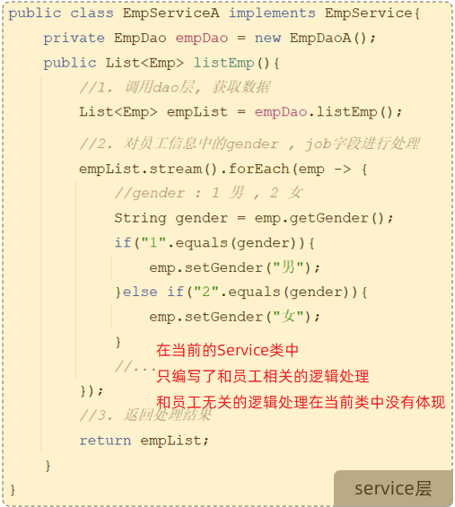
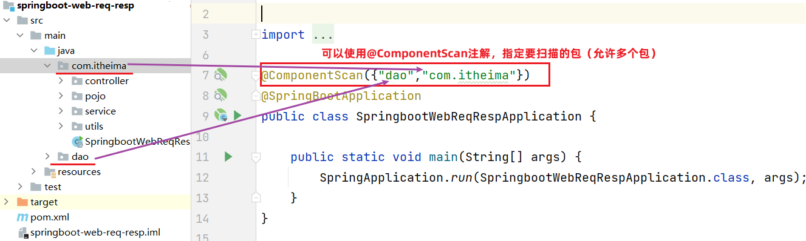

# Sprint Boot

## 快速入门

**结合 Mybatis**

**代码目录：** `代码/Spring Boot/整合Mybatis`


## 分层解耦

### 三层架构

在我们进行程序设计以及程序开发时，尽可能让每一个接口、类、方法的职责更单一些（单一职责原则）。

> 单一职责原则：一个类或一个方法，就只做一件事情，只管一块功能。
>
> 这样就可以让类、接口、方法的复杂度更低，可读性更强，扩展性更好，也更利用后期的维护。


我们之前开发的程序呢，并不满足单一职责原则。下面我们来分析下之前的程序：

 


那其实我们上述案例的处理逻辑呢，从组成上看可以分为三个部分：

- 数据访问：负责业务数据的维护操作，包括增、删、改、查等操作。
- 逻辑处理：负责业务逻辑处理的代码。
- 请求处理、响应数据：负责，接收页面的请求，给页面响应数据。

按照上述的三个组成部分，在我们项目开发中呢，可以将代码分为三层：


- Controller：控制层。接收前端发送的请求，对请求进行处理，并响应数据。
- Service：业务逻辑层。处理具体的业务逻辑。
- Dao：数据访问层(Data Access Object)，也称为持久层。负责数据访问操作，包括数据的增、删、改、查。


基于三层架构的程序执行流程：


- 前端发起的请求，由Controller层接收（Controller响应数据给前端）
- Controller层调用Service层来进行逻辑处理（Service层处理完后，把处理结果返回给Controller层）
- Serivce层调用Dao层（逻辑处理过程中需要用到的一些数据要从Dao层获取）
- Dao层操作文件中的数据（Dao拿到的数据会返回给Service层）

> 思考：按照三层架构的思想，如何要对业务逻辑(Service层)进行变更，会影响到Controller层和Dao层吗？ 
>
> 答案：不会影响。 （程序的扩展性、维护性变得更好了）


### 代码拆分

我们使用三层架构思想，来改造下之前的程序：

- 控制层包名：xxxx.controller
- 业务逻辑层包名：xxxx.service
- 数据访问层包名：xxxx.dao


**控制层：**接收前端发送的请求，对请求进行处理，并响应数据

```java
@RestController
public class EmpController {
    //业务层对象
    private EmpService empService = new EmpServiceA();

    @RequestMapping("/listEmp")
    public Result list(){
        //1. 调用service层, 获取数据
        List<Emp> empList = empService.listEmp();

        //3. 响应数据
        return Result.success(empList);
    }
}
```

**业务逻辑层：**处理具体的业务逻辑

- 业务接口

~~~java
//业务逻辑接口（制定业务标准）
public interface EmpService {
    //获取员工列表
    public List<Emp> listEmp();
}
~~~

- 业务实现类

```java
//业务逻辑实现类（按照业务标准实现）
public class EmpServiceA implements EmpService {
    //dao层对象
    private EmpDao empDao = new EmpDaoA();

    @Override
    public List<Emp> listEmp() {
        //1. 调用dao, 获取数据
        List<Emp> empList = empDao.listEmp();

        //2. 对数据进行转换处理 - gender, job
        empList.stream().forEach(emp -> {
            //处理 gender 1: 男, 2: 女
            String gender = emp.getGender();
            if("1".equals(gender)){
                emp.setGender("男");
            }else if("2".equals(gender)){
                emp.setGender("女");
            }

            //处理job - 1: 讲师, 2: 班主任 , 3: 就业指导
            String job = emp.getJob();
            if("1".equals(job)){
                emp.setJob("讲师");
            }else if("2".equals(job)){
                emp.setJob("班主任");
            }else if("3".equals(job)){
                emp.setJob("就业指导");
            }
        });
        return empList;
    }
}
```

**数据访问层：**负责数据的访问操作，包含数据的增、删、改、查

- 数据访问接口

~~~java
//数据访问层接口（制定标准）
public interface EmpDao {
    //获取员工列表数据
    public List<Emp> listEmp();
}
~~~

- 数据访问实现类

```java
//数据访问实现类
public class EmpDaoA implements EmpDao {
    @Override
    public List<Emp> listEmp() {
        //1. 加载并解析emp.xml
        String file = this.getClass().getClassLoader().getResource("emp.xml").getFile();
        System.out.println(file);
        List<Emp> empList = XmlParserUtils.parse(file, Emp.class);
        return empList;
    }
}
```


三层架构的好处：

1. 复用性强
2. 便于维护
3. 利用扩展


### 分层解耦

刚才我们学习过程序分层思想了，接下来呢，我们来学习下程序的解耦思想。

解耦：解除耦合。


**耦合问题**

首先需要了解软件开发涉及到的两个概念：内聚和耦合。

- 内聚：软件中各个功能模块内部的功能联系。

- 耦合：衡量软件中各个层/模块之间的依赖、关联的程度。

**软件设计原则：高内聚低耦合。**

> 高内聚指的是：一个模块中各个元素之间的联系的紧密程度，如果各个元素(语句、程序段)之间的联系程度越高，则内聚性越高，即 "高内聚"。
>
> 低耦合指的是：软件中各个层、模块之间的依赖关联程序越低越好。

程序中高内聚的体现：

- EmpServiceA类中只编写了和员工相关的逻辑处理代码

 

程序中耦合代码的体现：

- 把业务类变为EmpServiceB时，需要修改controller层中的代码


高内聚、低耦合的目的是使程序模块的可重用性、移植性大大增强。


**解耦思路**

之前我们在编写代码时，需要什么对象，就直接 `new` 一个就可以了。 这种做法呢，层与层之间代码就耦合了，当 `service` 层的实现变了之后， 我们还需要修改 `controller` 层的代码。


 那应该怎么解耦呢？

- 首先不能在 `EmpController` 中使用 `new` 对象。代码如下：


- 此时，就存在另一个问题了，不能 `new`，就意味着没有业务层对象（程序运行就报错），怎么办呢？
  - 我们的解决思路是：
    - 提供一个容器，容器中存储一些对象(例：EmpService对象)
    - `controller` 程序从容器中获取 `EmpService` 类型的对象

我们想要实现上述解耦操作，就涉及到 `Spring` 中的两个核心概念：

- **控制反转：** Inversion Of Control，简称IOC。对象的创建控制权由程序自身转移到外部（容器），这种思想称为控制反转。

  > 对象的创建权由程序员主动创建转移到容器(由容器创建、管理对象)。这个容器称为：IOC容器或Spring容器

- **依赖注入：** Dependency Injection，简称DI。容器为应用程序提供运行时，所依赖的资源，称之为依赖注入。

  > 程序运行时需要某个资源，此时容器就为其提供这个资源。
  >
  > 例：EmpController程序运行时需要EmpService对象，Spring容器就为其提供并注入EmpService对象

IOC容器中创建、管理的对象，称之为：`bean` 对象


## IOC&DI

上面我们引出了Spring中IOC和DI的基本概念，下面我们就来具体学习下IOC和DI的代码实现。

- **任务：**
  1. 删除Controller层、Service层中new对象的代码
  2. Service层及Dao层的实现类，交给IOC容器管理
  3. 为Controller及Service注入运行时依赖的对象
     - Controller程序中注入依赖的Service层对象
     - Service程序中注入依赖的Dao层对象


第1步：删除Controller层、Service层中new对象的代码


第2步：Service层及Dao层的实现类，交给IOC容器管理

- 使用Spring提供的注解：@Component ，就可以实现类交给IOC容器管理


第3步：为Controller及Service注入运行时依赖的对象

- 使用Spring提供的注解：@Autowired ，就可以实现程序运行时IOC容器自动注入需要的依赖对象


完整的三层代码：

- **Controller层：**

~~~java
@RestController
public class EmpController {

    @Autowired //运行时,从IOC容器中获取该类型对象,自动赋值给该变量
    private EmpService empService ;

    @RequestMapping("/listEmp")
    public Result list(){
        //1. 调用service, 获取数据
        List<Emp> empList = empService.listEmp();

        //3. 响应数据
        return Result.success(empList);
    }
}
~~~

- **Service层：**

~~~java
@Component //将当前对象交给IOC容器管理,成为IOC容器的bean
public class EmpServiceA implements EmpService {

    @Autowired //运行时,从IOC容器中获取该类型对象,赋值给该变量
    private EmpDao empDao ;

    @Override
    public List<Emp> listEmp() {
        //1. 调用dao, 获取数据
        List<Emp> empList = empDao.listEmp();

        //2. 对数据进行转换处理 - gender, job
        empList.stream().forEach(emp -> {
            //处理 gender 1: 男, 2: 女
            String gender = emp.getGender();
            if("1".equals(gender)){
                emp.setGender("男");
            }else if("2".equals(gender)){
                emp.setGender("女");
            }

            //处理job - 1: 讲师, 2: 班主任 , 3: 就业指导
            String job = emp.getJob();
            if("1".equals(job)){
                emp.setJob("讲师");
            }else if("2".equals(job)){
                emp.setJob("班主任");
            }else if("3".equals(job)){
                emp.setJob("就业指导");
            }
        });
        return empList;
    }
}
~~~

**Dao层：**

~~~java
@Component //将当前对象交给IOC容器管理,成为IOC容器的bean
public class EmpDaoA implements EmpDao {
    @Override
    public List<Emp> listEmp() {
        //1. 加载并解析emp.xml
        String file = this.getClass().getClassLoader().getResource("emp.xml").getFile();
        System.out.println(file);
        List<Emp> empList = XmlParserUtils.parse(file, Emp.class);
        return empList;
    }
}
~~~


运行测试：

- 启动SpringBoot引导类，打开浏览器，输入：http://localhost:8080/emp.html


 


### IOC详解

通过IOC和DI的入门程序呢，我们已经基本了解了IOC和DI的基础操作。接下来呢，我们学习下IOC控制反转和DI依赖注入的细节。

### 声明Bean

前面我们提到IOC控制反转，就是将对象的控制权交给Spring的IOC容器，由IOC容器创建及管理对象。IOC容器创建的对象称为bean对象。

在之前的入门案例中，要把某个对象交给IOC容器管理，需要在类上添加一个注解：@Component 

而Spring框架为了更好的标识web应用程序开发当中，bean对象到底归属于哪一层，又提供了@Component的衍生注解：

- @Controller    （标注在控制层类上）
- @Service          （标注在业务层类上）
- @Repository    （标注在数据访问层类上）


修改入门案例代码：

- **Controller层：**

~~~java
@RestController  //@RestController = @Controller + @ResponseBody
public class EmpController {

    @Autowired //运行时,从IOC容器中获取该类型对象,赋值给该变量
    private EmpService empService ;

    @RequestMapping("/listEmp")
    public Result list(){
        //1. 调用service, 获取数据
        List<Emp> empList = empService.listEmp();

        //3. 响应数据
        return Result.success(empList);
    }
}
~~~

- **Service层：**

~~~java
@Service
public class EmpServiceA implements EmpService {

    @Autowired //运行时,从IOC容器中获取该类型对象,赋值给该变量
    private EmpDao empDao ;

    @Override
    public List<Emp> listEmp() {
        //1. 调用dao, 获取数据
        List<Emp> empList = empDao.listEmp();

        //2. 对数据进行转换处理 - gender, job
        empList.stream().forEach(emp -> {
            //处理 gender 1: 男, 2: 女
            String gender = emp.getGender();
            if("1".equals(gender)){
                emp.setGender("男");
            }else if("2".equals(gender)){
                emp.setGender("女");
            }

            //处理job - 1: 讲师, 2: 班主任 , 3: 就业指导
            String job = emp.getJob();
            if("1".equals(job)){
                emp.setJob("讲师");
            }else if("2".equals(job)){
                emp.setJob("班主任");
            }else if("3".equals(job)){
                emp.setJob("就业指导");
            }
        });
        return empList;
    }
}
~~~

**Dao层：**

~~~java
@Repository
public class EmpDaoA implements EmpDao {
    @Override
    public List<Emp> listEmp() {
        //1. 加载并解析emp.xml
        String file = this.getClass().getClassLoader().getResource("emp.xml").getFile();
        System.out.println(file);
        List<Emp> empList = XmlParserUtils.parse(file, Emp.class);
        return empList;
    }
}
~~~


要把某个对象交给IOC容器管理，需要在对应的类上加上如下注解之一：

| 注解        | 说明                 | 位置                                            |
| :---------- | -------------------- | ----------------------------------------------- |
| @Controller | @Component的衍生注解 | 标注在控制器类上                                |
| @Service    | @Component的衍生注解 | 标注在业务类上                                  |
| @Repository | @Component的衍生注解 | 标注在数据访问类上（由于与mybatis整合，用的少） |
| @Component  | 声明bean的基础注解   | 不属于以上三类时，用此注解                      |

> 查看源码：

在IOC容器中，每一个Bean都有一个属于自己的名字，可以通过注解的value属性指定bean的名字。如果没有指定，默认为类名首字母小写。


> 注意事项: 
>
> - 声明bean的时候，可以通过value属性指定bean的名字，如果没有指定，默认为类名首字母小写。
> - 使用以上四个注解都可以声明bean，但是在springboot集成web开发中，声明控制器bean只能用@Controller。


### 组件扫描

问题：使用前面学习的四个注解声明的bean，一定会生效吗？

答案：不一定。（原因：bean想要生效，还需要被组件扫描）


 下面我们通过修改项目工程的目录结构，来测试bean对象是否生效：


运行程序后，报错：


为什么没有找到bean对象呢？

- 使用四大注解声明的bean，要想生效，还需要被组件扫描注解@ComponentScan扫描

> @ComponentScan注解虽然没有显式配置，但是实际上已经包含在了引导类声明注解 @SpringBootApplication 中，==**默认扫描的范围是SpringBoot启动类所在包及其子包**==。
>
>  

- 解决方案：手动添加@ComponentScan注解，指定要扫描的包   （==仅做了解，不推荐==）




推荐做法（如下图）：

- 将我们定义的controller，service，dao这些包呢，都放在引导类所在包com.itheima的子包下，这样我们定义的bean就会被自动的扫描到


### DI详解

上一小节我们讲解了控制反转IOC的细节，接下来呢，我们学习依赖注解DI的细节。

依赖注入，是指IOC容器要为应用程序去提供运行时所依赖的资源，而资源指的就是对象。

在入门程序案例中，我们使用了 `@Autowired` 这个注解，完成了依赖注入的操作，而这个 `Autowired` 翻译过来叫：自动装配。

`@Autowired` 注解，默认是按照**类型**进行自动装配的（去IOC容器中找某个类型的对象，然后完成注入操作）

> 入门程序举例：在EmpController运行的时候，就要到IOC容器当中去查找EmpService这个类型的对象，而我们的IOC容器中刚好有一个EmpService这个类型的对象，所以就找到了这个类型的对象完成注入操作。


那如果在IOC容器中，存在多个相同类型的 `bean` 对象，会出现什么情况呢？


- 程序运行会报错


如何解决上述问题呢？Spring提供了以下几种解决方案：

- @Primary

- @Qualifier

- @Resource


使用 `@Primary` 注解：当存在多个相同类型的 `Bean` 注入时，加上 `@Primary` 注解，来确定默认的实现。

 


使用 `@Qualifier` 注解：指定当前要注入的 `bean` 对象。 在 `@Qualifier的value` 属性中，指定注入的 `bean` 的名称。

- `@Qualifier` 注解 **不能单独使用**，必须配合 `@Autowired` 使用


使用 `@Resource` 注解：是按照 `bean` 的名称进行注入。通过 `name` 属性指定要注入的 `bean` 的名称。


下述代码 `@Resource` 不指定名称，则以字段或方法名称注入，相当于 `@Resource(name="userService")`

```java
@Resource
private UserService userService;
```


> 面试题 ： @Autowird 与 @Resource的区别
>
> - @Autowired 是spring框架提供的注解，而@Resource是JDK提供的注解
> - @Autowired 默认是按照类型注入，而@Resource是按照名称注入


