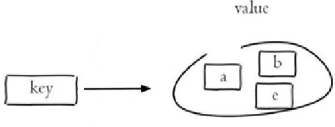

# Redis

`Redis` 是一个基于内存的 `key-value` 结构数据库。`Redis` 是互联网技术领域使用最为广泛的**存储中间件**。

**官网：**https://redis.io
**中文网：**https://www.redis.net.cn/


**key-value结构存储：**

 

**主要特点：**

- 基于内存存储，读写性能高  
- 适合存储热点数据（热点商品、资讯、新闻）
- 企业应用广泛


**Redis 安装包：** https://github.com/microsoftarchive/redis/releases


**运行 Redis**

直接双击 `redis-server.exe` 或者：

```
C:\env\Redis-x64-3.2.100>redis-server.exe redis.windows.conf
```


**修改 Redis 配置文件**

设置 `Redis` 服务密码，修改 `redis.windows.conf`

```
requirepass 123123
```


**注意：** 修改密码后需要重启 `Redis` 服务才能生效，Redis` 配置文件中 # 表示注释

```
redis-cli.exe -h localhost -p 6379 -a 123123 
```

重启 `Redis` 后，再次连接 `Redis` 时，需加上密码，否则连接失败。


## 数据类型

 

**解释说明：**

- 字符串(string)：普通字符串，Redis中最简单的数据类型
- 哈希(hash)：也叫散列，类似于Java中的HashMap结构
- 列表(list)：按照插入顺序排序，可以有重复元素，类似于Java中的LinkedList
- 集合(set)：无序集合，没有重复元素，类似于Java中的HashSet
- 有序集合(sorted set/zset)：集合中每个元素关联一个分数(score)，根据分数升序排序，没有重复元素


### 字符串

`Redis` 中字符串类型常用命令：

- **SET** key value 			     设置指定key的值
- **GET** key                                        获取指定key的值
- **SETEX** key seconds value         设置指定key的值，并将 key 的过期时间设为 seconds 秒
- **SETNX** key value                        只有在 key    不存在时设置 key 的值

更多命令可以参考Redis中文网：https://www.redis.net.cn

```bash
# 新增or修改数据
> set data 100
OK
# 获取数据
> get data
100
# 获取不存在的数据
> get data1
null

# 删除数据
> del data
1

# 重新设置数据
> set data 200
OK

# 设置值为300, 30秒后到期
> setex data 30 300
OK
# 如果值不存在才会重新设置
> setnx data 500
0

# 30秒后data已经过期自动删除了
> get data
null
# 所以可以重新设置数据了
> setnx data 500
1
# 获取数据
> get data
500
# 获取所有的属性
> keys data
data
```


### 映射

`Redis hash` 是一个 `string` 类型的 `field` 和 `value` 的映射表，`hash` 特别适合用于存储对象，常用命令：

- **HSET** key field value             将哈希表 key 中的字段 field 的值设为 value
- **HGET** key field                       获取存储在哈希表中指定字段的值
- **HDEL** key field                       删除存储在哈希表中的指定字段
- **HKEYS** key                              获取哈希表中所有字段
- **HVALS** key                              获取哈希表中所有值

 

```bash
# 设置数据：hset 数据 属性 值
> hset data name lyy
1
> hset data age 20
1
> hset data sex "男"
1

# 获取所有的属性名
> hkeys data
name
age
sex
# 获取所有的属性值
> hvals data
lyy
20
男
# 获取指定属性值
> hget data sex
男
```


### 列表

`Redis` 列表是简单的字符串列表，按照插入顺序排序，常用命令：

- **LPUSH** key value1 [value2]         将一个或多个值插入到列表头部
- **LRANGE** key start stop                获取列表指定范围内的元素
- **RPOP** key                                       移除并获取列表最后一个元素
- **LLEN** key                                        获取列表长度
- **BRPOP** key1 [key2 ] timeout       移出并获取列表的最后一个元素， 如果列表没有元素会阻塞列表直到等待超    时或发现可弹出元素为止

 

```bash
# 新增数据
> lpush list a b c d
4

# 查看从0到2的3个数据
> lrange list 0 2
d
c
b
# 查看所有数据
> lrange list 0 -1
d
c
b
a

# 删除最后一个数据
> rpop list
a

# 查看数据
> lrange list 0 -1
d
c
b

# 查看个数
> llen list
3
```


### 无序集合

`Redis set` 是 `string` 类型的无序集合。集合成员是唯一的，这就意味着集合中不能出现重复的数据，常用命令：

- **SADD** key member1 [member2]            向集合添加一个或多个成员
- **SMEMBERS** key                                         返回集合中的所有成员
- **SCARD** key                                                  获取集合的成员数
- **SINTER** key1 [key2]                                   返回给定所有集合的交集
- **SUNION** key1 [key2]                                 返回所有给定集合的并集
- **SREM** key member1 [member2]            移除集合中一个或多个成员

 

```bash
# 新增数据：sadd 集合 数据
> sadd set1 a b c
3
# 集合中存在的数据不能再被添加
> sadd set1 a
0
# 获取集合数据
> smembers set1
c
b
a
# 获取数据个数
> scard set1
3

# 创建新的集合
> sadd set2 a b x y
4
# 获取两个集合中相同的数据
> sinter set1 set2
b
a
# 获取两个集合中不同的数据
> sunion set1 set2
c
b
y
a
x

# 删除一个或多个数据
> srem set2 a
1
# 删除不存在的数据
> srem set2 a
0
# 删除多个数据
> srem set2 b c
1
# 查看数据
> smembers set2
x
y
```


### 有序集合

`Redis` 有序集合是 `string` 类型元素的集合，且不允许有重复成员。每个元素都会关联一个 `double` 类型的分数。常用命令：

常用命令：

- **ZADD** key score1 member1 [score2 member2]     向有序集合添加一个或多个成员
- **ZRANGE** key start stop [WITHSCORES]                     通过索引区间返回有序集合中指定区间内的成员
- **ZINCRBY** key increment member                              有序集合中对指定成员的分数加上增量 increment
- **ZREM** key member [member ...]                                移除有序集合中的一个或多个成员

 

```bash
# 新增数据：zadd 集合 分数 数据
> zadd zset 10 a 20 b
2
# 新增数据
> zadd zset 15 c
1

# 获取数据
> zrange zset 0 -1
a
c
b

# 获取带有分数的数据
> zrange zset 0 -1 withscores
a
10
c
15
b
20

# 给数据a增加15分
> zincrby zset 15 a
25
# 获取数据
> zrange zset 0 -1 withscores
c
15
b
20
a
25

# 删除数据b
> zrem zset b
1
# 获取数据
> zrange zset 0 -1 withscores
c
15
a
25
```


### 通用命令

`Redis` 的通用命令是不分数据类型的，都可以使用的命令：

- **KEYS** pattern 	查找所有符合给定模式( pattern)的 key 
- **EXISTS** key 	    检查给定 key 是否存在
- **TYPE** key 	       返回 key 所储存的值的类型
- **DEL** key 		 该命令用于在 key 存在是删除 key

```bash
# 查询全部key
> keys *
zset
set
set2
data
list
# 根据条件查询key
> keys set*
set
set2

# 删除key
> del data
1
# 删除多个key
> del set set2
2

# 判断key是否存在：存在（1）不存在（0）
> exists data
1
> exists data1
0

# 查看key类型
> type data
string
> type zset
zset
```


## Spring Data Redis

`Spring Data Redis` 是 `Spring` 的一部分，提供了在 `Spring` 应用中通过简单的配置就可以访问 `Redis` 服务，对 `Redis` 底层开发包进行了高度封装。在 `Spring` 项目中，可以使用 `Spring Data Redis` 来简化 `Redis` 操作。

**网址：** https://spring.io/projects/spring-data-redis

 

`Spring Boot` 提供了对应的 `Starter，maven` 坐标：

```xml
<dependency>
	<groupId>org.springframework.boot</groupId>
	<artifactId>spring-boot-starter-data-redis</artifactId>
</dependency>
```


`Spring Data Redis` 中提供了一个高度封装的类：**RedisTemplate**，对相关 `api` 进行了归类封装,将同一类型操作封装为 `operation` 接口，具体分类如下：

- **ValueOperations**：string 数据操作
- **SetOperations**：set 类型数据操作
- **ZSetOperations**：zset 类型数据操作
- **HashOperations**：hash 类型的数据操作
- **ListOperations**：list 类型的数据操作


### 环境配置

进入到 `sky-server` 模块

**导入 Maven 坐标**

```xml
<dependency>
     <groupId>org.springframework.boot</groupId>
     <artifactId>spring-boot-starter-data-redis</artifactId>
</dependency>
```


**配置 Redis 数据源**

在 `application-dev.yml` 中添加

```yaml
redis:
    host: localhost
    port: 6379
    password: 123456
    database: 10
```

**database**：指定使用 `Redis` 的哪个数据库，`Redis` 服务启动后默认有 `16` 个数据库，编号分别是从 `0` 到 `15`。

可以通过修改 `Redis` 配置文件来指定数据库的数量


### 快速上手

编写配置类，创建 `RedisTemplate` 对象

```java
package com.sky.config;

import lombok.extern.slf4j.Slf4j;
import org.springframework.context.annotation.Bean;
import org.springframework.context.annotation.Configuration;
import org.springframework.data.redis.connection.RedisConnectionFactory;
import org.springframework.data.redis.core.RedisTemplate;
import org.springframework.data.redis.serializer.StringRedisSerializer;

@Configuration
@Slf4j
public class RedisConfiguration {
    @Bean
    public RedisTemplate redisTemplate(RedisConnectionFactory redisConnectionFactory){
        log.info("开始创建redis模板对象...");
        
        RedisTemplate redisTemplate = new RedisTemplate();
        //设置redis的连接工厂对象
        redisTemplate.setConnectionFactory(redisConnectionFactory);
        //设置redis key的序列化器
        redisTemplate.setKeySerializer(new StringRedisSerializer());
        
        return redisTemplate;
    }
}
```

当前配置类不是必须的，因为 `Spring Boot` 框架会自动装配 `RedisTemplate` 对象，但是默认的 `key` 序列化器为

 `JdkSerializationRedisSerializer`，导致我们存到 `Redis` 中后的数据和原始数据有差别，故设置为

 `StringRedisSerializer` 序列化器。


**Java 操作 Redis**

```java
package com.sky.test;

import org.junit.jupiter.api.Test;
import org.springframework.beans.factory.annotation.Autowired;
import org.springframework.boot.test.context.SpringBootTest;
import org.springframework.data.redis.connection.DataType;
import org.springframework.data.redis.core.*;

import java.util.List;
import java.util.Set;
import java.util.concurrent.TimeUnit;

@SpringBootTest
public class SpringDataRedisTest {
    @Autowired
    private RedisTemplate redisTemplate;

    @Test
    public void testRedisTemplate() {
        // string数据操作
        ValueOperations valueOperations = redisTemplate.opsForValue();
        // hash类型的数据操作
        HashOperations hashOperations = redisTemplate.opsForHash();
        // list类型的数据操作
        ListOperations listOperations = redisTemplate.opsForList();
        // set类型数据操作
        SetOperations setOperations = redisTemplate.opsForSet();
        // zset类型数据操作
        ZSetOperations zSetOperations = redisTemplate.opsForZSet();
    }

    // 操作字符串
    @Test
    public void testString() {
        // 命令：set get setex setnx
        redisTemplate.opsForValue().set("name", "小明");

        String name = (String) redisTemplate.opsForValue().get("name");
        System.out.println(name); // 小明

        redisTemplate.opsForValue().set("code", "1234", 3, TimeUnit.MINUTES);

        redisTemplate.opsForValue().setIfAbsent("lock", "100");
        redisTemplate.opsForValue().setIfAbsent("lock", "200");
    }

    // 操作哈希
    @Test
    public void testHash() {
        // 命令：hset hget hdel hkeys hvals
        HashOperations hashOperations = redisTemplate.opsForHash();

        hashOperations.put("100", "name", "tom");
        hashOperations.put("100", "age", "20");

        String name = (String) hashOperations.get("100", "name");
        System.out.println(name);

        Set keys = hashOperations.keys("100");
        System.out.println(keys);

        List values = hashOperations.values("100");
        System.out.println(values);

        hashOperations.delete("100", "age");
    }

    // 操作列表
    @Test
    public void testList() {
        // 命令：lpush lrange rpop llen
        ListOperations listOperations = redisTemplate.opsForList();

        listOperations.leftPushAll("mylist", "a", "b", "c");
        listOperations.leftPush("mylist", "d");

        List mylist = listOperations.range("mylist", 0, -1);
        System.out.println(mylist);

        listOperations.rightPop("mylist");

        Long size = listOperations.size("mylist");
        System.out.println(size);
    }

    // 操作无序集合
    @Test
    public void testSet() {
        // 命令：sadd smembers scard sinter sunion srem
        SetOperations setOperations = redisTemplate.opsForSet();

        setOperations.add("set1", "a", "b", "c", "d");
        setOperations.add("set2", "a", "b", "x", "y");

        Set members = setOperations.members("set1");
        System.out.println(members);

        Long size = setOperations.size("set1");
        System.out.println(size);

        Set intersect = setOperations.intersect("set1", "set2");
        System.out.println(intersect);

        Set union = setOperations.union("set1", "set2");
        System.out.println(union);

        setOperations.remove("set1", "a", "b");
    }

    // 操作有序集合
    @Test
    public void testZset() {
        // 命令：zadd zrange zincrby zrem
        ZSetOperations zSetOperations = redisTemplate.opsForZSet();

        zSetOperations.add("zset1", "a", 10);
        zSetOperations.add("zset1", "b", 12);
        zSetOperations.add("zset1", "c", 9);

        Set zset1 = zSetOperations.range("zset1", 0, -1);
        System.out.println(zset1);

        zSetOperations.incrementScore("zset1", "c", 10);

        zSetOperations.remove("zset1", "a", "b");
    }

    // 操作通用命令
    @Test
    public void testCommon() {
        // keys exists type del
        Set keys = redisTemplate.keys("*");
        System.out.println(keys);

        Boolean name = redisTemplate.hasKey("name");
        Boolean set1 = redisTemplate.hasKey("set1");

        for (Object key : keys) {
            DataType type = redisTemplate.type(key);
            System.out.println(type.name());
        }

        redisTemplate.delete("mylist");
    }
}
```


## Spring Cache

Spring Cache 是一个框架，实现了基于注解的缓存功能，只需要简单地加一个注解，就能实现缓存功能。

Spring Cache 提供了一层抽象，底层可以切换不同的缓存实现，例如：

- EHCache
- Caffeine
- Redis(常用)

**Maven依赖：**

```xml
<dependency>
	<groupId>org.springframework.boot</groupId>
	<artifactId>spring-boot-starter-cache</artifactId>  		            		       	 		     		<version>2.7.3</version> 
</dependency>
```


### 快速上手

在 `SpringCache` 中提供了很多缓存操作的注解，常见的是以下的几个：

| **注解**       | **说明**                                                     |
| -------------- | ------------------------------------------------------------ |
| @EnableCaching | 开启缓存注解功能，通常加在启动类上                           |
| @Cacheable     | 在方法执行前先查询缓存中是否有数据，如果有数据，则直接返回缓存数据；如果没有缓存数据，调用方法并将方法返回值放到缓存中 |
| @CachePut      | 将方法的返回值放到缓存中                                     |
| @CacheEvict    | 将一条或多条数据从缓存中删除                                 |

在 `Spring Boot` 项目中，使用缓存技术只需在项目中导入相关缓存技术的依赖包，并在启动类上使用 `@EnableCaching` 开启缓存支持即可。

例如，使用 `Redis` 作为缓存技术，只需要导入 `Spring data Redis` 的 `maven` 坐标即可。

```xml
<dependency>
      <groupId>org.springframework.boot</groupId>
      <artifactId>spring-boot-starter-data-redis</artifactId>
</dependency>
```


#### @CachePut

**作用：** 将方法返回值，放入缓存

**value：** 缓存的名称, 每个缓存名称下面可以有很多 `key`

**key：** 缓存的key  ----------> 支持 `Spring` 的表达式语言 `SPEL` 语法


在 `save` 方法上加注解 `@CachePut`

当前 `UserController` 的 `save` 方法是用来保存用户信息的，我们希望在该用户信息保存到数据库的同时，也往缓存中缓存一份数据，我们可以在 `save` 方法上加上注解 `@CachePut`，用法如下：

```java
	@PostMapping
    @CachePut(value = "userCache", key = "#user.id") // 相当于Redis命令：set userCache::100 100
    public User save(@RequestBody User user){
        userMapper.insert(user);
        return user;
    }
```

**说明： key 的写法如下**

**#user.id：** `#user` 指的是方法形参的名称,  `id` 指的是 `user` 的 `id` 属性 , 也就是使用 `user` 的 `id` 属性作为 `key` ;

**#result.id：** `#result` 代表方法返回值，该表达式 代表以返回对象的 `id` 属性作为 `key`；

**#p0.id：** `#p0` 指的是方法中的第一个参数，`id` 指的是第一个参数的 `id` 属性,也就是使用第一个参数的 `id` 属性作为 `key` ;

**#a0.id：** `#a0` 指的是方法中的第一个参数，`id` 指的是第一个参数的 `id` 属性,也就是使用第一个参数的 `id` 属性作为 `key`;

**#root.args[0].id：** `#root.args[0]` 指的是方法中的第一个参数，`id` 指的是第一个参数的 `id` 属性,也就是使用第一个参数

的 `id` 属性作为 `key` ;


#### @Cacheable

**作用：** 在方法执行前，`spring` 先查看缓存中是否有数据，如果有数据，则直接返回缓存数据；若没有数据，调用方法并将方法返回值放到缓存中

**value：** 缓存的名称，每个缓存名称下面可以有多个 `key`

**key：** 缓存的 `key`  ----------> 支持 `Spring` 的表达式语言 `SPEL` 语法


**我们先来看一下之前的写法：** 如果缓存中有数据，就用缓存的数据，没有就查询数据库

```java
	@GetMapping("/list")
    @ApiOperation("根据分类id查询菜品")
    public Result<List<Dish>> list(Integer categoryId) {
        // 1. 核心代码
        String key = "dish_" + categoryId;

        // 2. 核心代码
        List<Dish> data = (List<Dish>) redisTemplate.opsForValue().get(key);

        // 3. 核心代码：查询redis中是否有当前的数据，如果有就从缓存中取
        if (data != null && !data.isEmpty()) {
            return Result.success(data);
        }

        data = dishService.CateByIdDish(categoryId);

        // 4. 核心代码：如果缓存中没有，那么就将查询的数据存在缓存中
        redisTemplate.opsForValue().set(key, data);

        return Result.success(data);
    }
```


**再对比一下 Cache 的写法：** 在 `getById` 上加注解 `@Cacheable`

```java
	@GetMapping
    @Cacheable(cacheNames = "userCache", key="#id") // 相当于Redis命令：get userCache::100
    public User getById(Long id){
        User user = userMapper.getById(id);
        return user;
    }
```

第一次访问，会请求我们 `controller` 的方法，查询数据库。

后面再查询相同的 `id`，就直接从 `Redis` 中查询数据，不用再查询数据库也就意味着方法不会执行了


#### @CacheEvict注解

**作用：** 清理指定缓存

**value：** 缓存的名称，每个缓存名称下面可以有多个 `key`

**key：** 缓存的 `key`  ----------> 支持 `Spring` 的表达式语言 `SPEL` 语法


在 `delete` 方法上加注解 `@CacheEvict`

```java
	@DeleteMapping
    @CacheEvict(cacheNames = "userCache", key = "#id") // 相当于Redis命令：del userCache::100
    public void deleteById(Long id){
        userMapper.deleteById(id);
    }

	@DeleteMapping("/delAll")
    @CacheEvict(cacheNames = "userCache", allEntries = true) // 删除userCache的所有数据
    public void deleteAll(){
        userMapper.deleteAll();
    }
```

上述代码会删除数据库的数据同时删除缓存中的数据
