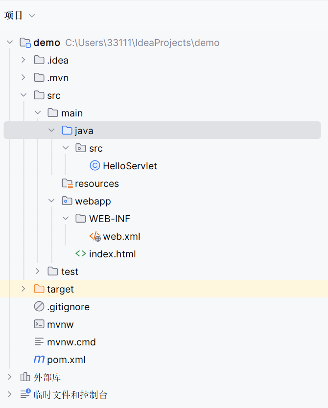
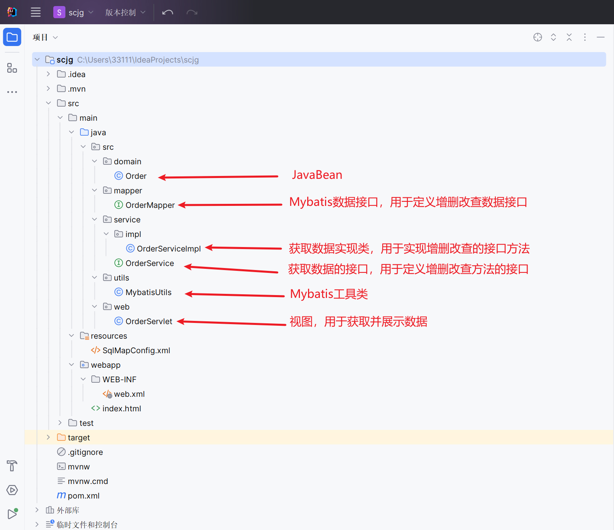

# Servlet

## 项目结构




## 快速入门

简单的 `get`、`post` 请求接口示例

```java
package src.demo;

import javax.servlet.annotation.WebServlet;
import javax.servlet.http.HttpServlet;
import javax.servlet.http.HttpServletRequest;
import javax.servlet.http.HttpServletResponse;
import java.io.IOException;

@WebServlet("/hello")
public class HelloServlet extends HttpServlet {
    @Override
    public void doGet(HttpServletRequest request, HttpServletResponse response) throws IOException {
        System.out.println("GET请求成功");
    }

    @Override
    public void doPost(HttpServletRequest request, HttpServletResponse response) throws IOException{
        System.out.println("POST请求成功");
    }
}
```

```html
<!DOCTYPE html>
<html lang="en">
<head>
    <meta charset="UTF-8">
    <title>Title</title>
</head>
<body>
    <form action="/web/hello" method="post">
        <input type="submit" value="提交"/>
    </form>
</body>
</html>
```


## Request

获取请求头以及参数信息

```java
package src.demo;

import javax.servlet.annotation.WebServlet;
import javax.servlet.http.HttpServlet;
import javax.servlet.http.HttpServletRequest;
import javax.servlet.http.HttpServletResponse;
import java.io.IOException;

@WebServlet("/user")
public class HelloServlet extends HttpServlet {
    @Override
    public void doGet(HttpServletRequest request, HttpServletResponse response) throws IOException {
        System.out.println("GET请求成功");
    }

    @Override
    public void doPost(HttpServletRequest request, HttpServletResponse response) throws IOException{
        System.out.println("POST请求成功");

        // 获取请求方式
        String method = request.getMethod();
        System.out.println(method); // POST

        // 获取请求路径
        String path = request.getServletPath();
        System.out.println(path); // /hello

        // 获取指定名称的请求头信息
        String host = request.getHeader("host");
        System.out.println(host); // localhost:8888

        // 获取指定名称的请求参数信息
        String username = request.getParameter("username");
        System.out.println(username); // admin

        String password = request.getParameter("password");
        System.out.println(password); // 123123
    }
}
```

```html
<!DOCTYPE html>
<html lang="en">
<head>
    <meta charset="UTF-8">
    <title>Title</title>
</head>
<body>
    <form action="/web/user" method="post">
        用户名：<input type="text" name="username">
        密码：<input type="password" name="password">
        
        <input type="submit" value="提交"/>
    </form>
</body>
</html>
```


## Responent

### 写入数据

写入 `JSON` 数据

```java
@WebServlet("/user")
public class HelloServlet extends HttpServlet {
    @Override
    public void doPost(HttpServletRequest request, HttpServletResponse response) throws IOException {
        System.out.println("POST请求成功");
        
        // 设置页面为JSON字符编码
        response.setContentType("application/json; charset=utf8");

        // 获取响应流
        PrintWriter out = response.getWriter();

        // 获取请求的参数
        String username = request.getParameter("username");
        String password = request.getParameter("password");

        // 写入JSON
        out.printf("{\"username\": \"%s\", \"password\": \"%s\"}", username, password);
    }
}
```


写入 `HTML` 数据

```java
@WebServlet("/user")
public class HelloServlet extends HttpServlet {
    @Override
    public void doPost(HttpServletRequest request, HttpServletResponse response) throws IOException {
        System.out.println("POST请求成功");

        // 设置页面为HTML字符编码
        response.setContentType("text/html; charset=utf8");

        // 获取响应流
        PrintWriter out = response.getWriter();

        // 获取请求的参数
        String username = request.getParameter("username");
        String password = request.getParameter("password");

        // 写入HTML
        out.printf("<h1>用户名：%s <br/> 密码：%s</h1>", username, password);
    }
}
```


将 `JavaBean` 数据转换为 `JSON` 字符串

```java
@WebServlet("/user")
public class UserServlet extends HttpServlet {
    @Override
    public void doPost(HttpServletRequest request, HttpServletResponse response) throws IOException {
        System.out.println("POST请求成功");

        User user = new User(1, "admin", "123123");
        System.out.println(user);
        // User(id=1, username=admin, password=123123)

        // 将Java类转换为JSON字符串
        String jsonStr = JSONObject.toJSONString(user);
        System.out.println(jsonStr);
        // {"id":1,"password":"123123","username":"admin"}

        // 设置JSON字符编码
        response.setContentType("application/json; charset=utf8");

        // 获取流
        PrintWriter out = response.getWriter();

        // 将JSON写入到页面
        out.println(jsonStr);
    }
}
```


### fastjson

 `fastjson` 是一个可以将 `JavaBean` 数据转换为 `JSON` 格式数据的包

```xml
	<dependency>
		<groupId>com.alibaba</groupId>
		<artifactId>fastjson</artifactId>
		<version>1.2.9</version>
	</dependency>
```


**举个栗子**

```java
[Student(name=jack, age=20, hobby=[抽烟, 喝酒], teacher=Teacher(id=1, name=张三)), Student(name=rose, age=23, hobby=[抽烟, 喝酒, 烫头], teacher=Teacher(id=2, name=李四))]
```

将上述 `JavaBean` 数据转换为以下 `JSON` 格式数据

```java
[
    {
        "age": 20,
        "hobby": [
            "抽烟",
            "喝酒"
        ],
        "name": "jack",
        "teacher": {
            "id": 1,
            "name": "张三"
        }
    },
    {
        "age": 23,
        "hobby": [
            "抽烟",
            "喝酒",
            "烫头"
        ],
        "name": "rose",
        "teacher": {
            "id": 2,
            "name": "李四"
        }
    }
]
```


第一步定义相关 `JavaBean`

```java
package src.domain;

import lombok.AllArgsConstructor;
import lombok.Data;
import lombok.NoArgsConstructor;

import java.util.List;

@Data
@NoArgsConstructor
@AllArgsConstructor
public class Student {
    private String name;
    private int age;
    private List<String> hobby;
    private Teacher teacher;
}
```

```java
package src.domain;

import lombok.AllArgsConstructor;
import lombok.Data;
import lombok.NoArgsConstructor;

@Data
@NoArgsConstructor
@AllArgsConstructor
public class Teacher {
    private int id;
    private String name;
}
```


核心代码

```java
		List<Student> list = new ArrayList<>();

        // 数据1
        Teacher t1 = new Teacher(1, "张三");
        Student s1 = new Student("jack", 20, Arrays.asList("抽烟", "喝酒"), t1);
        list.add(s1);

        // 数据2
        Teacher t2 = new Teacher(2, "李四");
        Student s2 = new Student("rose", 23, Arrays.asList("抽烟", "喝酒", "烫头"), t2);
        list.add(s2);

        // 转换为JSON
        String jsonStr = JSONObject.toJSONString(list);

        System.out.println(list);
        // 转换前：[Student(name=jack, age=20, hobby=[抽烟, 喝酒], teacher=Teacher(id=1, name=张三)), Student(name=rose, age=23, hobby=[抽烟, 喝酒, 烫头], teacher=Teacher(id=2, name=李四))]

        System.out.println(jsonStr);
        // 转换后：[{"age":20,"hobby":["抽烟","喝酒"],"name":"jack","teacher":{"id":1,"name":"张三"}},{"age":23,"hobby":["抽烟","喝酒","烫头"],"name":"rose","teacher":{"id":2,"name":"李四"}}]
```


## 三层架构

### 项目结构

**代码目录：** `代码/Service/三层架构`




### JavaBean

定义数据

```java
package src.domain;

import lombok.AllArgsConstructor;
import lombok.Data;
import lombok.NoArgsConstructor;

@Data
@NoArgsConstructor
@AllArgsConstructor
public class Order {
    private Integer oid;
    private Double price;
    private Integer userId;
}
```


### OrderMapper

定义 `Mybatis` 的数据接口

```java
package src.mapper;

import org.apache.ibatis.annotations.Select;
import src.domain.Order;

public interface OrderMapper {
    @Select("select * from `order` where oid = #{oid}")
    public Order info(Integer oid);
}
```


### OrderService

定义用于获取 `Mybatis` 数据的接口

```java
package src.service;

import src.domain.Order;

public interface OrderService {
    public Order info(Integer oid);
}
```


### OrderServicelmpl

定义 `OrderService` 的实现类

```java
package src.service.impl;

import org.apache.ibatis.session.SqlSession;
import src.domain.Order;
import src.mapper.OrderMapper;
import src.service.OrderService;
import src.utils.MybatisUtils;

public class OrderServicelmpl implements OrderService {
    @Override
    public Order info(Integer id) {
        // 获取session
        SqlSession sqlSession = MybatisUtils.getSession();

        OrderMapper orderMapper = sqlSession.getMapper(OrderMapper.class);
        System.out.println(orderMapper);

        Order order = orderMapper.info(id);

        MybatisUtils.close(sqlSession);

        return order;
    }
}
```


### MybatisUtils

 `Mybatis` 工具类，减少代码冗余

```java
package src.utils;

import org.apache.ibatis.io.Resources;
import org.apache.ibatis.session.SqlSession;
import org.apache.ibatis.session.SqlSessionFactory;
import org.apache.ibatis.session.SqlSessionFactoryBuilder;

import java.io.IOException;
import java.io.InputStream;

public class MybatisUtils {
    static SqlSessionFactory sessionFactory = null;

    static {
        try {
            // 加载 SqlMapConfig.xml 文件
            InputStream is = Resources.getResourceAsStream("SqlMapConfig.xml");

            // 通过解析 SqlMapConfig.xml 文件创建 SqlSessionFactory 对象
            sessionFactory = new SqlSessionFactoryBuilder().build(is);
        } catch (IOException e) {
            throw new RuntimeException(e);
        }
    }

    // 获取session
    public static SqlSession getSession() {
        SqlSession session = sessionFactory.openSession();
        return session;
    }

    public static void close(SqlSession session) {
        if (session != null) {
            // 自动提交事务
            session.commit();

            // 自动释放资源
            session.close();
        }
    }
}
```


### OrderServlet

用于接收参数以及展示数据

```java
package src.web;

import src.domain.Order;
import src.service.OrderService;
import src.service.impl.OrderServicelmpl;

import java.io.*;
import javax.servlet.ServletException;
import javax.servlet.http.*;
import javax.servlet.annotation.*;
import com.alibaba.fastjson.JSONObject;

@WebServlet("/order")
public class OrderServlet extends HttpServlet {
    @Override
    protected void doGet(HttpServletRequest request, HttpServletResponse response) throws ServletException, IOException {
        // 获取请求的oid
        Integer oid = Integer.valueOf(request.getParameter("oid"));

        OrderService orderService = new OrderServicelmpl();

        Order orderData =  orderService.info(oid);

        response.setContentType("application/json; charset=utf8");
        PrintWriter out = response.getWriter();

        String jsonStr = JSONObject.toJSONString(orderData);

        out.println(jsonStr);
    }
}
```


### SqlMapConfig.xml

 `Mybatis` 配置信息

```xml
<?xml version="1.0" encoding="UTF-8" ?>
<!DOCTYPE configuration
        PUBLIC "-//mybatis.org//DTD Config 3.0//EN"
        "http://mybatis.org/dtd/mybatis-3-config.dtd">
<configuration>

    <settings>
        <!--在控制台输出发送的sql日志-->
        <setting name="logImpl" value="STDOUT_LOGGING"/>
        
        <!--驼峰映射-->
        <setting name="mapUnderscoreToCamelCase" value="true"/>
    </settings>

    <environments default="development">
        <environment id="development">
            <transactionManager type="JDBC"/>

            <!--目前只关注这部分内容,它的作用就是声明要连接的数据信息-->
            <dataSource type="POOLED">
                <property name="driver" value="com.mysql.cj.jdbc.Driver"/>
                <property name="url" value="jdbc:mysql://localhost:3306/ceshi1"/>
                <property name="username" value="root"/>
                <property name="password" value="123123"/>
            </dataSource>
        </environment>
    </environments>

    <mappers>
        <!--声明含有sql的接口所在的位置-->
        <package name="src.mapper"/>
    </mappers>
</configuration>
```


### pom.xml

项目所依赖的包

```xml
<?xml version="1.0" encoding="UTF-8"?>
<project xmlns="http://maven.apache.org/POM/4.0.0"
         xmlns:xsi="http://www.w3.org/2001/XMLSchema-instance"
         xsi:schemaLocation="http://maven.apache.org/POM/4.0.0 https://maven.apache.org/xsd/maven-4.0.0.xsd">
    <modelVersion>4.0.0</modelVersion>

    <groupId>src</groupId>
    <artifactId>scjg</artifactId>
    <version>1.0-SNAPSHOT</version>
    <name>scjg</name>
    <packaging>war</packaging>

    <properties>
        <project.build.sourceEncoding>UTF-8</project.build.sourceEncoding>
        <maven.compiler.target>1.8</maven.compiler.target>
        <maven.compiler.source>1.8</maven.compiler.source>
        <junit.version>5.9.2</junit.version>
    </properties>

    <dependencies>
        <dependency>
            <groupId>javax.servlet</groupId>
            <artifactId>javax.servlet-api</artifactId>
            <version>4.0.1</version>
            <scope>provided</scope>
        </dependency>

        <dependency>
            <groupId>org.junit.jupiter</groupId>
            <artifactId>junit-jupiter-api</artifactId>
            <version>${junit.version}</version>
            <scope>test</scope>
        </dependency>

        <dependency>
            <groupId>org.junit.jupiter</groupId>
            <artifactId>junit-jupiter-engine</artifactId>
            <version>${junit.version}</version>
            <scope>test</scope>
        </dependency>

        <!--mysql-->
        <dependency>
            <groupId>mysql</groupId>
            <artifactId>mysql-connector-java</artifactId>
            <version>8.0.28</version>
        </dependency>

        <!--mybatis-->
        <dependency>
            <groupId>org.mybatis</groupId>
            <artifactId>mybatis</artifactId>
            <version>3.5.9</version>
        </dependency>

        <!--junit-->
        <dependency>
            <groupId>junit</groupId>
            <artifactId>junit</artifactId>
            <version>4.13.2</version>
            <scope>test</scope>
        </dependency>

        <dependency>
            <groupId>org.projectlombok</groupId>
            <artifactId>lombok</artifactId>
            <version>1.18.26</version>
            <scope>compile</scope>
        </dependency>

        <!--用于将JavaBean转换为JSON数据-->
        <dependency>
            <groupId>com.alibaba</groupId>
            <artifactId>fastjson</artifactId>
            <version>1.2.9</version>
        </dependency>
    </dependencies>

    <build>
        <plugins>
            <plugin>
                <groupId>org.apache.maven.plugins</groupId>
                <artifactId>maven-war-plugin</artifactId>
                <version>3.3.2</version>
            </plugin>

            <!--服务器配置-->
            <plugin>
                <groupId>org.apache.tomcat.maven</groupId>
                <artifactId>tomcat7-maven-plugin</artifactId>
                <version>2.1</version>
                <configuration>
                    <port>9999</port>
                    <path>/</path>
                </configuration>
            </plugin>
        </plugins>
    </build>
</project>
```

