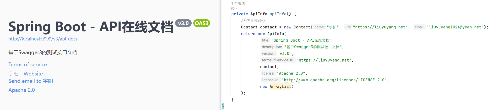
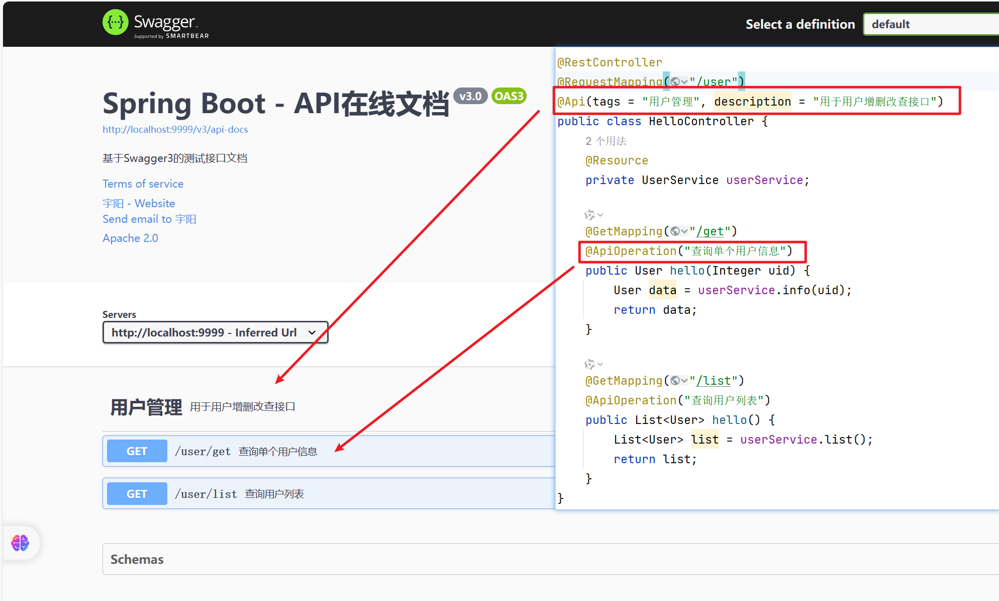
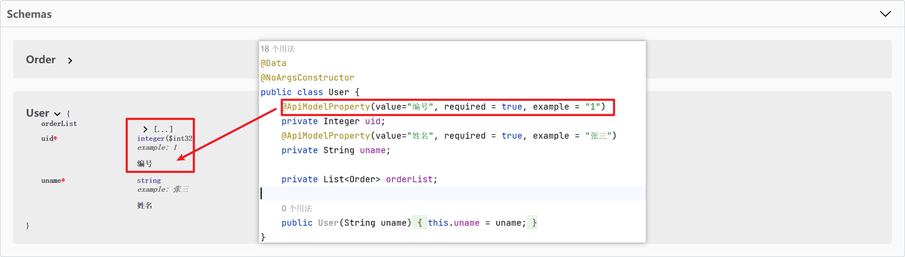

# 包

## lombok

为您的 `Java` 增添趣味：自动资源管理，自动生成 `getter`，`setter`，`equals`，`hashCode` 和 `toString` 等等！


**Maven依赖**

```xml
        <dependency>
            <groupId>org.projectlombok</groupId>
            <artifactId>lombok</artifactId>
            <version>1.18.26</version>
        </dependency>
```


**代码示例**

```java
import lombok.Data;
import lombok.AllArgsConstructor;
import lombok.NoArgsConstructor;

@Data
@NoArgsConstructor
@AllArgsConstructor
public class User {
    private Integer id;
    private String name;
}
```

```java
public class Test {
    @org.junit.Test
    public void run() {
        User u = new User();
        u.setId(1);
        u.setName("张三");
        
        System.out.println(u);
        // User(id=1, name=张三)
        
        System.out.println(u.getName()); // 张三
    }
}
```

or

```java
public class Test {
    @org.junit.Test
    public void run() {
        User u1 = new User(1, "张三");
        System.out.println(u1);
        // User(id=1, name=张三)
        
        User u2 = new User();
        u2.setId(2);
        u2.setName("李四");
        
        System.out.println(u2);
        // User(id=2, name=李四)
    }
}
```

从上述代码中可以看到 `User` 类中并没有写 `set`、`get` 等方法却可以使用，这就是 `lombok` 插件的好处


**注解含义**

| 注解                | 作用                                 |
| ------------------- | ------------------------------------ |
| @Getter/@Setter     | 为所有的属性提供getter / setter方法  |
| @ToString           | 会给类自动生成易阅读的 toString 方法 |
| @EqualsAndHashCode  | 自动生成 equals 和  hashCode 方法    |
| @Data               | 包含上述所有                         |
| @NoArgsConstructor  | 空参构造方法                         |
| @AllArgsConstructor | 全参构造方法                         |


## fastjson

 `fastjson` 是一个可以将 `JavaBean` 数据转换为 `JSON` 格式数据的包

**Maven依赖**

```xml
	<dependency>
		<groupId>com.alibaba</groupId>
		<artifactId>fastjson</artifactId>
		<version>1.2.9</version>
	</dependency>
```


**代码示例**

```java
[Student(name=jack, age=20, hobby=[抽烟, 喝酒], teacher=Teacher(id=1, name=张三)), Student(name=rose, age=23, hobby=[抽烟, 喝酒, 烫头], teacher=Teacher(id=2, name=李四))]
```

将上述 `JavaBean` 数据转换为以下 `JSON` 格式数据

```java
[
    {
        "age": 20,
        "hobby": [
            "抽烟",
            "喝酒"
        ],
        "name": "jack",
        "teacher": {
            "id": 1,
            "name": "张三"
        }
    },
    {
        "age": 23,
        "hobby": [
            "抽烟",
            "喝酒",
            "烫头"
        ],
        "name": "rose",
        "teacher": {
            "id": 2,
            "name": "李四"
        }
    }
]
```


第一步定义相关 `JavaBean`

```java
package src.domain;

import lombok.AllArgsConstructor;
import lombok.Data;
import lombok.NoArgsConstructor;

import java.util.List;

@Data
@NoArgsConstructor
@AllArgsConstructor
public class Student {
    private String name;
    private int age;
    private List<String> hobby;
    private Teacher teacher;
}
```

```java
package src.domain;

import lombok.AllArgsConstructor;
import lombok.Data;
import lombok.NoArgsConstructor;

@Data
@NoArgsConstructor
@AllArgsConstructor
public class Teacher {
    private int id;
    private String name;
}
```


**核心代码**

```java
		List<Student> list = new ArrayList<>();

        // 数据1
        Teacher t1 = new Teacher(1, "张三");
        Student s1 = new Student("jack", 20, Arrays.asList("抽烟", "喝酒"), t1);
        list.add(s1);

        // 数据2
        Teacher t2 = new Teacher(2, "李四");
        Student s2 = new Student("rose", 23, Arrays.asList("抽烟", "喝酒", "烫头"), t2);
        list.add(s2);

        // 转换为JSON
        String jsonStr = JSONObject.toJSONString(list);

        System.out.println(list);
        // 转换前：[Student(name=jack, age=20, hobby=[抽烟, 喝酒], teacher=Teacher(id=1, name=张三)), Student(name=rose, age=23, hobby=[抽烟, 喝酒, 烫头], teacher=Teacher(id=2, name=李四))]

        System.out.println(jsonStr);
        // 转换后：[{"age":20,"hobby":["抽烟","喝酒"],"name":"jack","teacher":{"id":1,"name":"张三"}},{"age":23,"hobby":["抽烟","喝酒","烫头"],"name":"rose","teacher":{"id":2,"name":"李四"}}]
```


## Swagger3

`Swagger` 是一种用于设计、构建、文档和测试 `RESTful API` 的开源框架。它的作用主要有以下几个方面：

1. API 文档自动生成：Swagger 可以根据代码中的注解自动生成 API 的文档，包括接口的描述、参数、返回数据等信息，开发人员无需手动编写文档，提高了开发效率。
2. API 可视化：Swagger 提供了一个直观的用户界面，可以方便地展示 API 的结构和调用方式，让开发者和使用者更好地理解和使用 API。
3. API 调试和测试：Swagger 提供了一个交互式的界面，可以直接在界面上调用和测试 API，避免了繁琐的手动构造请求和解析响应的过程。
4. API 规范约束：Swagger 定义了一套规范，可以用来约束 API 的设计和实现，包括接口的路径、参数类型、返回数据类型等，提高了 API 的一致性和可维护性。


**Maven依赖**

```xml
<dependency>
	<groupId>io.springfox</groupId>
	<artifactId>springfox-boot-starter</artifactId>
	<version>3.0.0</version>
</dependency>
```


**配置文件**

```java
package liuyuyang.config;

import org.springframework.beans.factory.annotation.Value;
import org.springframework.context.annotation.Bean;
import org.springframework.context.annotation.Configuration;
import springfox.documentation.builders.ApiInfoBuilder;
import springfox.documentation.builders.PathSelectors;
import springfox.documentation.builders.RequestHandlerSelectors;
import springfox.documentation.oas.annotations.EnableOpenApi;
import springfox.documentation.service.ApiInfo;
import springfox.documentation.service.Contact;
import springfox.documentation.spi.DocumentationType;
import springfox.documentation.spring.web.plugins.Docket;

import java.util.ArrayList;

@Configuration
@EnableOpenApi
public class Swagger3 {
    /**
     * 用于读取配置文件 application.properties 中 swagger 属性是否开启
     */
    // @Value("${swagger.enabled}")
    @Value("true")
    Boolean swaggerEnabled;

    @Bean
    public Docket docket() {
        return new Docket(DocumentationType.OAS_30)
                .apiInfo(apiInfo())
                // 是否开启swagger
                .enable(swaggerEnabled)
                .select()
                // 过滤条件，扫描指定路径下的文件
                .apis(RequestHandlerSelectors.basePackage("liuyuyang"))
                // 指定路径处理，PathSelectors.any()代表不过滤任何路径
                //.paths(PathSelectors.any())
                .build();
    }

    private ApiInfo apiInfo() {
        /*作者信息*/
        Contact contact = new Contact("宇阳", "https://liuyuyang.net", "liuyuyang1024@yeah.net");
        return new ApiInfo(
                "Spring Boot - API在线文档",
                "基于Swagger3的测试接口文档",
                "v3.0",
                "https://liuyuyang.net",
                contact,
                "Apache 2.0",
                "http://www.apache.org/licenses/LICENSE-2.0",
                new ArrayList()
        );
    }
}
```

**访问文档：** http://localhost:9999/swagger-ui/index.html


**高级定制：** 给文档设置接口说明，提高可读性

配置API项目名称以及标题等信息




配置接口分组名称

```java
@Api(tags = "用户管理", description = "用于用户增删改查接口")

@ApiOperation("查询单个用户信息")
```




备注 `User` 模型类的属性以及实例

```java
@ApiModelProperty(value = "编号", required = true, example = "1")
```




## 单元测试

**Maven依赖**

```xml
<dependency>
    <groupId>org.springframework.boot</groupId>
    <artifactId>spring-boot-starter-test</artifactId>
    <scope>test</scope>
</dependency>
```


**核心代码**

```java
// 核心代码
@RunWith(SpringRunner.class)
@SpringBootTest(classes = Main.class)
public class TestApplication {
    // 通过@Test进行测试
    @Test
    public void run(){
        System.out.println("Hello World!");
    }
}
```


**代码示例**

```java
@RunWith(SpringRunner.class)
@SpringBootTest(classes = Main.class)
public class TestApplication {
    @Resource
    private StudentService studentService;

    @Test
    public void run(){
        Student data = studentService.get(1);
        System.out.println(data);
    }
}
```

