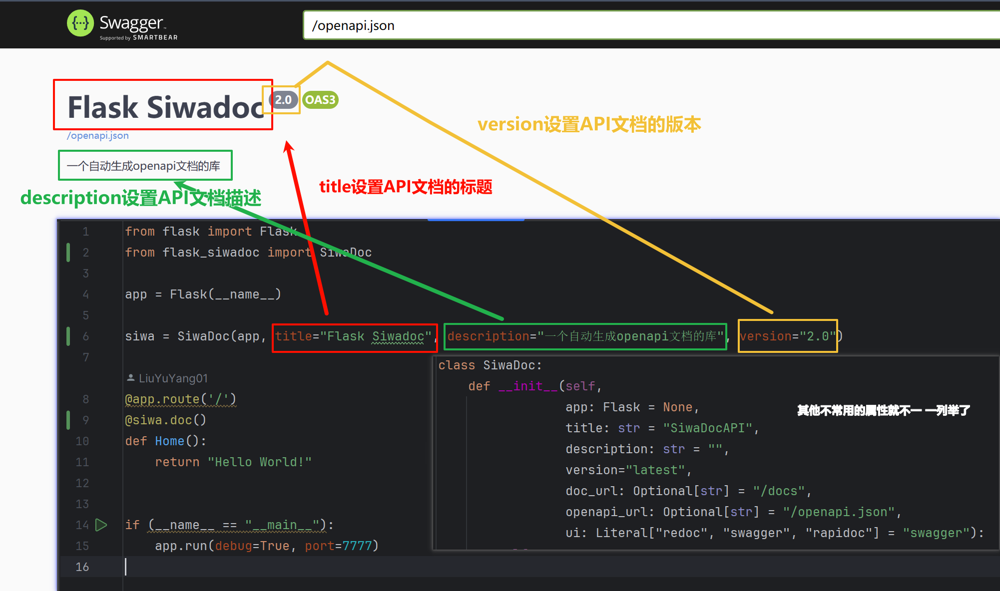
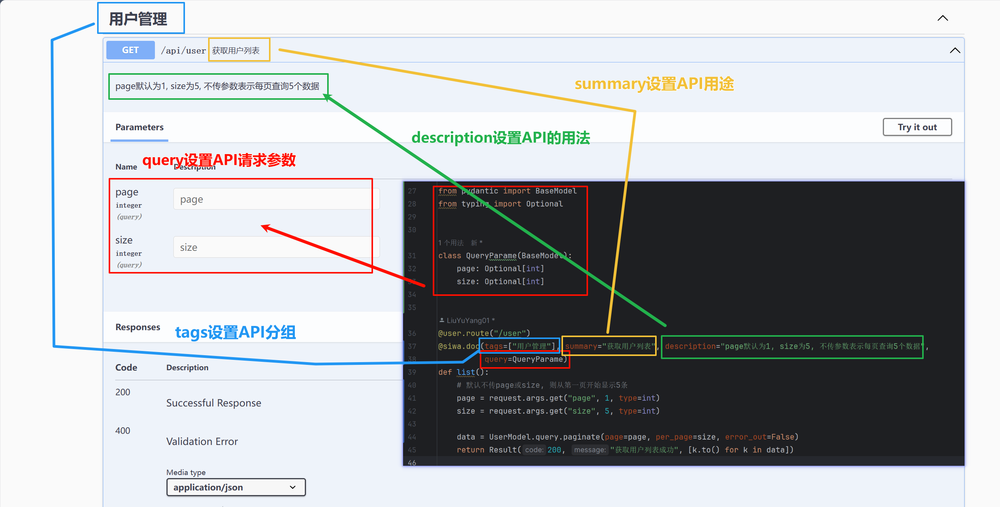

# Flask-Siwadoc

## 安装

```
pip3 install flask-siwadoc
```


## 快速上手

```python
from flask import Flask
from flask_siwadoc import SiwaDoc

app = Flask(__name__)

siwa = SiwaDoc(app)

@app.route('/')
@siwa.doc()
def Home():
    return "Hello World!"


if (__name__ == "__main__"):
    app.run(debug=True, port=7777)
```

**访问文档：** [http://127.0.0.1:7777/docs](http://127.0.0.1:7777/docs)


## 配置项

### 文档配置项

文件上传

```python
@siwa.doc(tags=["文件管理"], summary="文件上传", files={'file': {"required": True, "single": False}}, form=ResBody)
```





### 接口配置项




## pydantic

```python
from pydantic import BaseModel, ConstrainedList, Field
```


约束 `crearetime` 为日期类型

```python
crearetime: datetime = Field(default=datetime.now(), description="文章创建时间")
```


### typing

```python
from typing import Optional, Any
```


约束 `file` 为任意类型

```python
class ResBody(BaseModel):
    file: Any
```


约束传递的数据，`uid` 为可选，其余的为必须

```python
class BodyParams(BaseModel):
    uid: Optional[int] # 可选
    username: str
    password: str
```


### ConstrainedList

约束 `list` 中的数据为 `int` 类型

```python
class BodyIdParams(BaseModel):
    # ids: ConstrainedList[str] 等价于 ids: list
    # ids: ConstrainedList[bool]
    ids: ConstrainedList[int]
```


### Field

配置默认值、字段描述、最小值

```python
class QueryParams(BaseModel):
	page: Optional[int] = Field(default=1, description="第几页", ge=1)
    size: Optional[int] = Field(default=5, description="每页显示几个")
```

`Optional` 表示参数可选择的，不加表示必须


