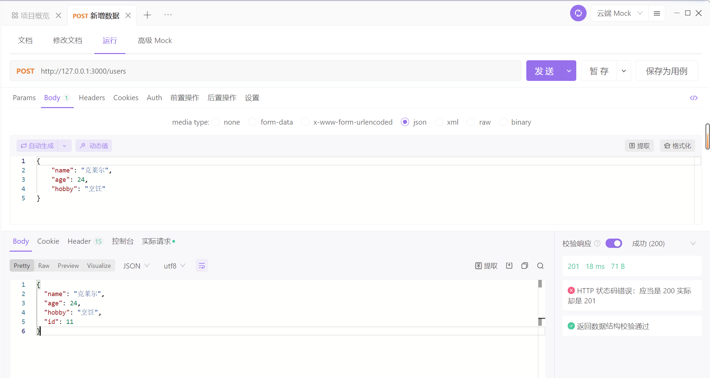
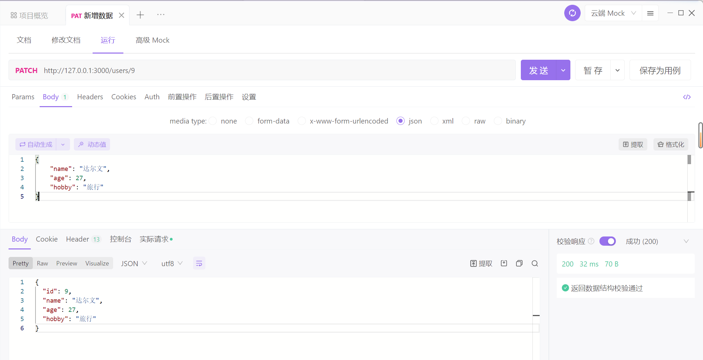

# json-serve

## 起步

### 数据源

`src/db/db.json`

```json
{
  "users": [
    { "id": 1, "name": "杰瑞", "age": 20, "hobby": "写代码" },
    { "id": 2, "name": "乔治", "age": 23, "hobby": "钓鱼" },
    { "id": 3, "name": "约瑟夫", "age": 19, "hobby": "阅读" },
    { "id": 4, "name": "史蒂夫", "age": 26, "hobby": "摄影" },
    { "id": 5, "name": "拉尔夫", "age": 30, "hobby": "登山" },
    { "id": 6, "name": "本尼", "age": 25, "hobby": "健身" },
    { "id": 7, "name": "达尔文", "age": 27, "hobby": "旅行" },
    { "id": 8, "name": "丹尼尔", "age": 22, "hobby": "绘画" },
    { "id": 9, "name": "哈罗德", "age": 28, "hobby": "游泳" },
    { "id": 10, "name": "克莱尔", "age": 24, "hobby": "烹饪" }
  ]
}
```


### 启动服务

```bash
json-server --watch ./src/db/db.json
```


## 增删改查

### 查询数据

#### 查询全部数据

http://localhost:3000/users

```json
[
    {
        "id": 1,
        "name": "杰瑞",
        "age": 20,
        "hobby": "写代码"
    },
    {
        "id": 2,
        "name": "乔治",
        "age": 23,
        "hobby": "钓鱼"
    },
    {
        "id": 3,
        "name": "约瑟夫",
        "age": 19,
        "hobby": "阅读"
    },
    {
        "id": 4,
        "name": "史蒂夫",
        "age": 26,
        "hobby": "摄影"
    },
    {
        "id": 5,
        "name": "拉尔夫",
        "age": 30,
        "hobby": "登山"
    },
    {
        "id": 6,
        "name": "本尼",
        "age": 25,
        "hobby": "健身"
    },
    {
        "id": 7,
        "name": "达尔文",
        "age": 27,
        "hobby": "旅行"
    },
    {
        "id": 8,
        "name": "丹尼尔",
        "age": 22,
        "hobby": "绘画"
    },
    {
        "id": 9,
        "name": "哈罗德",
        "age": 28,
        "hobby": "游泳"
    },
    {
        "id": 10,
        "name": "克莱尔",
        "age": 24,
        "hobby": "烹饪"
    }
]
```


#### 查询指定数据

查询 id 为 1 的数据

http://localhost:3000/users/1 | http://localhost:3000/users?id=1

```json
[
    {
        "id": 1,
        "name": "杰瑞",
        "age": 20,
        "hobby": "写代码"
	}
]
```


#### 查询指定范围的数据

查询 id 为 3 - 5 之间的数据

http://localhost:3000/users?_start=2&_end=5

```java
[
    {
        "id": 3,
        "name": "约瑟夫",
        "age": 19,
        "hobby": "阅读"
    },
    {
        "id": 4,
        "name": "史蒂夫",
        "age": 26,
        "hobby": "摄影"
    },
    {
        "id": 5,
        "name": "拉尔夫",
        "age": 30,
        "hobby": "登山"
    }
]
```


从第 2 个数据起往后取 5 个数据

http://localhost:3000/users?_start=2&_limit=5

```json
[
    {
        "id": 3,
        "name": "约瑟夫",
        "age": 19,
        "hobby": "阅读"
    },
    {
        "id": 4,
        "name": "史蒂夫",
        "age": 26,
        "hobby": "摄影"
    },
    {
        "id": 5,
        "name": "拉尔夫",
        "age": 30,
        "hobby": "登山"
    },
    {
        "id": 6,
        "name": "本尼",
        "age": 25,
        "hobby": "健身"
    },
    {
        "id": 7,
        "name": "达尔文",
        "age": 27,
        "hobby": "旅行"
    }
]
```


#### 查询指定范围字段的数据

查询 年龄 为 18 - 20 之间的数据

http://localhost:3000/users?age_gte=18&age_lte=23

```json
[
    {
        "id": 1,
        "name": "杰瑞",
        "age": 20,
        "hobby": "写代码"
    },
    {
        "id": 2,
        "name": "乔治",
        "age": 23,
        "hobby": "钓鱼"
    },
    {
        "id": 3,
        "name": "约瑟夫",
        "age": 19,
        "hobby": "阅读"
    },
    {
        "id": 8,
        "name": "丹尼尔",
        "age": 22,
        "hobby": "绘画"
    }
]
```


#### 过滤某个数据

过滤 id 为 1 与 2 的数据

http://localhost:3000/users?id_ne=1&id_ne=2

```java
[
    {
        "id": 3,
        "name": "约瑟夫",
        "age": 19,
        "hobby": "阅读"
    },
    {
        "id": 4,
        "name": "史蒂夫",
        "age": 26,
        "hobby": "摄影"
    },
    {
        "id": 5,
        "name": "拉尔夫",
        "age": 30,
        "hobby": "登山"
    },
    {
        "id": 6,
        "name": "本尼",
        "age": 25,
        "hobby": "健身"
    },
    {
        "id": 7,
        "name": "达尔文",
        "age": 27,
        "hobby": "旅行"
    },
    {
        "id": 8,
        "name": "丹尼尔",
        "age": 22,
        "hobby": "绘画"
    },
    {
        "id": 9,
        "name": "哈罗德",
        "age": 28,
        "hobby": "游泳"
    },
    {
        "id": 10,
        "name": "克莱尔",
        "age": 24,
        "hobby": "烹饪"
    }
]
```


#### 模糊查询某个字段

查询所有 `name` 带有 `夫` 的数据

http://localhost:3000/users?name_like=夫

```json
[
    {
        "id": 3,
        "name": "约瑟夫",
        "age": 19,
        "hobby": "阅读"
    },
    {
        "id": 4,
        "name": "史蒂夫",
        "age": 26,
        "hobby": "摄影"
    },
    {
        "id": 5,
        "name": "拉尔夫",
        "age": 30,
        "hobby": "登山"
    }
]
```


#### 全局查询某个数据

查询所有字段中为 `夫` 的数据

http://localhost:3000/users?q=夫


#### 分页查询

查询第 2 页的数据，每页显示 5 条数据

http://localhost:3000/users?_page=2&_limit=5

```json
[
    {
        "id": 6,
        "name": "本尼",
        "age": 25,
        "hobby": "健身"
    },
    {
        "id": 7,
        "name": "达尔文",
        "age": 27,
        "hobby": "旅行"
    },
    {
        "id": 8,
        "name": "丹尼尔",
        "age": 22,
        "hobby": "绘画"
    },
    {
        "id": 9,
        "name": "哈罗德",
        "age": 28,
        "hobby": "游泳"
    },
    {
        "id": 10,
        "name": "克莱尔",
        "age": 24,
        "hobby": "烹饪"
    }
]
```


#### 截取数据


#### 数据排序

查询后的结果根据从大到小的顺序排序，默认从小到大

http://localhost:3000/users?_sort=id&_order=desc

```json
[
    {
        "id": 10,
        "name": "克莱尔",
        "age": 24,
        "hobby": "烹饪"
    },
    {
        "id": 9,
        "name": "哈罗德",
        "age": 28,
        "hobby": "游泳"
    },
    {
        "id": 8,
        "name": "丹尼尔",
        "age": 22,
        "hobby": "绘画"
    },
    {
        "id": 7,
        "name": "达尔文",
        "age": 27,
        "hobby": "旅行"
    },
    {
        "id": 6,
        "name": "本尼",
        "age": 25,
        "hobby": "健身"
    },
    {
        "id": 5,
        "name": "拉尔夫",
        "age": 30,
        "hobby": "登山"
    },
    {
        "id": 4,
        "name": "史蒂夫",
        "age": 26,
        "hobby": "摄影"
    },
    {
        "id": 3,
        "name": "约瑟夫",
        "age": 19,
        "hobby": "阅读"
    },
    {
        "id": 2,
        "name": "乔治",
        "age": 23,
        "hobby": "钓鱼"
    },
    {
        "id": 1,
        "name": "杰瑞",
        "age": 20,
        "hobby": "写代码"
    }
]
```


也可以指定多个字段排序，先排前面字段，前面字段相同的再排第二个字段

http://localhost:3000/users?_sort=id,age&_order=asc,desc


### 新增数据




### 删除数据


### 修改数据

