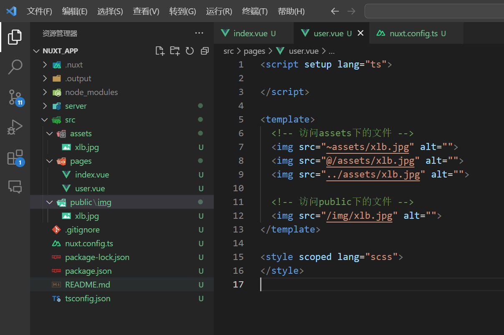
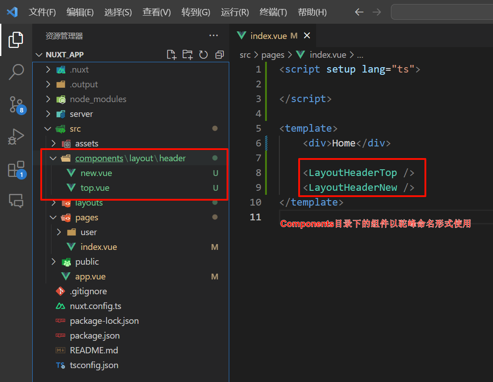
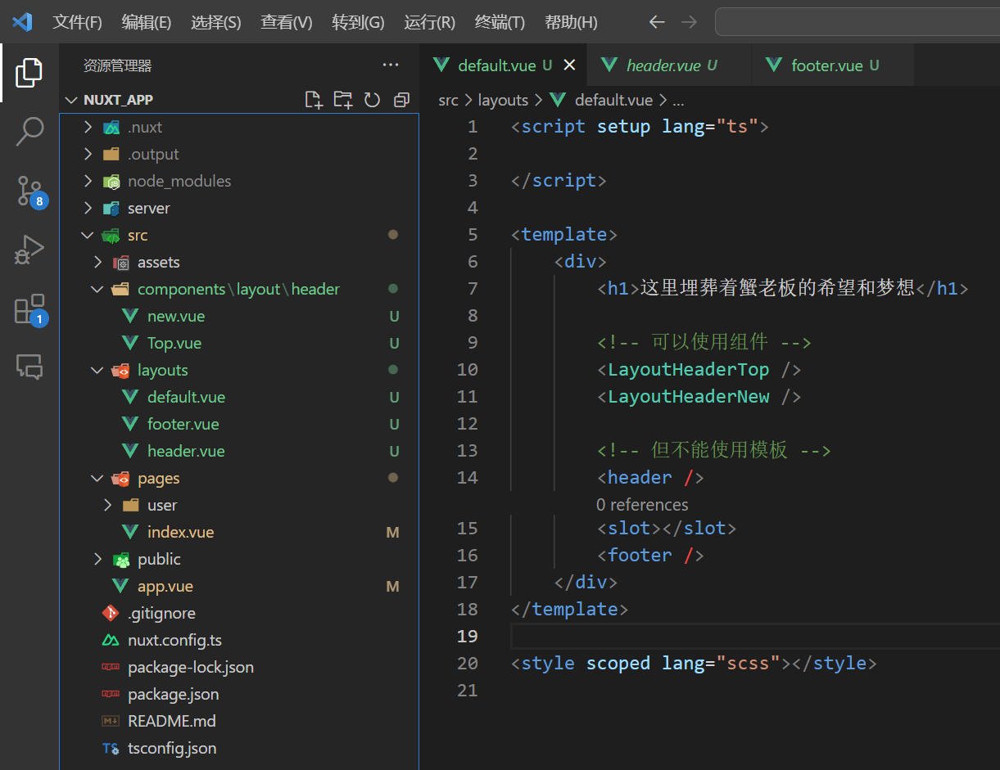
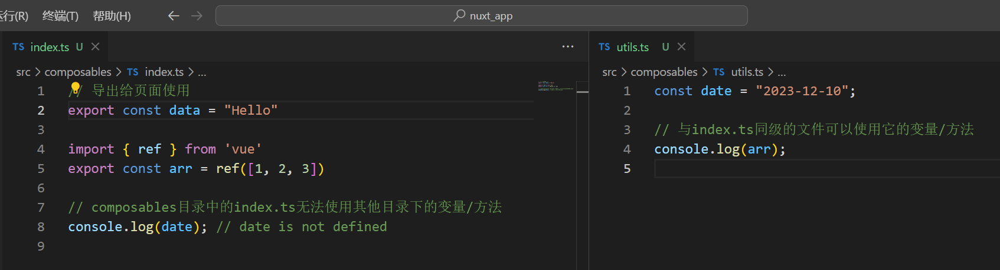

# NuxtJS

推荐文章：[https://juejin.cn/post/7170746000112353293#heading-12](https://juejin.cn/post/7170746000112353293#heading-12)

## 快速入门

安装

```
npx nuxi@latest init 项目名
```


配置 `nuxt.config.ts`

```java
export default defineNuxtConfig({
  // 是否开启调试
  devtools: { enabled: true },
  // 设置项目的源代码目录
  srcDir: "src/",
  // 是否开启自动配置路由
  standalone: true,
  // 开启更严格的TypeScript类型检查
  typescript: {
    strict: true
  }
})
```


## Public

在 `public` 目录中的文件在打包时不会参与编译，它会原封不动的复制到打包后的根目录中

这意味着 `public` 目录中的文件可以通过其相对路径直接在根网站进行访问，比如

**项目中的目录：** `src/public/img` 

**可以通过： **`http://xxx.xxx/img/xlb.jpg` 直接访问




## definePageMeta

在 `definePageMeta` 中定义的数据可以在布局页面接收并使用

```html
<script setup lang="ts">
definePageMeta({
    title: "首页",
    // 这里的属性是自定义的
    abc: 100
})
</script>

<template>
    <div class="page">
        <h1>首页</h1>

        <NuxtLayout />
    </div>
</template>
```

```html
<script setup lang="ts">
import { useRoute } from 'vue-router';
const route = useRoute();
console.log(route.meta); // {title: '首页', abc: 100}
</script>

<template>
  <h1>Hello</h1>
</template>
```


## Router

`Nuxt.js` 依据 `pages` 目录结构自动生成 `vue-router` 模块的路由配置。

在 `Nuxt` 中可以使用 `NuxtLink`、`NuxtPage` 替代 `Vue` 中的 `RouterLink`、`RouterView`


### 路由规则

| 访问路径  | 组件位置&名称             |
| --------- | ------------------------- |
| /         | `pages/index.vue`         |
| /user     | `pages/user.vue` （优先） |
| /user     | `pages/user/index.vue`    |
| /user/one | `pages/user/one.vue`      |

**注意：** 如果 `pages` 中有 `pages/user.vue`  和 `pages/user/index.vue` 同时存在，那么匹配的路由为前者 `user.vue`


### 路由跳转

虽然使用 `Vue` 中的 `RouterLink` 也可以实现跳转路由，但在 `Nuxt` 项目中建议使用 `NuxtLink`

```html
<script setup lang="ts">

</script>

<template>
    <h1>首页</h1>

    <NuxtLink to="/login">跳转到登录页</NuxtLink>
</template>
```

```html
<script setup lang="ts">

</script>

<template>
    <h1>登录页</h1>

    <NuxtLink to="/">跳转到首页</NuxtLink>
</template>
```


### 动态路由

**目录结构：** `src/pages/user/[id].vue`

**访问：** http://localhost:3000/user/10

```html
<script setup lang="ts">
import { useRoute } from 'vue-router'
const id: string = useRoute().params.id as string
</script>

<template>
    <h1>ID：{{ id }}</h1>
</template>

<style scoped lang="scss"></style>
```


**目录结构：** `src/pages/user-[id].vue`

**访问：** http://localhost:3000/user-10

```html
<template>
    <h1>用户ID：{{ $route.params.id }}</h1>
</template>
```


### 多级动态路由

**目录结构：** `src/pages/user/[uid]/[aid].vue`

**访问：** http://localhost:3000/user/1/3

```html
<template>
    <h1>用户ID：{{ $route.params.uid }}</h1>
    <h1>文章ID：{{ $route.params.aid }}</h1>
</template>
```


### 使用 Vue 路由模式

如果觉得 `Nuxt.js` 自动配置路由不习惯，那么可以通过如下配置进行关闭，然后手动配置 `router`

```javascript
export default defineNuxtConfig({
  // 是否开启自动配置路由
  standalone: true,
})
```


## Components

### 自动引入

在 `Nuxt3` 中只要是在 `components` 目录下定义的组件，不需要手动引入，可以直接在页面中使用

```html
<template>
  <h1>A组件</h1>
</template>
```

```html
<template>
  <h1>B组件</h1>
</template>
```

```html
<script setup lang="ts">
// 不需要手动引入组件，直接使用即可
import A from '@/components/A.vue'
import B from '@/components/B.vue'
</script>

<template>
    <div>Home</div>

    <A />
    <B />
</template>
```


### 嵌套组件

`Components` 目录下嵌套的组件以驼峰命名形式使用




## Layouts

### 默认布局

如果没有指定布局，将使用 `layouts/default.vue`

接下来在 `src/Layouts` 目录中创建一个默认的布局：`default.vue` 文件 

```html
<script setup lang="ts">

</script>

<template>
    <div>
        <h1>这里埋葬着蟹老板的希望和梦想</h1>
        
        <!-- 在布局文件中，页面的内容将显示在 <slot /> 组件中。 -->
        <slot />
    </div>
</template>

<style scoped lang="scss"></style>
```


在 `app.vue` 中将布局应用在所有页面，这样一来，所有页面都会被插槽到 `default.vue` 布局的指定位置

```html
<template>
    <NuxtLayout>
        <NuxtPage />
    </NuxtLayout>
</template>
```


如果是多个插槽可以这么做

```html
<template>
    <div>
        <h1>这里埋葬着蟹老板的希望和梦想</h1>
        
        <slot name="header"/>
        <slot name="body"/>
        <slot name="footer"/>
    </div>
</template>
```

```html
<template>
    <NuxtLayout>
        <template #header>我是导航栏</template>

        <template #body>
            <NuxtPage />
        </template>
        
        <template #footer>我是底部内容</template>
    </NuxtLayout>
</template>
```

如果应用程序中只有一个布局，建议使用 `app.vue`


### 自定义布局

当然，也可以指定一个布局：`src/Layouts/page.vue`

```html
<template>
    <h1>我是网页导航栏</h1>
    <slot />
    <h1>我是网页底部</h1>
</template>
```


在 `src/pages/index.vue` 文件中使用 `page` 布局

```html
<template>
    <NuxtLayout name="page">
        <h1>我是网页核心内容</h1>
    </NuxtLayout>
</template>
```

或

```html
<script setup lang="ts">
definePageMeta({
    layout: "page"
})
</script>

<template>
    <NuxtLayout>
        <h1>我是网页核心内容</h1>
    </NuxtLayout>
</template>
```

关于 `definePageMeta` 的详细使用看这里：[https://nuxt.com.cn/docs/api/utils/define-page-meta](https://nuxt.com.cn/docs/api/utils/define-page-meta)


### 404页面


### 错误页面


### 动态更改布局

```html
<script setup lang="ts">
const btn = () => {
    // 动态更改布局
    setPageLayout('login')
}
</script>

<template>
    <button @click="btn">按钮</button>
</template>
```


### 注意点

1. 其他组件不同，`Layouts` 布局和页面必须具有单个根元素，以允许 `Nuxt` 在布局更改时应用过渡效果－而且此根元素不能是 `<slot/>`

2. 在模板中可以使用组件，但不能使用其他模板




## Composables

在 `composables` 目录中所定义的业务逻辑代码会自动导入到你的应用程序中


**目录结构：** 在 `src/composables/index.ts` 中定义的数据导出后可以在所有页面使用，不需要手动导入

```ts
export const data = "Hello World!"

export const info = () => {
    console.log("这里埋葬着蟹老板的希望和梦想");
    
    return "这里埋葬着蟹老板的希望和梦想"
}
```

```html
<script setup lang="ts">

</script>

<template>
    <div>{{ data }}</div>
    <div>{{ info() }}</div>
</template>
```


### 注意点

`composables` 目录中与 `index.ts` 同级或嵌套目录中的文件可以使用 `index.ts` 的数据，而 `index.ts`  无法使用其他文件的数据。可以通过 `import` 手动引入




默认情况下 `Nuxt` 只会扫描并导出 `composables` 目录中的顶级文件，像那些嵌套文件无法导出使用，我们可以进行如下配置让它扫描到嵌套模块并导出使用

```javascript
export default defineNuxtConfig({
  imports: {
    dirs: [
      // 扫描顶级模块
      'composables',
      // ... 或扫描带有特定名称和文件扩展名的一级嵌套模块
      'composables/*/index.{ts,js,mjs,mts}',
      // ... 或扫描给定目录中的所有模块
      'composables/**'
    ]
  }
})
```


## 安装第三方包

在 `Nuxt` 项目中安装第三方包，就拿 `Ant-design-vue` 举例

在 `plugins` 目录中创建一个 `antd.ts` 文件，然后像往常一样导入相关文件，不同的是安装的语法与 `Vue` 略有差异

```javascript
import Antd from 'ant-design-vue';
import 'ant-design-vue/dist/reset.css';

export default defineNuxtPlugin((nuxtApp) => {
    // Vue 安装语法：createApp(App).use(Antd)
    nuxtApp.vueApp.use(Antd);
})
```

