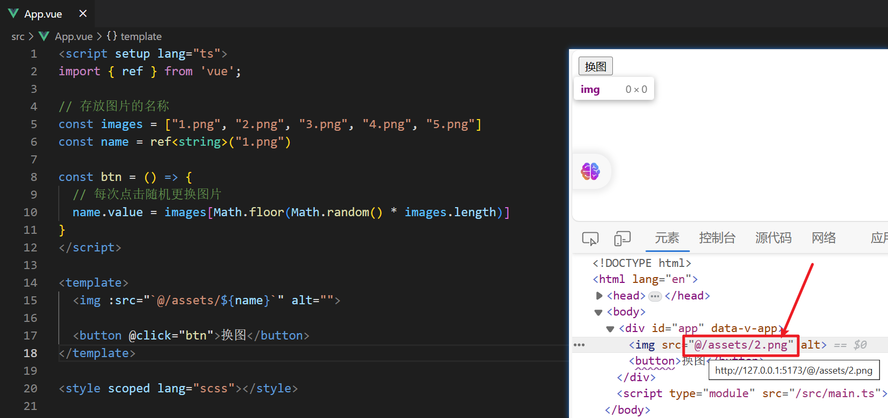
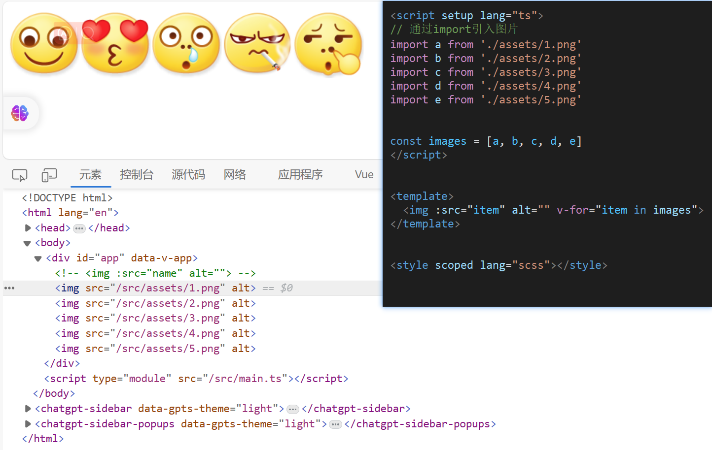
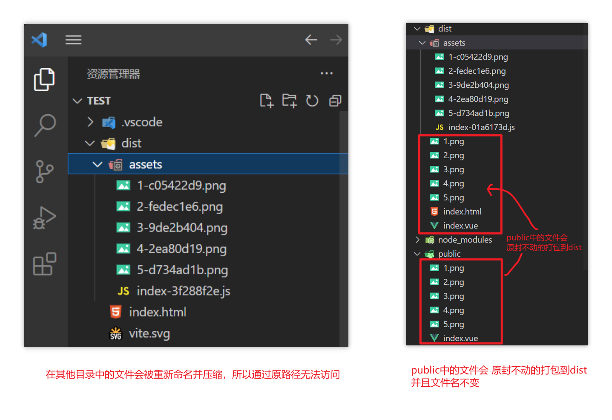

# 一篇文章教会你 Vue3 + Vite 项目资源如何动态访问

## 问题描述

在 `assets` 中有 `5` 个 `.png` 文件

如果我们想要实现每次点击按钮更换不同的图片可以这么做



可见图片并没有显示，这是因为 `Vite` 在打包项目代码时候路径出了问题


## 解决方法

### 方法一

通过 `import` 引入实现动态更换图片功能，适用于处理单个资源文件

```vue
<script setup lang="ts">
import { ref } from 'vue';

// 通过import引入图片
import a from './assets/1.png'
import b from './assets/2.png'
import c from './assets/3.png'
import d from './assets/4.png'
import e from './assets/5.png'

const images = [a, b, c, d, e]
const name = ref<string>(a)

const btn = () => {
  name.value = images[Math.floor(Math.random() * images.length)]
}
</script>

<template>
  

  <button @click="btn">换图</button>
</template>
```


当然我们也可以通过循环来 **动态** 渲染所有的图片

```vue
<script setup lang="ts">
// 通过import引入图片
import a from './assets/1.png'
import b from './assets/2.png'
import c from './assets/3.png'
import d from './assets/4.png'
import e from './assets/5.png'

const images = [a, b, c, d, e]
</script>

<template>
  
</template>
```




### 方法二

直接将资源放在 `public` 中，然后访问 `public` 中的资源即可

**原理：** 将资源存放在 `public` 目录中不会被打包。Vite的构建过程中，只有 `src` 目录中的文件会被处理和打包，而`public` 目录中的文件会被直接复制到 `dist` 目录中，保持原样。因此在项目中可以直接访问 `public` 中的资源



```vue
<script setup lang="ts">
const images = ["1.png", "2.png", "3.png", "4.png", "5.png"]
</script>

<template>
    
</template>
```

这种写法虽然方便，但通过该方式会导致打包后的项目体积变大，可见上述图中 `public` 中的文件不仅会原封不动的打包到 `dist` 目录中，并且还会再复制一份压缩后的放在 `assets` 目录中。这也就导致了大量资源浪费


### 方法三（推荐）

```vue
<script setup lang="ts">
const images = ["1.png", "2.png", "3.png", "4.png", "5.png"]

const getAssetsFile = (url: string) => {
  return new URL(`./assets/${url}`, import.meta.url).href
}
</script>

<template>
  
</template>
```

