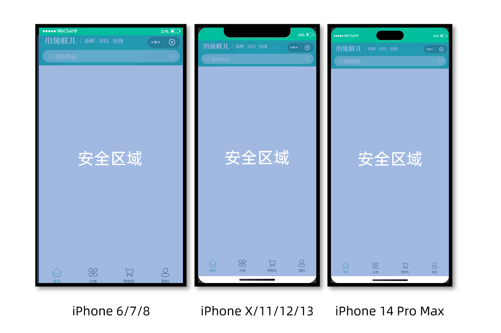
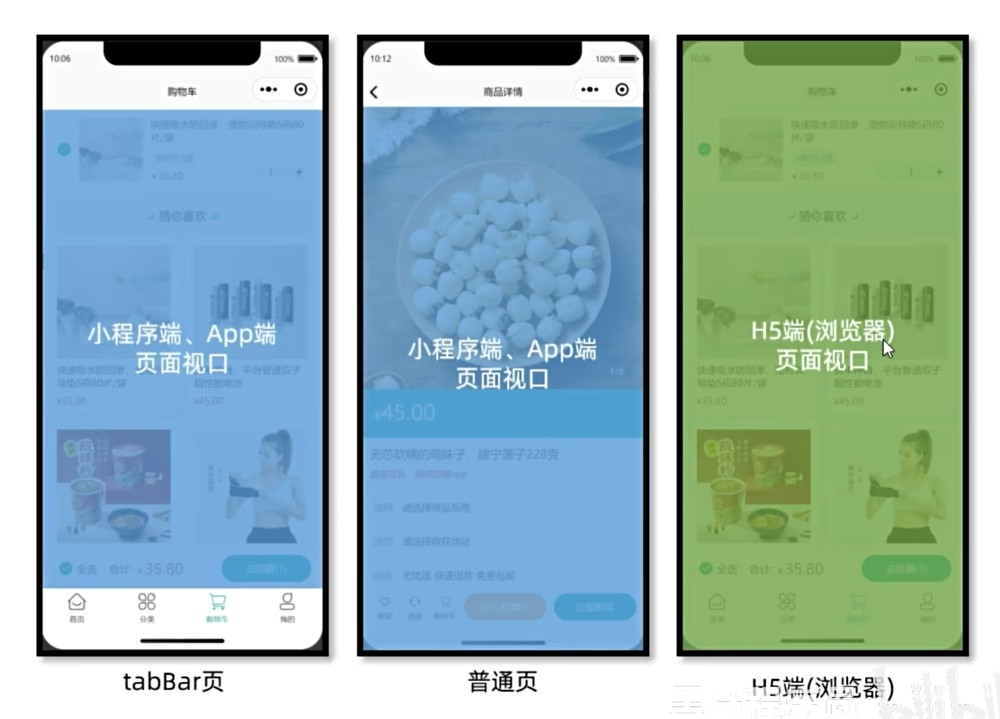

# uniapp

## 快速开始

**创建工程**

Vue3 + JavaScript + Vite

```shell
npx degit dcloudio/uni-preset-vue#vite my-vue3-project
```

Vue3 + TypeScript + Vite

```shell
npx degit dcloudio/uni-preset-vue#vite-ts my-vue3-project
```


## 项目工程结构

```
├── .husky                     # Git Hooks
├── .vscode                    # VS Code 插件 + 设置
├── dist                       # 打包文件夹（可删除重新打包）
├── src                        # 源代码
│   ├── components             # 全局组件
│   ├── composables            # 组合式函数
│   ├── pages                  # 主包页面
│       ├── index               # 首页
│       ├── category            # 分类页
│       ├── cart                # 购物车
│       ├── my                  # 我的
│       ├── goods               # 商品详情
│       └── hot                 # 热门推荐
│       └── login               # 登录页
│   ├── pagesMember            # 分包页面(用户模块)
│       ├── address             # 地址管理
│       ├── address-form        # 地址表单
│       ├── profile             # 用户信息
│       └── settings            # 用户设置
│   ├── pagesOrder             # 分包页面(订单模块)
│       ├── create              # 创建订单
│       ├── detail              # 订单详情
│       ├── list                # 订单列表
│       └── payment             # 支付结果
│   ├── services               # 所有请求
│   ├── static                 # 存放应用引用的本地静态资源的目录
│       ├── images              # 普通图片
│       └── tabs                # tabBar 图片
│   ├── stores                 # 全局 pinia store
│       ├── modules             # 模块
│       └── index.ts            # store 入口
│   ├── styles                 # 全局样式
│       └── fonts.scss          # 字体图标
│   ├── types                  # 类型声明文件
│   ├── utils                  # 全局方法
│   ├── App.vue                # 入口页面
│   ├── main.ts                # Vue初始化入口文件
│   ├── pages.json             # 配置页面路由等页面类信息
│   ├── manifest.json          # 配置appid等打包信息
│   └── uni.scss               # uni-app 内置的常用样式变量
├── .eslintrc.cjs              # eslint 配置
├── .prettierrc.json           # prettier 配置
├── .gitignore                 # git 忽略文件
├── index.html                 # H5 端首页
├── package.json               # package.json 依赖
├── tsconfig.json              # typescript 配置
└── vite.config.ts             # vite 配置
```


## 安全距离

不同手机的安全区域不同，适配安全区域能防止页面重要内容被遮挡。

可通过 `uni.getSystemInfoSync()` 获取屏幕边界到安全区的距离。

```vue
<script setup lang="ts">
const { safeAreaInsets } = uni.getSystemInfoSync()
</script>

<template>
    <view class="navbar" :style="{ paddingTop: safeAreaInsets?.top + 'px' }">
        
    </view>
</template>
```




## 全局组件类型

在这段代码中，`vue` 模块被导入并扩展了一个名为 `GlobalComponents` 的接口。

通过这个接口，我们可以将 `XtxSwiper` 和 `XtxGuess` 两个组件声明为全局组件，这样它们可以在整个项目的任何地方使用，而无需在每个组件中分别导入和注册它们，并且具备组件类型

```typescript
import 'vue'
import Swiper from '@/components/Swiper.vue'
import Guess from '@/components/Guess.vue'

declare module 'vue' {
  export interface GlobalComponents {
    Swiper: typeof Swiper
    Guess: typeof Guess
  }
}

// 定义组件的类型
type GuessInstance = InstanceType<typeof Guess>
```

```javascript
const guessRef = ref<GuessInstance>()
```


## 生命周期

onLoad 每次进入页面时候触发


## 常用操作

### 获取上个页面传递的数据

App.vue

```vue
<navigator url="/pages/hot/hot?type=100"></navigator>
```

hot.vue

```javascript
onLoad((e) => {
    console.log(e); // { type:100 }
})
```


## 常用API

### 界面

#### 设置页面的标题

```javascript
uni.setNavigationBarTitle({
    title: '新的标题'
});
```


## 遇到的坑

### scroll-view 上拉触底事件失效

在使用 `scroll-view` 组件的 `@scrolltolower` 事件监听是否上拉触底时一定要给他或父级设置高度，否则会导致事件无法触发

```vue
<script setup lang="ts">
// 上拉触底
const onScrolltolower = () => {
  console.log("触底了~");
}
</script>

<template>
  <!-- 滚动容器 -->
   <scroll-view scroll-y @scrolltolower="onScrolltolower">
		<!-- 自定义内容 -->
  </scroll-view>
</template>

<style lang="scss">
page {
  height: 100%;
}
</style>

```


## 项目打包

按照 `uniapp` 规范开发可保证多平台兼容，但每个平台都有一些自己的特性，比如网页端不支持使用微信平台授权登录，这时就可以使用条件编译，让代码按条件编译到不同平台

**条件编译语法： **`#ifdef` 或 `#ifndef` 加 平台名称开头，然后以 `#endif` 结尾

通过条件编译实现在 `H5` 端显示 `H5` 的代码，小程序端显示小程序的代码

```html
<!-- 网页端表单登录 -->
<!-- #ifdef H5 -->
  <input class="input" type="text" placeholder="请输入用户名/手机号码" />
  <input class="input" type="text" password placeholder="请输入密码" />
  <button class="button phone">登录</button>
<!-- #endif -->

<!-- 小程序端授权登录 -->
<!-- #ifdef MP-WEIXIN -->
  <button class="button phone" open-type="getPhoneNumber" @getphonenumber="onGetphonenumber">
    <text class="icon icon-phone"></text>
    手机号快捷登录
  </button>
<!-- #endif -->
```

`JavaScript` 中可以这么写

```javascript
// #ifdef MP-WEIXIN

// 登录凭证
let code: string = ''

onLoad(async () => {
  const res = await wx.login()
  code = res.code
})

// 获取用户手机号码
const onGetphonenumber: UniHelper.ButtonOnGetphonenumber = async (ev) => {
  // 获取参数
  const encryptedData = ev.detail.encryptedData!
  const iv = ev.detail.iv!
  // 登录请求
  await postLoginWxMinAPI({ code, encryptedData, iv })
  // 成功提示
  uni.showToast({ icon: 'none', title: '登录成功' })
}

// #endif
```


假如有这样的需求，我们小程序、APP的代码一致，只有H5的需要更改，可以这么做

```css
#ifdef MP-WEIXIN || APP-PLUS
	/* ... */
#endif
```


## 多端差异

### 本地存储

### 样式隔离

`H5` 和 `APP` 端都具有样式隔离效果，会导致样式错乱的效果，此时我们就需要给组件内再引入一次样式

```css
/* #ifdef H5 || APP-PLUS */
@import '@/components/styles/XtxSwiper.scss';
@import './styles/CategoryPanel.scss';
@import './styles/HotPanel.scss';
@import '@/components/styles/XtxGuess.scss';
/* #endif */
```


### 样式选择器


### 组件差异

比如小程序端特有的API在H5以及APP端无法使用，这时候我们可以将这个组件通过条件编译去除掉


### 视口

`H5` 端视口是所有可视区，而小程序和 `APP` 视口不包含顶部和底部 `TabBar`，这样的话就会导致布局差异



我们可以通过 `uniapp` 提供的 `css` 变量来解决这个问题

```css
.toolbar {
  position: fixed;
  left: 0;
  right: 0;
  padding-bottom: var(--window-bottom);
  ...
 }
```

在小程序与APP端 `var(--window-bottom)` 的值为0，在 `H5` 端他的值为 `TabBar` 的高度


骨架屏
