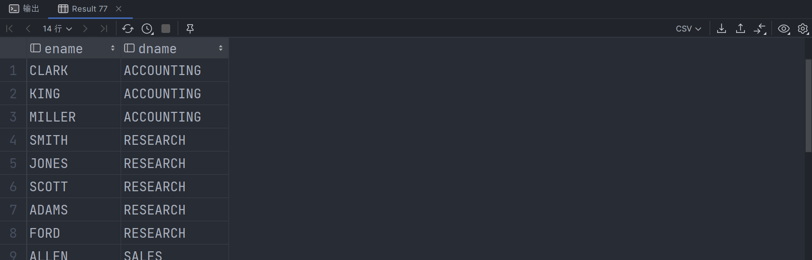
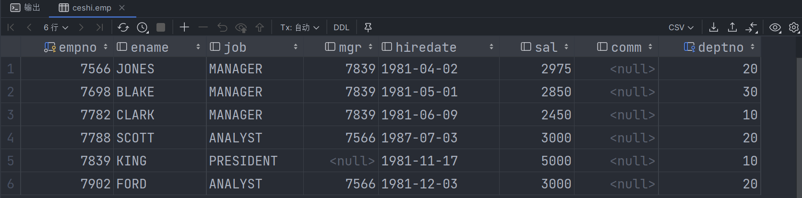
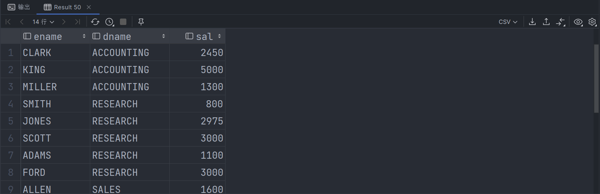
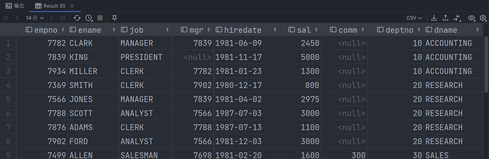
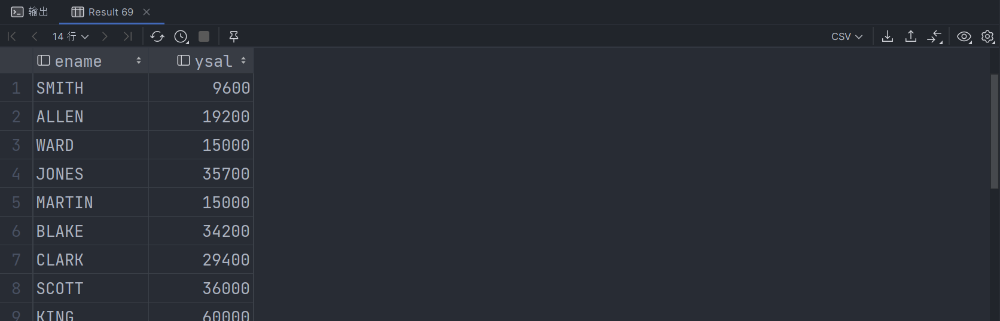
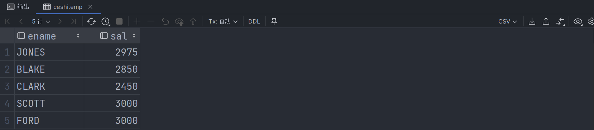
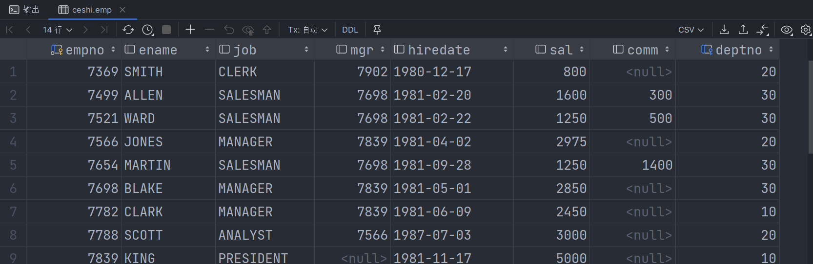
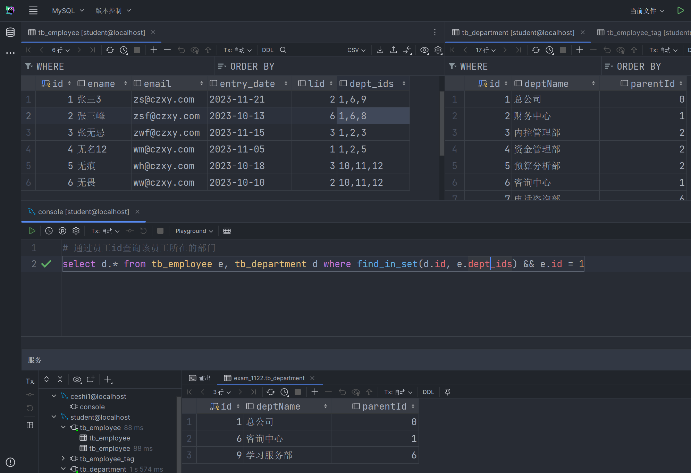

# SQL练习题

## 初始化

```sql
drop database if exists test1;
create database test1;
use test1;

# 部门表
create table dept(
deptno int primary key,##部门编号
dname varchar(14) , ##部门名称
loc varchar(13) ##部门地址
);

insert into dept values (10,‘accounting’,‘new york’);
insert into dept values (20,‘research’,‘dallas’);
insert into dept values (30,‘sales’,‘chicago’);
insert into dept values (40,‘operations’,‘boston’);

# 员工表
#drop if exists table emp;
create table emp(
empno int primary key, #员工编号
ename varchar(10), #员工姓名
job varchar(9), #员工工作
mgr int, #员工直属领导编号
hiredate date, #入职时间
sal double, #工资
comm double, #奖金
deptno int #对应dept表的外键
);

# 添加 部门 和 员工 之间的主外键关系
alter table emp add constraint foreign key emp(deptno) references dept (deptno);

insert into emp values(7369,‘smith’,‘clerk’,7902,“1980-12-17”,800,null,20);
insert into emp values(7499,‘allen’,‘salesman’,7698,‘1981-02-20’,1600,300,30);
insert into emp values(7521,‘ward’,‘salesman’,7698,‘1981-02-22’,1250,500,30);
insert into emp values(7566,‘jones’,‘manager’,7839,‘1981-04-02’,2975,null,20);
insert into emp values(7654,‘martin’,‘salesman’,7698,‘1981-09-28’,1250,1400,30);
insert into emp values(7698,‘blake’,‘manager’,7839,‘1981-05-01’,2850,null,30);
insert into emp values(7782,‘clark’,‘manager’,7839,‘1981-06-09’,2450,null,10);
insert into emp values(7788,‘scott’,‘analyst’,7566,‘1987-07-03’,3000,null,20);
insert into emp values(7839,‘king’,‘president’,null,‘1981-11-17’,5000,null,10);
insert into emp values(7844,‘turner’,‘salesman’,7698,‘1981-09-08’,1500,0,30);
insert into emp values(7876,‘adams’,‘clerk’,7788,‘1987-07-13’,1100,null,20);
insert into emp values(7900,‘james’,‘clerk’,7698,‘1981-12-03’,950,null,30);
insert into emp values(7902,‘ford’,‘analyst’,7566,‘1981-12-03’,3000,null,20);
insert into emp values(7934,‘miller’,‘clerk’,7782,‘1981-01-23’,1300,null,10);

#工资等级表
#drop if exists table salgrade;
create table salgrade(
grade int, #等级
losal double, #最低工资
hisal double ); #最高工资

insert into salgrade values (1,700,1200);
insert into salgrade values (2,1201,1400);
insert into salgrade values (3,1401,2000);
insert into salgrade values (4,2001,3000);
insert into salgrade values (5,3001,9999);
```


## 单表

### 二

```sql
select * from emp where job = 'clerk';
```


### 四

```sql
select * from emp where comm > sal * 0.6;
```


### 六

```sql
select * from emp where deptno = 10 && job = 'manager' or deptno = 20 && job = 'clerk' or job not in('manager', 'clerk') && sal > 2000;
```


### 八

```sql
select * from emp where comm is not null && comm > 0;
```


### 十

```sql
select * from emp where length(ename) = 6;
```


## 多表

### 一

**需求：** 查询拥有员工的部门名、部门号

**难度：** ⭐⭐

```sql
select d.dname, d.deptno from emp e, dept d where e.deptno = d.deptno group by d.deptno;
```


### 二

**需求：** 查询工资高于姓名为 `turner` 的员工

**难度：** ⭐

```sql
# 查询姓名为turner的工资
select sal from emp e where e.ename = 'turner';

select * from emp e where e.sal > (select sal from emp where ename = 'turner')
```


### 三

**需求：** 查询员工姓名和他的经理姓名

**难度：** ⭐⭐

```sql
select e.ename,m.ename from emp e, emp m where e.mgr = m.empno;
```


### 四

**需求：** 查询员工入职时间早于所属经理入职的员工及经理姓名

**难度：** ⭐⭐⭐

```sql
select e.ename, m.ename from emp e, emp m where e.mgr = m.empno && e.hiredate < m.hiredate
```


### 五

**需求：** 查询员工姓名、部门名称

**难度：** ⭐⭐

```sql
select e.ename, d.dname from emp e, dept d where e.deptno = d.deptno;
```




### 六

**需求：** 查询从事 `clerk` 工作的员工姓名以及部门名称

**难度：** ⭐

```sql
select e.ename, d.dname from emp e, dept d where e.job = 'clerk' && e.deptno = d.deptno;
```


### 七

**需求：** 查询部门号以及本部门的最低工资

**难度：** ⭐⭐⭐

```sql
select d.deptno, min(e.sal) as sal from emp e, dept d where e.deptno = d.deptno group by deptno;
```


### 八

**需求：** 查询部门中销售部 `sales` 的所有员工姓名

**难度：** ⭐⭐

```sql
select e.ename from emp e where e.deptno = (select d.deptno from dept d where d.dname = 'sales')
```


### 九

**需求：** 查询工资高于平均工资的员工

**难度：** ⭐

```sql
# 查询平均工资
select avg(e.sal) as sal from emp e;

select * from emp e where e.sal > (select avg(e.sal) as sal from emp e)
```




### 十

**需求：** 查询与员工 `scott` 从事相同工作的员工

**难度：** ⭐⭐

```sql
# 查询姓名为scott员工的工作
select e.job from emp e where e.ename = 'scott';

# 含自己
select * from emp e where e.job = (select e.job from emp e where e.ename = 'scott');

# 不含自己
select * from emp e where e.job = (select e.job from emp e where e.ename = 'scott') && e.ename != 'scott';
```


### 十一

**需求：** 查询部门为30的所有员工姓名与工资

**难度：** ⭐

```sql
select e.ename, e.sal from emp e where e.deptno = 30;
```


### 十二

**需求：** 查询工资高于30部门中所有员工的数据

**难度：** ⭐⭐

```sql
# 查询部门为30的所有员工中最高的工资
select max(e.sal) as sal from emp e where e.deptno = 30;

select * from emp e where e.sal > (select max(e.sal) as sal from emp e where e.deptno = 30);
```


### 十三

**需求：** 查询部门号、部门名、部门所在位置以及每个每个部门的员工总数

**难度：** ⭐⭐⭐

```sql
# 方式一
select d.deptno, d.dname, d.loc, count(e.empno) as count from emp e, dept d where e.deptno = d.deptno group by e.deptno;

# 方式二
select d.*, count(e.empno) as number from dept d, emp e where d.deptno = e.deptno group by d.deptno;
```


### 十四

**需求：** 查询员工的姓名、部门名以及工资

**难度：** ⭐⭐

```sql
select e.ename, d.dname, e.sal from emp e, dept d where e.deptno = d.deptno;
```




### 十五

**需求：** 查询员工的详细信息包含部门名

**难度：** ⭐⭐

```sql
select e.*, d.dname from emp e, dept d where e.deptno = d.deptno;
```




### 十六

**需求：** 查询员工工作以及从事此工作的最低工资

**难度：** ⭐⭐⭐

```sql
select e.job, min(e.sal) as sal from emp e group by e.job;
```


### 十七

**需求：** 查询所有部门中工资最低的经理

**难度：** ⭐

```sql
select e.deptno, e.ename, e.job, min(e.sal) as sal from emp e where e.job = 'manager';
```


### 十八

**需求：** 查询所有员工的姓名、年薪

**难度：** ⭐

```sql
select e.ename, round(e.sal * 12, 0) as ysal from emp e;
```




### 十九

**需求：** 查询 `grade=3` 的三级员工姓名、工资

**难度：** ⭐⭐⭐

```sql
# 方法一：关联查询
select e.ename, e.sal from emp e, salgrade s where s.grade = 4 && e.sal between s.losal and s.hisal;

# 方法二：子查询
select e.ename, e.sal from emp e, (select losal, hisal from salgrade s where s.grade = 4) s where e.sal >= s.losal && e.sal <= s.hisal;

# 方法三：子查询&范围查询
select e.ename, e.sal from emp e, (select losal, hisal from salgrade s where s.grade = 4) s where e.sal between s.losal and s.hisal;
```




### 二十

**需求：** 查询二级工资的职员姓名、部门、以及最低最高工资

**难度：** ⭐⭐⭐

```sql
# 查询二级员工最低与最高工资
select s.losal, s.hisal from salgrade s where s.grade = 2;

# 查询所有员工对应的部门名称
select e.ename, d.dname from emp e, dept d where e.deptno = d.deptno;

select e.ename, d.dname, e.sal, s.losal, s.hisal from emp e, dept d, salgrade s where s.grade = 2 && e.sal between s.losal and s.hisal && e.deptno = d.deptno;
```


### 二十一

**需求：** 查询 `grade=2` 的二级员工最低与最高工资

**难度：** ⭐⭐⭐⭐

```sql
# 查询二级员工 工资范围
select losal, hisal from salgrade s where s.grade = 2;

select min(e.sal) as 最低工资, max(e.sal) as 最高工资 from emp e, (select losal, hisal from salgrade s where s.grade = 2) s where e.sal between s.losal and s.hisal
```


###  二十二

**需求：** 查询工资等级多于 `smith` 的员工信息

**难度：** ⭐⭐⭐

```sql
select * from emp e where e.sal >= (select sal from emp s where s.ename = 'smith');
```




### 二十三

**需求：** 查询工资最高的员工姓名、工作、薪资

**难度：** ⭐⭐⭐

```sql
select e.ename, e.job, e.sal from emp e where e.sal = (select max(sal) from emp);
```


### 二十四

**需求：** 通过员工 `id` 查询该员工所在的部门

**难度：** ⭐⭐⭐⭐

```
select d.* from tb_employee e, tb_department d where find_in_set(d.id, e.dept_ids) && e.id = 1
```


